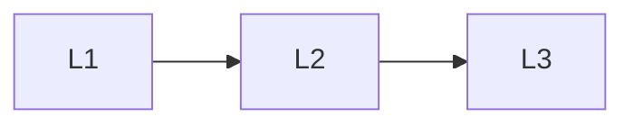

# Communication

> Section of the **multi-agent-systems** handbook.

## Lessons

| # | Lesson |
|---|--------|
| 1 | [Multi-Agent Protocols](01-protocols.md) |
| 2 | [Shared Memory](02-shared-memory.md) |
| 3 | [Agent Handoffs](03-handoffs.md) |

**Topic hub:** [../README.md](../README.md)
