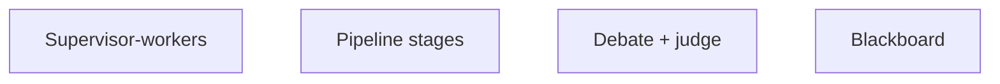

# Coordination Patterns

> Supervisor, pipeline, debate, and blackboards — pattern cheat sheet.

## Definition

Common patterns: **supervisor–workers** (central assigner), **pipeline** (stage handoffs), **debate/critique** (improve quality), **blackboard** (shared workspace). Pick based on dependency structure and where quality gates belong.

## Why it matters

Pattern clarity beats ad-hoc agent chats in logs you cannot debug.

## How it works

## Key principles

1. **Make the topology explicit** — Draw it before coding.
2. **Put judges at quality gates** — Don't hope peers converge.
3. **Cap fan-out** — Parallelism has token costs.

## Common applications

| Application | Description |
|-------------|-------------|
| Doc QA | Retrieve || browse → synthesize |
| Coding | Implement → test → review |
| Strategy | Propose → critique → revise |

## Common mistakes

- Fully connected agent meshes
- No idempotency on worker tools

## Further reading

- [When not to multi-agent](when-not-to-multi-agent.md)
- [Agentic AI](../agentic-ai/README.md)
