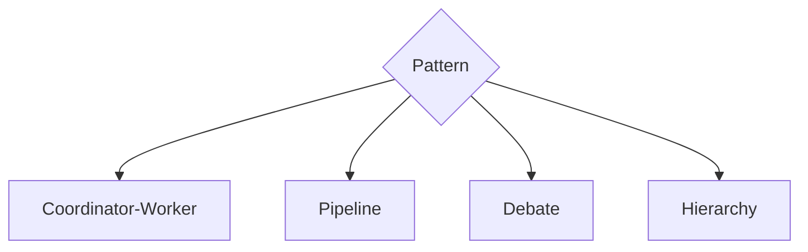

# Coordination Patterns

> Reusable ways agents work together: coordinator-worker, peer mesh, pipeline stages, market/bidding, and hierarchical teams.

## Table of Contents

- [Overview](#overview)
- [Definition](#definition)
- [Why It Matters](#why-it-matters)
- [Uses](#uses)
- [How It Works](#how-it-works)
- [Worked Example](#worked-example)
- [Python Examples](#python-examples)
- [Production Considerations](#production-considerations)
- [Performance Considerations](#performance-considerations)
- [Cost Considerations](#cost-considerations)
- [Security Considerations](#security-considerations)
- [Best Practices](#best-practices)
- [Common Mistakes](#common-mistakes)
- [Interview Preparation](#interview-preparation)
- [Navigation](#navigation)

---

## Overview

This lesson covers **Coordination Patterns** inside the `coordination` section of the `multi-agent-systems` handbook. Treat it as production engineering guidance: clear definitions, when to apply the idea, system shape, and code you can adapt.

---

## Definition

**Coordination Patterns** — Reusable ways agents work together: coordinator-worker, peer mesh, pipeline stages, market/bidding, and hierarchical teams.

---

## Why It Matters

Coordination pattern choice dominates reliability. Pick one primary pattern; mixing ad hoc messaging creates undebuggable systems.

Without a clear model for this topic, teams ship demos that fail under load, cost, or correctness pressure.

---

## Uses

| Use case | How this applies |
|----------|------------------|
| Coordinator-worker | Central planner fans out |
| Pipeline | Stage agents with handoffs |
| Peer debate | Equals critique then vote |
| Hierarchy | Manager agents own sub-teams |

---

## How It Works

Document the pattern, message types, and who may write shared state. Prefer coordinator-worker for ops; pipelines for content; debate for high-precision judgments.



---

## Worked Example

Doc Q&A: coordinator retrieves, workers answer shards, coordinator merges with citations — classic CW pattern.

---

## Python Examples

```python
from enum import Enum
from dataclasses import dataclass
from typing import Any

class Pattern(Enum):
    COORDINATOR_WORKER = "cw"
    PIPELINE = "pipeline"
    DEBATE = "debate"
    HIERARCHY = "hierarchy"

@dataclass
class CoordinationConfig:
    pattern: Pattern
    max_workers: int = 4
    max_rounds: int = 3

def select_pattern(parallel_shards: bool, needs_critique: bool, stages: int) -> Pattern:
    if stages >= 3:
        return Pattern.PIPELINE
    if needs_critique and not parallel_shards:
        return Pattern.DEBATE
    if parallel_shards:
        return Pattern.COORDINATOR_WORKER
    return Pattern.COORDINATOR_WORKER

def run_cw(goal: str, workers: list, coordinator, fanout) -> Any:
    shards = fanout(goal)
    partials = [w.run(s) for w, s in zip(workers, shards)]
    return coordinator.merge(partials)

```

---

## Production Considerations

- Log request IDs across orchestration steps.
- Fail closed on auth and policy; degrade only where product explicitly allows it.
- Keep feature flags for prompt/model swaps.

## Performance Considerations

- Bound concurrency to the model provider.
- Stream when UX needs time-to-first-token.
- Cache stable sub-results carefully with invalidation rules.

## Cost Considerations

- Track tokens and tool calls per feature / tenant.
- Prefer smaller models for routers and classifiers.
- Cap max tokens and tool-loop iterations.

## Security Considerations

- Never put secrets in prompts.
- Treat model output as untrusted until validated.
- Enforce tenant isolation on retrieval and tools.

---

## Best Practices

1. Start from a strong single agent; split only with measured gains.
2. Define message schemas and ownership of shared state.
3. Cap debate rounds and worker fan-out hard.
4. Measure team cost and latency, not just final quality.
5. Keep a collapse-to-single-agent feature flag.

---

## Common Mistakes

- Spawning agents because the framework makes it easy.
- No owner for conflicts on the blackboard.
- Unbounded debate that never converges.
- Duplicating the same retrieval across workers.
- Missing deadlock and cost-blowup monitors.

---

## Interview Preparation

**Q: When does multi-agent help?**

A: When specialization, parallelism, or critique measurably improves quality/latency enough to pay coordination cost — proven against a single-agent baseline.

**Q: What are common failure modes?**

A: Deadlocks, infinite critique loops, cost blowups from fan-out, and inconsistent shared state without locking or ownership.

**Q: How do you evaluate a multi-agent system?**

A: Joint task success, trajectory/team traces, cost per success, contention metrics, and ablation vs single agent on the same suite.

---

## Navigation

- **Section hub:** [README](README.md)
- **Topic hub:** [../README.md](../README.md)
