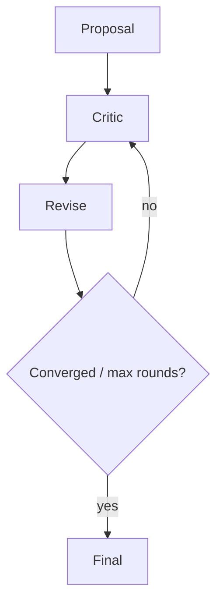

# Debate and Critique

> Patterns where agents argue or critique proposals to improve precision — with round limits, judges, and convergence criteria.

## Table of Contents

- [Overview](#overview)
- [Definition](#definition)
- [Why It Matters](#why-it-matters)
- [Uses](#uses)
- [How It Works](#how-it-works)
- [Worked Example](#worked-example)
- [Python Examples](#python-examples)
- [Production Considerations](#production-considerations)
- [Performance Considerations](#performance-considerations)
- [Cost Considerations](#cost-considerations)
- [Security Considerations](#security-considerations)
- [Best Practices](#best-practices)
- [Common Mistakes](#common-mistakes)
- [Interview Preparation](#interview-preparation)
- [Navigation](#navigation)

---

## Overview

This lesson covers **Debate and Critique** inside the `coordination` section of the `multi-agent-systems` handbook. Treat it as production engineering guidance: clear definitions, when to apply the idea, system shape, and code you can adapt.

---

## Definition

**Debate and Critique** — Patterns where agents argue or critique proposals to improve precision — with round limits, judges, and convergence criteria.

---

## Why It Matters

Unbounded debate burns tokens and can polarize nonsense. Structured critique with a judge and stop rules turns disagreement into quality.

Without a clear model for this topic, teams ship demos that fail under load, cost, or correctness pressure.

---

## Uses

| Use case | How this applies |
|----------|------------------|
| Safety review | Red-team vs policy agent |
| Claim checking | Writer vs critic with sources |
| Architecture | Two design proposals + judge |
| Moderation | Allow vs deny with arbiter |

---

## How It Works

Separate proposer and critic contexts. Score critiques against rubrics. Stop on agreement, rubric pass, or max rounds — then judge picks.



---

## Worked Example

Medical billing code suggestion: coder proposes, critic checks documentation support, judge accepts only with cited evidence.

---

## Python Examples

```python
from dataclasses import dataclass

@dataclass
class DebateTurn:
    round: int
    proposer: str
    critic: str
    proposal: str
    critique: str
    score: float

def should_stop(turns: list[DebateTurn], max_rounds: int, pass_score: float = 0.85) -> bool:
    if not turns:
        return False
    if turns[-1].score >= pass_score:
        return True
    if turns[-1].round >= max_rounds:
        return True
    if len(turns) >= 2 and turns[-1].proposal.strip() == turns[-2].proposal.strip():
        return True
    return False

def judge(turns: list[DebateTurn]) -> str:
    best = max(turns, key=lambda t: t.score)
    return best.proposal

def run_debate(propose, critique, score_fn, max_rounds: int = 3) -> str:
    turns = []
    proposal = propose(None)
    for r in range(1, max_rounds + 1):
        crit = critique(proposal)
        sc = score_fn(proposal, crit)
        turns.append(DebateTurn(r, "proposer", "critic", proposal, crit, sc))
        if should_stop(turns, max_rounds):
            break
        proposal = propose(crit)
    return judge(turns)

```

---

## Production Considerations

- Log request IDs across orchestration steps.
- Fail closed on auth and policy; degrade only where product explicitly allows it.
- Keep feature flags for prompt/model swaps.

## Performance Considerations

- Bound concurrency to the model provider.
- Stream when UX needs time-to-first-token.
- Cache stable sub-results carefully with invalidation rules.

## Cost Considerations

- Track tokens and tool calls per feature / tenant.
- Prefer smaller models for routers and classifiers.
- Cap max tokens and tool-loop iterations.

## Security Considerations

- Never put secrets in prompts.
- Treat model output as untrusted until validated.
- Enforce tenant isolation on retrieval and tools.

---

## Best Practices

1. Start from a strong single agent; split only with measured gains.
2. Define message schemas and ownership of shared state.
3. Cap debate rounds and worker fan-out hard.
4. Measure team cost and latency, not just final quality.
5. Keep a collapse-to-single-agent feature flag.

---

## Common Mistakes

- Spawning agents because the framework makes it easy.
- No owner for conflicts on the blackboard.
- Unbounded debate that never converges.
- Duplicating the same retrieval across workers.
- Missing deadlock and cost-blowup monitors.

---

## Interview Preparation

**Q: When does multi-agent help?**

A: When specialization, parallelism, or critique measurably improves quality/latency enough to pay coordination cost — proven against a single-agent baseline.

**Q: What are common failure modes?**

A: Deadlocks, infinite critique loops, cost blowups from fan-out, and inconsistent shared state without locking or ownership.

**Q: How do you evaluate a multi-agent system?**

A: Joint task success, trajectory/team traces, cost per success, contention metrics, and ablation vs single agent on the same suite.

---

## Navigation

- **Section hub:** [README](README.md)
- **Topic hub:** [../README.md](../README.md)
