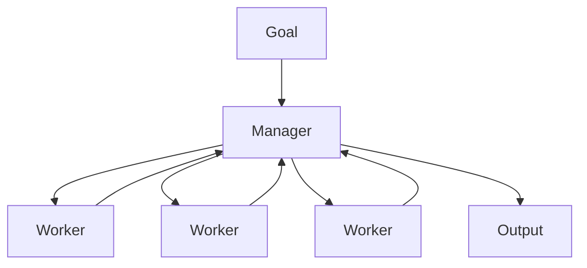

# Manager-Worker Pattern

> A manager agent decomposes work, assigns workers, monitors progress, and merges results — the default scalable multi-agent topology.

## Table of Contents

- [Overview](#overview)
- [Definition](#definition)
- [Why It Matters](#why-it-matters)
- [Uses](#uses)
- [How It Works](#how-it-works)
- [Worked Example](#worked-example)
- [Python Examples](#python-examples)
- [Production Considerations](#production-considerations)
- [Performance Considerations](#performance-considerations)
- [Cost Considerations](#cost-considerations)
- [Security Considerations](#security-considerations)
- [Best Practices](#best-practices)
- [Common Mistakes](#common-mistakes)
- [Interview Preparation](#interview-preparation)
- [Navigation](#navigation)

---

## Overview

This lesson covers **Manager-Worker Pattern** inside the `coordination` section of the `multi-agent-systems` handbook. Treat it as production engineering guidance: clear definitions, when to apply the idea, system shape, and code you can adapt.

---

## Definition

**Manager-Worker Pattern** — A manager agent decomposes work, assigns workers, monitors progress, and merges results — the default scalable multi-agent topology.

---

## Why It Matters

Manager-worker mirrors how human teams scale. It centralizes policy and budgets while workers stay specialized and replaceable.

Without a clear model for this topic, teams ship demos that fail under load, cost, or correctness pressure.

---

## Uses

| Use case | How this applies |
|----------|------------------|
| Research | Manager assigns query clusters |
| Coding | Manager owns PR; workers edit modules |
| Support | Manager triages; specialists resolve |
| Data labeling | Manager samples; workers label |

---

## How It Works

Manager owns budgets, retries, and merge logic. Workers should be pure functions of their assignment + tools. Avoid workers chatting laterally unless the pattern explicitly allows it.



---

## Worked Example

ETL incident: manager assigns log slice workers, merges anomalies, decides restart vs escalate.

---

## Python Examples

```python
from dataclasses import dataclass, field
from concurrent.futures import ThreadPoolExecutor, as_completed
from typing import Callable, Any

@dataclass
class Assignment:
    id: str
    payload: dict
    worker: str

@dataclass
class ManagerState:
    goal: str
    assignments: list[Assignment] = field(default_factory=list)
    results: dict[str, Any] = field(default_factory=dict)
    budget_left: float = 5.0

def decompose(goal: str) -> list[dict]:
    # Placeholder: real systems use planner LLM + rules
    return [{"shard": i, "goal": goal} for i in range(3)]

def manager_run(
    goal: str,
    workers: dict[str, Callable[[dict], Any]],
    cost_per_task: float = 0.2,
    max_workers: int = 3,
) -> dict:
    state = ManagerState(goal=goal)
    shards = decompose(goal)
    names = list(workers.keys())
    for i, shard in enumerate(shards):
        if state.budget_left < cost_per_task:
            break
        a = Assignment(id=f"a{i}", payload=shard, worker=names[i % len(names)])
        state.assignments.append(a)
        state.budget_left -= cost_per_task
    with ThreadPoolExecutor(max_workers=max_workers) as pool:
        futs = {
            pool.submit(workers[a.worker], a.payload): a.id for a in state.assignments
        }
        for fut in as_completed(futs):
            state.results[futs[fut]] = fut.result()
    return {"goal": goal, "results": state.results, "budget_left": state.budget_left}

```

---

## Production Considerations

- Log request IDs across orchestration steps.
- Fail closed on auth and policy; degrade only where product explicitly allows it.
- Keep feature flags for prompt/model swaps.

## Performance Considerations

- Bound concurrency to the model provider.
- Stream when UX needs time-to-first-token.
- Cache stable sub-results carefully with invalidation rules.

## Cost Considerations

- Track tokens and tool calls per feature / tenant.
- Prefer smaller models for routers and classifiers.
- Cap max tokens and tool-loop iterations.

## Security Considerations

- Never put secrets in prompts.
- Treat model output as untrusted until validated.
- Enforce tenant isolation on retrieval and tools.

---

## Best Practices

1. Start from a strong single agent; split only with measured gains.
2. Define message schemas and ownership of shared state.
3. Cap debate rounds and worker fan-out hard.
4. Measure team cost and latency, not just final quality.
5. Keep a collapse-to-single-agent feature flag.

---

## Common Mistakes

- Spawning agents because the framework makes it easy.
- No owner for conflicts on the blackboard.
- Unbounded debate that never converges.
- Duplicating the same retrieval across workers.
- Missing deadlock and cost-blowup monitors.

---

## Interview Preparation

**Q: When does multi-agent help?**

A: When specialization, parallelism, or critique measurably improves quality/latency enough to pay coordination cost — proven against a single-agent baseline.

**Q: What are common failure modes?**

A: Deadlocks, infinite critique loops, cost blowups from fan-out, and inconsistent shared state without locking or ownership.

**Q: How do you evaluate a multi-agent system?**

A: Joint task success, trajectory/team traces, cost per success, contention metrics, and ablation vs single agent on the same suite.

---

## Navigation

- **Section hub:** [README](README.md)
- **Topic hub:** [../README.md](../README.md)
