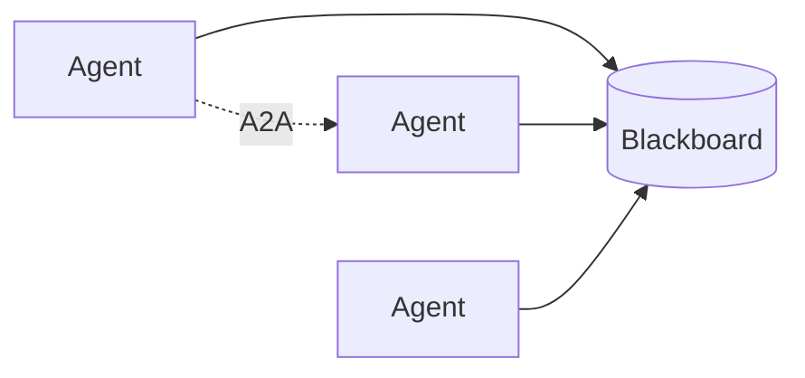

# Blackboard and Agent-to-Agent (A2A)

> Shared blackboard memory versus direct agent-to-agent protocols — when to post artifacts to a common store vs send point-to-point messages.

## Table of Contents

- [Overview](#overview)
- [Definition](#definition)
- [Why It Matters](#why-it-matters)
- [Uses](#uses)
- [How It Works](#how-it-works)
- [Worked Example](#worked-example)
- [Python Examples](#python-examples)
- [Production Considerations](#production-considerations)
- [Performance Considerations](#performance-considerations)
- [Cost Considerations](#cost-considerations)
- [Security Considerations](#security-considerations)
- [Best Practices](#best-practices)
- [Common Mistakes](#common-mistakes)
- [Interview Preparation](#interview-preparation)
- [Navigation](#navigation)

---

## Overview

This lesson covers **Blackboard and Agent-to-Agent (A2A)** inside the `coordination` section of the `multi-agent-systems` handbook. Treat it as production engineering guidance: clear definitions, when to apply the idea, system shape, and code you can adapt.

---

## Definition

**Blackboard and Agent-to-Agent (A2A)** — Shared blackboard memory versus direct agent-to-agent protocols — when to post artifacts to a common store vs send point-to-point messages.

---

## Why It Matters

Communication topology determines coupling. Blackboards help asynchronous specialists; A2A helps negotiated handoffs — both need schemas and auth.

Without a clear model for this topic, teams ship demos that fail under load, cost, or correctness pressure.

---

## Uses

| Use case | How this applies |
|----------|------------------|
| Blackboard | Async specialists contributing hypotheses |
| A2A | Explicit handoff with acknowledgements |
| Hybrid | Blackboard for artifacts; A2A for control |
| Cross-org | A2A with signed capability tokens |

---

## How It Works

Blackboard entries need types, owners, TTLs, and conflict rules. A2A messages need ids, auth, and at-least-once handling. Do not invent a second database inside prompts.



---

## Worked Example

Threat analysis: detectors post IOCs to blackboard; responder agent consumes; escalate via A2A to human-approval agent.

---

## Python Examples

```python
from dataclasses import dataclass, field
from time import time
from typing import Any
import itertools

_ids = itertools.count(1)

@dataclass
class BlackboardItem:
    id: str
    type: str
    owner: str
    payload: dict
    ts: float = field(default_factory=time)
    ttl_sec: float = 3600

@dataclass
class Blackboard:
    items: dict[str, BlackboardItem] = field(default_factory=dict)

    def post(self, type: str, owner: str, payload: dict) -> str:
        iid = f"bb-{next(_ids)}"
        self.items[iid] = BlackboardItem(iid, type, owner, payload)
        return iid

    def read(self, type: str | None = None) -> list[BlackboardItem]:
        now = time()
        out = []
        for it in self.items.values():
            if now - it.ts > it.ttl_sec:
                continue
            if type and it.type != type:
                continue
            out.append(it)
        return out

@dataclass
class A2AMessage:
    id: str
    from_agent: str
    to_agent: str
    intent: str
    body: dict
    ack: bool = False

class A2ABus:
    def __init__(self):
        self.queue: list[A2AMessage] = []

    def send(self, msg: A2AMessage) -> None:
        self.queue.append(msg)

    def recv(self, agent: str) -> list[A2AMessage]:
        return [m for m in self.queue if m.to_agent == agent and not m.ack]

    def acknowledge(self, msg_id: str) -> None:
        for m in self.queue:
            if m.id == msg_id:
                m.ack = True

```

---

## Production Considerations

- Log request IDs across orchestration steps.
- Fail closed on auth and policy; degrade only where product explicitly allows it.
- Keep feature flags for prompt/model swaps.

## Performance Considerations

- Bound concurrency to the model provider.
- Stream when UX needs time-to-first-token.
- Cache stable sub-results carefully with invalidation rules.

## Cost Considerations

- Track tokens and tool calls per feature / tenant.
- Prefer smaller models for routers and classifiers.
- Cap max tokens and tool-loop iterations.

## Security Considerations

- Never put secrets in prompts.
- Treat model output as untrusted until validated.
- Enforce tenant isolation on retrieval and tools.

---

## Best Practices

1. Start from a strong single agent; split only with measured gains.
2. Define message schemas and ownership of shared state.
3. Cap debate rounds and worker fan-out hard.
4. Measure team cost and latency, not just final quality.
5. Keep a collapse-to-single-agent feature flag.

---

## Common Mistakes

- Spawning agents because the framework makes it easy.
- No owner for conflicts on the blackboard.
- Unbounded debate that never converges.
- Duplicating the same retrieval across workers.
- Missing deadlock and cost-blowup monitors.

---

## Interview Preparation

**Q: When does multi-agent help?**

A: When specialization, parallelism, or critique measurably improves quality/latency enough to pay coordination cost — proven against a single-agent baseline.

**Q: What are common failure modes?**

A: Deadlocks, infinite critique loops, cost blowups from fan-out, and inconsistent shared state without locking or ownership.

**Q: How do you evaluate a multi-agent system?**

A: Joint task success, trajectory/team traces, cost per success, contention metrics, and ablation vs single agent on the same suite.

---

## Navigation

- **Section hub:** [README](README.md)
- **Topic hub:** [../README.md](../README.md)
