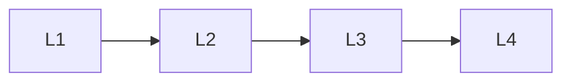

# Coordination

> Section of the **multi-agent-systems** handbook.

## Lessons

| # | Lesson |
|---|--------|
| 1 | [Coordination Patterns](01-coordination-patterns.md) |
| 2 | [Debate and Critique](02-debate-and-critique.md) |
| 3 | [Manager-Worker Pattern](03-manager-worker.md) |
| 4 | [Blackboard and Agent-to-Agent (A2A)](04-blackboard-and-a2a.md) |

**Topic hub:** [../README.md](../README.md)
