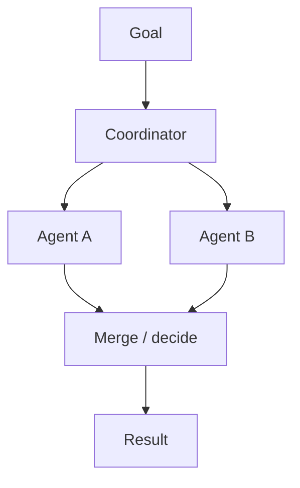

# Multi-Agent Fundamentals

> Systems where multiple LLM (or hybrid) agents with distinct roles collaborate via messages, shared memory, or a coordinator to complete tasks.

## Table of Contents

- [Overview](#overview)
- [Definition](#definition)
- [Why It Matters](#why-it-matters)
- [Uses](#uses)
- [How It Works](#how-it-works)
- [Worked Example](#worked-example)
- [Python Examples](#python-examples)
- [Production Considerations](#production-considerations)
- [Performance Considerations](#performance-considerations)
- [Cost Considerations](#cost-considerations)
- [Security Considerations](#security-considerations)
- [Best Practices](#best-practices)
- [Common Mistakes](#common-mistakes)
- [Interview Preparation](#interview-preparation)
- [Navigation](#navigation)

---

## Overview

This lesson covers **Multi-Agent Fundamentals** inside the `foundations` section of the `multi-agent-systems` handbook. Treat it as production engineering guidance: clear definitions, when to apply the idea, system shape, and code you can adapt.

---

## Definition

**Multi-Agent Fundamentals** — Systems where multiple LLM (or hybrid) agents with distinct roles collaborate via messages, shared memory, or a coordinator to complete tasks.

---

## Why It Matters

Multi-agent designs multiply cost and failure modes. Fundamentals — roles, communication, and joint goals — keep the pattern intentional rather than accidental complexity.

Without a clear model for this topic, teams ship demos that fail under load, cost, or correctness pressure.

---

## Uses

| Use case | How this applies |
|----------|------------------|
| Specialization | Researcher + writer + critic |
| Parallelism | Fan-out workers on shards |
| Separation of duties | Planner vs executor vs verifier |
| Org simulation | Role-play for complex workflows |

---

## How It Works

An agent is a role with tools, memory scope, and a contract. Multi-agent means composing roles with an explicit coordination mechanism. Without contracts you have a chat room, not a system.



---

## Worked Example

Content pipeline: Researcher gathers sources, Writer drafts, Critic checks claims. Coordinator merges only if critic score ≥ threshold.

---

## Python Examples

```python
from dataclasses import dataclass, field
from typing import Any, Callable

@dataclass
class AgentSpec:
    name: str
    role: str
    tools: list[str]
    system_prompt: str

@dataclass
class Message:
    sender: str
    recipient: str  # or "broadcast"
    type: str
    payload: dict

@dataclass
class Team:
    agents: dict[str, AgentSpec]
    inbox: list[Message] = field(default_factory=list)

    def send(self, msg: Message) -> None:
        self.inbox.append(msg)

def run_role(spec: AgentSpec, context: dict, llm: Callable) -> dict:
    return llm({
        "system": spec.system_prompt,
        "role": spec.role,
        "tools": spec.tools,
        "context": context,
    })

def fundamental_loop(team: Team, goal: str, coordinator: str, max_rounds: int, llm) -> Any:
    ctx = {"goal": goal, "artifacts": {}}
    for _ in range(max_rounds):
        for name, spec in team.agents.items():
            if name == coordinator:
                continue
            out = run_role(spec, ctx, llm)
            ctx["artifacts"][name] = out
            team.send(Message(name, coordinator, "result", out))
        decision = run_role(team.agents[coordinator], ctx, llm)
        if decision.get("done"):
            return decision.get("result")
        ctx["coordinator_notes"] = decision.get("notes", "")
    return {"error": "max_rounds"}

```

---

## Production Considerations

- Log request IDs across orchestration steps.
- Fail closed on auth and policy; degrade only where product explicitly allows it.
- Keep feature flags for prompt/model swaps.

## Performance Considerations

- Bound concurrency to the model provider.
- Stream when UX needs time-to-first-token.
- Cache stable sub-results carefully with invalidation rules.

## Cost Considerations

- Track tokens and tool calls per feature / tenant.
- Prefer smaller models for routers and classifiers.
- Cap max tokens and tool-loop iterations.

## Security Considerations

- Never put secrets in prompts.
- Treat model output as untrusted until validated.
- Enforce tenant isolation on retrieval and tools.

---

## Best Practices

1. Start from a strong single agent; split only with measured gains.
2. Define message schemas and ownership of shared state.
3. Cap debate rounds and worker fan-out hard.
4. Measure team cost and latency, not just final quality.
5. Keep a collapse-to-single-agent feature flag.

---

## Common Mistakes

- Spawning agents because the framework makes it easy.
- No owner for conflicts on the blackboard.
- Unbounded debate that never converges.
- Duplicating the same retrieval across workers.
- Missing deadlock and cost-blowup monitors.

---

## Interview Preparation

**Q: When does multi-agent help?**

A: When specialization, parallelism, or critique measurably improves quality/latency enough to pay coordination cost — proven against a single-agent baseline.

**Q: What are common failure modes?**

A: Deadlocks, infinite critique loops, cost blowups from fan-out, and inconsistent shared state without locking or ownership.

**Q: How do you evaluate a multi-agent system?**

A: Joint task success, trajectory/team traces, cost per success, contention metrics, and ablation vs single agent on the same suite.

---

## Navigation

- **Section hub:** [README](README.md)
- **Topic hub:** [../README.md](../README.md)
