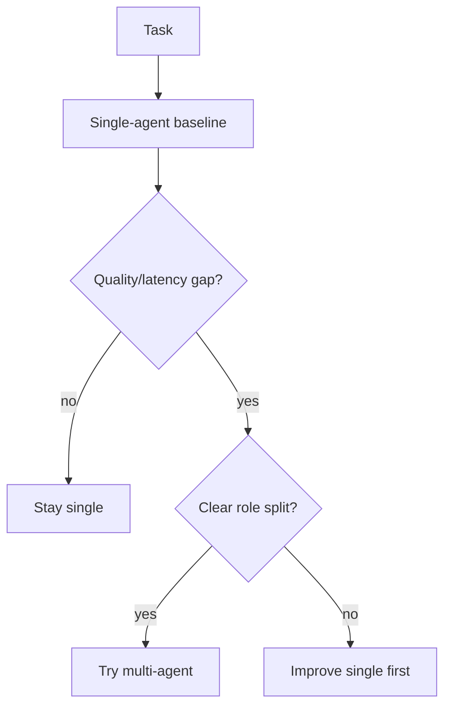

# When Multi-Agent Helps

> Decision criteria for introducing multiple agents: measurable specialization gains, parallel speedups, or critique quality that beat a tuned single agent.

## Table of Contents

- [Overview](#overview)
- [Definition](#definition)
- [Why It Matters](#why-it-matters)
- [Uses](#uses)
- [How It Works](#how-it-works)
- [Worked Example](#worked-example)
- [Python Examples](#python-examples)
- [Production Considerations](#production-considerations)
- [Performance Considerations](#performance-considerations)
- [Cost Considerations](#cost-considerations)
- [Security Considerations](#security-considerations)
- [Best Practices](#best-practices)
- [Common Mistakes](#common-mistakes)
- [Interview Preparation](#interview-preparation)
- [Navigation](#navigation)

---

## Overview

This lesson covers **When Multi-Agent Helps** inside the `foundations` section of the `multi-agent-systems` handbook. Treat it as production engineering guidance: clear definitions, when to apply the idea, system shape, and code you can adapt.

---

## Definition

**When Multi-Agent Helps** — Decision criteria for introducing multiple agents: measurable specialization gains, parallel speedups, or critique quality that beat a tuned single agent.

---

## Why It Matters

Most tasks do not need a swarm. Knowing when multi-agent helps — and when it only adds latency — protects roadmaps and budgets.

Without a clear model for this topic, teams ship demos that fail under load, cost, or correctness pressure.

---

## Uses

| Use case | How this applies |
|----------|------------------|
| Heterogeneous skills | Different tools/prompts per role |
| Embarrassingly parallel | Shard documents or tickets |
| Adversarial QA | Independent critic improves precision |
| Org constraints | Compliance requires separation of duties |

---

## How It Works

Require an ablation: single agent with same total token budget vs team. Multi-agent wins only if success↑ or latency↓ at acceptable cost↑.



---

## Worked Example

Summarizing 200 contracts: parallel workers cut wall-clock 6×; critic role cuts hallucinated clauses 40% vs single agent at equal spend.

---

## Python Examples

```python
from dataclasses import dataclass

@dataclass
class AblationResult:
    mode: str
    success: float
    latency_s: float
    usd: float

def multi_agent_helps(single: AblationResult, multi: AblationResult,
                      min_success_lift: float = 0.05,
                      max_cost_ratio: float = 2.5,
                      min_latency_ratio: float = 0.7) -> tuple[bool, str]:
    if multi.success < single.success + min_success_lift and multi.latency_s > single.latency_s * min_latency_ratio:
        return False, "no_quality_or_speed_win"
    if multi.usd > single.usd * max_cost_ratio:
        return False, "cost_too_high"
    if multi.success >= single.success + min_success_lift:
        return True, "quality_win"
    if multi.latency_s <= single.latency_s * min_latency_ratio and multi.success >= single.success - 0.01:
        return True, "speed_win"
    return False, "marginal"

def role_split_clear(roles: list[str], shared_tools_ratio: float) -> bool:
    return len(roles) >= 2 and shared_tools_ratio < 0.6

```

---

## Production Considerations

- Log request IDs across orchestration steps.
- Fail closed on auth and policy; degrade only where product explicitly allows it.
- Keep feature flags for prompt/model swaps.

## Performance Considerations

- Bound concurrency to the model provider.
- Stream when UX needs time-to-first-token.
- Cache stable sub-results carefully with invalidation rules.

## Cost Considerations

- Track tokens and tool calls per feature / tenant.
- Prefer smaller models for routers and classifiers.
- Cap max tokens and tool-loop iterations.

## Security Considerations

- Never put secrets in prompts.
- Treat model output as untrusted until validated.
- Enforce tenant isolation on retrieval and tools.

---

## Best Practices

1. Start from a strong single agent; split only with measured gains.
2. Define message schemas and ownership of shared state.
3. Cap debate rounds and worker fan-out hard.
4. Measure team cost and latency, not just final quality.
5. Keep a collapse-to-single-agent feature flag.

---

## Common Mistakes

- Spawning agents because the framework makes it easy.
- No owner for conflicts on the blackboard.
- Unbounded debate that never converges.
- Duplicating the same retrieval across workers.
- Missing deadlock and cost-blowup monitors.

---

## Interview Preparation

**Q: When does multi-agent help?**

A: When specialization, parallelism, or critique measurably improves quality/latency enough to pay coordination cost — proven against a single-agent baseline.

**Q: What are common failure modes?**

A: Deadlocks, infinite critique loops, cost blowups from fan-out, and inconsistent shared state without locking or ownership.

**Q: How do you evaluate a multi-agent system?**

A: Joint task success, trajectory/team traces, cost per success, contention metrics, and ablation vs single agent on the same suite.

---

## Navigation

- **Section hub:** [README](README.md)
- **Topic hub:** [../README.md](../README.md)
