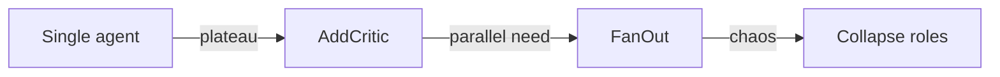

# Single vs Multi-Agent Tradeoffs

> A structured comparison of complexity, cost, latency, debuggability, and failure modes between single-agent and multi-agent designs.

## Table of Contents

- [Overview](#overview)
- [Definition](#definition)
- [Why It Matters](#why-it-matters)
- [Uses](#uses)
- [How It Works](#how-it-works)
- [Worked Example](#worked-example)
- [Python Examples](#python-examples)
- [Production Considerations](#production-considerations)
- [Performance Considerations](#performance-considerations)
- [Cost Considerations](#cost-considerations)
- [Security Considerations](#security-considerations)
- [Best Practices](#best-practices)
- [Common Mistakes](#common-mistakes)
- [Interview Preparation](#interview-preparation)
- [Navigation](#navigation)

---

## Overview

This lesson covers **Single vs Multi-Agent Tradeoffs** inside the `foundations` section of the `multi-agent-systems` handbook. Treat it as production engineering guidance: clear definitions, when to apply the idea, system shape, and code you can adapt.

---

## Definition

**Single vs Multi-Agent Tradeoffs** — A structured comparison of complexity, cost, latency, debuggability, and failure modes between single-agent and multi-agent designs.

---

## Why It Matters

Tradeoff literacy stops cargo-cult swarms. Choose deliberately and keep a rollback path to single-agent mode.

Without a clear model for this topic, teams ship demos that fail under load, cost, or correctness pressure.

---

## Uses

| Use case | How this applies |
|----------|------------------|
| Prototype | Single agent until eval plateau |
| Production scale | Multi for parallel shards |
| High-stakes | Critic agent + verifier tools |
| Tight latency | Often single with good tools |

---

## How It Works

Score candidates on: cognitive load for operators, $/success, p95 latency, and mean-time-to-debug. Multi-agent usually loses on debug until tracing is excellent.



---

## Worked Example

Support bot: single agent handles 90% intents; multi-agent only for 'billing dispute' path with investigator + policy critic.

---

## Python Examples

```python
from dataclasses import dataclass

@dataclass
class DesignScore:
    complexity: int  # 1-5
    cost: int
    latency: int
    debuggability: int  # higher better
    safety: int

def prefer_multi(s: DesignScore, m: DesignScore) -> bool:
    # Weighted: safety and success proxies matter most; complexity hurts.
    single_pts = 2*s.safety + 2*s.debuggability - s.complexity - s.cost - s.latency
    multi_pts = 2*m.safety + 2*m.debuggability - m.complexity - m.cost - m.latency
    return multi_pts > single_pts + 1

def collapse_flag(enabled_multi: bool, error_rate: float, threshold: float = 0.15) -> bool:
    """Return True if we should force single-agent mode."""
    return enabled_multi and error_rate >= threshold

ROUTING = {
    "faq": "single",
    "billing_dispute": "multi:investigator+critic",
    "password_reset": "single",
}

```

---

## Production Considerations

- Log request IDs across orchestration steps.
- Fail closed on auth and policy; degrade only where product explicitly allows it.
- Keep feature flags for prompt/model swaps.

## Performance Considerations

- Bound concurrency to the model provider.
- Stream when UX needs time-to-first-token.
- Cache stable sub-results carefully with invalidation rules.

## Cost Considerations

- Track tokens and tool calls per feature / tenant.
- Prefer smaller models for routers and classifiers.
- Cap max tokens and tool-loop iterations.

## Security Considerations

- Never put secrets in prompts.
- Treat model output as untrusted until validated.
- Enforce tenant isolation on retrieval and tools.

---

## Best Practices

1. Start from a strong single agent; split only with measured gains.
2. Define message schemas and ownership of shared state.
3. Cap debate rounds and worker fan-out hard.
4. Measure team cost and latency, not just final quality.
5. Keep a collapse-to-single-agent feature flag.

---

## Common Mistakes

- Spawning agents because the framework makes it easy.
- No owner for conflicts on the blackboard.
- Unbounded debate that never converges.
- Duplicating the same retrieval across workers.
- Missing deadlock and cost-blowup monitors.

---

## Interview Preparation

**Q: When does multi-agent help?**

A: When specialization, parallelism, or critique measurably improves quality/latency enough to pay coordination cost — proven against a single-agent baseline.

**Q: What are common failure modes?**

A: Deadlocks, infinite critique loops, cost blowups from fan-out, and inconsistent shared state without locking or ownership.

**Q: How do you evaluate a multi-agent system?**

A: Joint task success, trajectory/team traces, cost per success, contention metrics, and ablation vs single agent on the same suite.

---

## Navigation

- **Section hub:** [README](README.md)
- **Topic hub:** [../README.md](../README.md)
