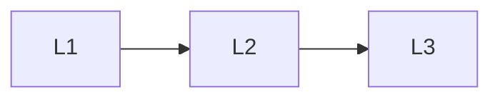

# Foundations

> Section of the **multi-agent-systems** handbook.

## Lessons

| # | Lesson |
|---|--------|
| 1 | [Multi-Agent Fundamentals](01-multi-agent-fundamentals.md) |
| 2 | [When Multi-Agent Helps](02-when-multi-agent-helps.md) |
| 3 | [Single vs Multi-Agent Tradeoffs](03-single-vs-multi.md) |

**Topic hub:** [../README.md](../README.md)
