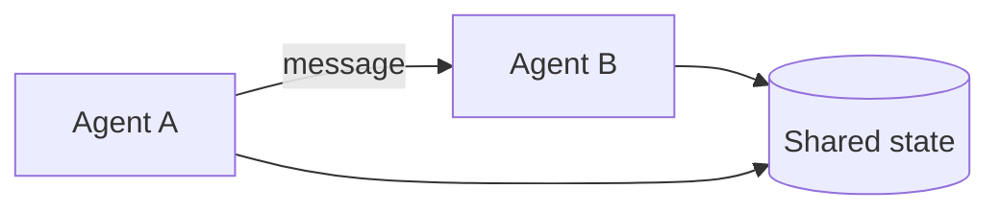

# Multi-Agent Fundamentals

> Roles, messages, shared state, and failure modes.

## Definition

A multi-agent system assigns roles (planner, researcher, executor, critic), defines message protocols, and decides what state is shared vs local. Failures include loops, contradictory actions, and cost blowups.

## Why it matters

More agents multiply tokens and coordination bugs. Fundamentals help you keep the graph small.

## How it works

## Key principles

1. **Few roles** — Start with 2–3 max.
2. **Typed messages** — Schemas over free chat between agents.
3. **Single writer for side effects** — Avoid conflicting tool calls.

## Common applications

| Application | Description |
|-------------|-------------|
| Research + writer | Content pipelines |
| Coder + reviewer | Software agents |
| Triager + specialist | Support |

## Common mistakes

- Agents debating forever without a judge/stop
- Shared writable memory with no locks/ownership

## Further reading

- [Coordination patterns](coordination-patterns.md)
- [AI Agents](../ai-agents/README.md)
