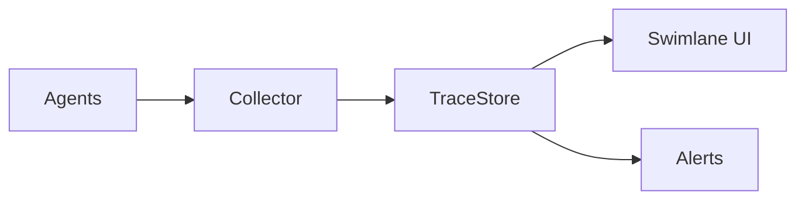

# Multi-Agent Observability

> Tracing messages, roles, handoffs, and shared-memory writes so team behavior is inspectable in production.

## Table of Contents

- [Overview](#overview)
- [Definition](#definition)
- [Why It Matters](#why-it-matters)
- [Uses](#uses)
- [How It Works](#how-it-works)
- [Worked Example](#worked-example)
- [Python Examples](#python-examples)
- [Production Considerations](#production-considerations)
- [Performance Considerations](#performance-considerations)
- [Cost Considerations](#cost-considerations)
- [Security Considerations](#security-considerations)
- [Best Practices](#best-practices)
- [Common Mistakes](#common-mistakes)
- [Interview Preparation](#interview-preparation)
- [Navigation](#navigation)

---

## Overview

This lesson covers **Multi-Agent Observability** inside the `production` section of the `multi-agent-systems` handbook. Treat it as production engineering guidance: clear definitions, when to apply the idea, system shape, and code you can adapt.

---

## Definition

**Multi-Agent Observability** — Tracing messages, roles, handoffs, and shared-memory writes so team behavior is inspectable in production.

---

## Why It Matters

You cannot operate what you cannot see. Multi-agent observability is distributed tracing applied to LLM roles.

Without a clear model for this topic, teams ship demos that fail under load, cost, or correctness pressure.

---

## Uses

| Use case | How this applies |
|----------|------------------|
| Trace grids | Swimlanes per agent |
| Message logs | Protocol envelopes |
| Cost attribution | Per role and per team |
| Failure taxonomy | Deadlock, timeout, reject |

---

## How It Works

Propagate trace_id and parent_span_id on every message. Index by run_id and tenant. Sample full prompts carefully under PII rules.



---

## Worked Example

On-call opens run_id swimlane, sees critic stuck waiting on writer ack → fixes handoff TTL.

---

## Python Examples

```python
from dataclasses import dataclass, field
from time import time
from typing import Any
import uuid

@dataclass
class Span:
    trace_id: str
    span_id: str
    parent_id: str | None
    agent: str
    name: str
    ts: float = field(default_factory=time)
    attrs: dict[str, Any] = field(default_factory=dict)
    end_ts: float | None = None

class Tracer:
    def __init__(self):
        self.spans: list[Span] = []

    def start(self, agent: str, name: str, trace_id: str | None = None,
              parent_id: str | None = None, **attrs) -> Span:
        sp = Span(
            trace_id=trace_id or str(uuid.uuid4()),
            span_id=str(uuid.uuid4()),
            parent_id=parent_id,
            agent=agent,
            name=name,
            attrs=attrs,
        )
        self.spans.append(sp)
        return sp

    def end(self, span: Span, **attrs) -> None:
        span.end_ts = time()
        span.attrs.update(attrs)

    def by_trace(self, trace_id: str) -> list[Span]:
        return [s for s in self.spans if s.trace_id == trace_id]

```

---

## Production Considerations

- Log request IDs across orchestration steps.
- Fail closed on auth and policy; degrade only where product explicitly allows it.
- Keep feature flags for prompt/model swaps.

## Performance Considerations

- Bound concurrency to the model provider.
- Stream when UX needs time-to-first-token.
- Cache stable sub-results carefully with invalidation rules.

## Cost Considerations

- Track tokens and tool calls per feature / tenant.
- Prefer smaller models for routers and classifiers.
- Cap max tokens and tool-loop iterations.

## Security Considerations

- Never put secrets in prompts.
- Treat model output as untrusted until validated.
- Enforce tenant isolation on retrieval and tools.

---

## Best Practices

1. Start from a strong single agent; split only with measured gains.
2. Define message schemas and ownership of shared state.
3. Cap debate rounds and worker fan-out hard.
4. Measure team cost and latency, not just final quality.
5. Keep a collapse-to-single-agent feature flag.

---

## Common Mistakes

- Spawning agents because the framework makes it easy.
- No owner for conflicts on the blackboard.
- Unbounded debate that never converges.
- Duplicating the same retrieval across workers.
- Missing deadlock and cost-blowup monitors.

---

## Interview Preparation

**Q: When does multi-agent help?**

A: When specialization, parallelism, or critique measurably improves quality/latency enough to pay coordination cost — proven against a single-agent baseline.

**Q: What are common failure modes?**

A: Deadlocks, infinite critique loops, cost blowups from fan-out, and inconsistent shared state without locking or ownership.

**Q: How do you evaluate a multi-agent system?**

A: Joint task success, trajectory/team traces, cost per success, contention metrics, and ablation vs single agent on the same suite.

---

## Navigation

- **Section hub:** [README](README.md)
- **Topic hub:** [../README.md](../README.md)
