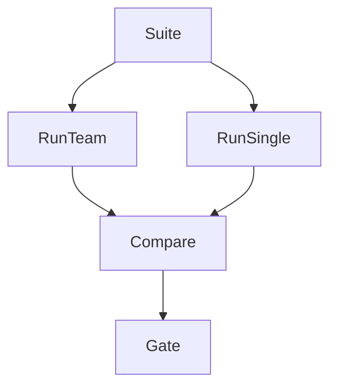

# Team Evaluation

> Evaluating multi-agent systems as a unit: joint success, ablations, contention, and role contribution analysis.

## Table of Contents

- [Overview](#overview)
- [Definition](#definition)
- [Why It Matters](#why-it-matters)
- [Uses](#uses)
- [How It Works](#how-it-works)
- [Worked Example](#worked-example)
- [Python Examples](#python-examples)
- [Production Considerations](#production-considerations)
- [Performance Considerations](#performance-considerations)
- [Cost Considerations](#cost-considerations)
- [Security Considerations](#security-considerations)
- [Best Practices](#best-practices)
- [Common Mistakes](#common-mistakes)
- [Interview Preparation](#interview-preparation)
- [Navigation](#navigation)

---

## Overview

This lesson covers **Team Evaluation** inside the `production` section of the `multi-agent-systems` handbook. Treat it as production engineering guidance: clear definitions, when to apply the idea, system shape, and code you can adapt.

---

## Definition

**Team Evaluation** — Evaluating multi-agent systems as a unit: joint success, ablations, contention, and role contribution analysis.

---

## Why It Matters

Unit-testing one agent misses emergent failure. Team evals and ablations tell you which roles earn their keep.

Without a clear model for this topic, teams ship demos that fail under load, cost, or correctness pressure.

---

## Uses

| Use case | How this applies |
|----------|------------------|
| Joint success | End-to-end task metrics |
| Ablations | Drop critic / drop worker |
| Contribution | Leave-one-out role analysis |
| Stress | High fan-out and poisoned messages |

---

## How It Works

Freeze a suite with scenarios that need coordination. Report success, $/success, steps, deadlock rate. Ship only if team beats single on agreed criteria.



---

## Worked Example

Ablation shows critic adds +8% precision at +20% cost — keep. Third researcher adds +0.5% at +40% cost — remove.

---

## Python Examples

```python
from dataclasses import dataclass

@dataclass
class TeamEvalResult:
    config: str
    success: float
    usd_per_success: float
    deadlock_rate: float

def beats_single(team: TeamEvalResult, single: TeamEvalResult,
                 min_lift: float = 0.04, max_cost_ratio: float = 2.0) -> bool:
    if team.deadlock_rate > 0.01:
        return False
    if team.success < single.success + min_lift:
        return False
    if team.usd_per_success > single.usd_per_success * max_cost_ratio:
        return False
    return True

def leave_one_out(full: TeamEvalResult, without: dict[str, TeamEvalResult]) -> dict[str, float]:
    return {role: full.success - res.success for role, res in without.items()}

def gate(results: list[TeamEvalResult], floors: dict) -> bool:
    latest = results[-1]
    return (
        latest.success >= floors["success"]
        and latest.deadlock_rate <= floors["deadlock_rate"]
        and latest.usd_per_success <= floors["usd_per_success"]
    )

```

---

## Production Considerations

- Log request IDs across orchestration steps.
- Fail closed on auth and policy; degrade only where product explicitly allows it.
- Keep feature flags for prompt/model swaps.

## Performance Considerations

- Bound concurrency to the model provider.
- Stream when UX needs time-to-first-token.
- Cache stable sub-results carefully with invalidation rules.

## Cost Considerations

- Track tokens and tool calls per feature / tenant.
- Prefer smaller models for routers and classifiers.
- Cap max tokens and tool-loop iterations.

## Security Considerations

- Never put secrets in prompts.
- Treat model output as untrusted until validated.
- Enforce tenant isolation on retrieval and tools.

---

## Best Practices

1. Start from a strong single agent; split only with measured gains.
2. Define message schemas and ownership of shared state.
3. Cap debate rounds and worker fan-out hard.
4. Measure team cost and latency, not just final quality.
5. Keep a collapse-to-single-agent feature flag.

---

## Common Mistakes

- Spawning agents because the framework makes it easy.
- No owner for conflicts on the blackboard.
- Unbounded debate that never converges.
- Duplicating the same retrieval across workers.
- Missing deadlock and cost-blowup monitors.

---

## Interview Preparation

**Q: When does multi-agent help?**

A: When specialization, parallelism, or critique measurably improves quality/latency enough to pay coordination cost — proven against a single-agent baseline.

**Q: What are common failure modes?**

A: Deadlocks, infinite critique loops, cost blowups from fan-out, and inconsistent shared state without locking or ownership.

**Q: How do you evaluate a multi-agent system?**

A: Joint task success, trajectory/team traces, cost per success, contention metrics, and ablation vs single agent on the same suite.

---

## Navigation

- **Section hub:** [README](README.md)
- **Topic hub:** [../README.md](../README.md)
