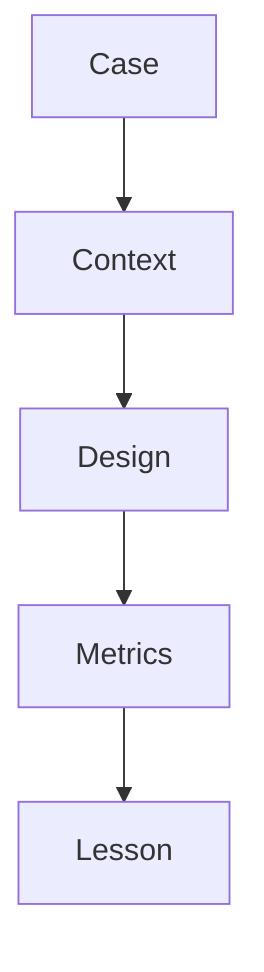

# Multi-Agent Case Studies

> Compressed case studies of multi-agent wins and failures — research teams, coding crews, and ops swarms — with lessons for production design.

## Table of Contents

- [Overview](#overview)
- [Definition](#definition)
- [Why It Matters](#why-it-matters)
- [Uses](#uses)
- [How It Works](#how-it-works)
- [Worked Example](#worked-example)
- [Python Examples](#python-examples)
- [Production Considerations](#production-considerations)
- [Performance Considerations](#performance-considerations)
- [Cost Considerations](#cost-considerations)
- [Security Considerations](#security-considerations)
- [Best Practices](#best-practices)
- [Common Mistakes](#common-mistakes)
- [Interview Preparation](#interview-preparation)
- [Navigation](#navigation)

---

## Overview

This lesson covers **Multi-Agent Case Studies** inside the `production` section of the `multi-agent-systems` handbook. Treat it as production engineering guidance: clear definitions, when to apply the idea, system shape, and code you can adapt.

---

## Definition

**Multi-Agent Case Studies** — Compressed case studies of multi-agent wins and failures — research teams, coding crews, and ops swarms — with lessons for production design.

---

## Why It Matters

Patterns stick better as stories with metrics. Case studies encode when to copy a topology and when to walk away.

Without a clear model for this topic, teams ship demos that fail under load, cost, or correctness pressure.

---

## Uses

| Use case | How this applies |
|----------|------------------|
| Win: parallel research | Wall-clock cut with citation merge |
| Win: critic gate | Precision up on claims |
| Fail: chat room | No owner, cost explosion |
| Fail: recursive spawn | Wallet melt in one hour |

---

## How It Works

For each case capture: baseline, topology, budgets, metrics, failure mode, and decision (keep/iterate/collapse). Reuse as design review checklist.



---

## Worked Example

Startup coding crew of 5 agents shipped broken PRs; collapsed to manager + 1 worker + tests; merge rate recovered.

---

## Python Examples

```python
from dataclasses import dataclass

@dataclass
class CaseStudy:
    name: str
    topology: str
    baseline_success: float
    team_success: float
    cost_ratio: float
    failure_mode: str
    decision: str  # keep|iterate|collapse

CASES = [
    CaseStudy("parallel_research", "cw", 0.72, 0.81, 1.6, "none", "keep"),
    CaseStudy("critic_gate", "debate", 0.80, 0.88, 1.3, "none", "keep"),
    CaseStudy("chat_room", "peer_mesh", 0.70, 0.68, 4.2, "no_owner", "collapse"),
    CaseStudy("recursive_spawn", "hierarchy", 0.75, 0.74, 12.0, "wallet_melt", "collapse"),
]

def lessons(cases: list[CaseStudy]) -> list[str]:
    out = []
    for c in cases:
        if c.decision == "collapse":
            out.append(f"{c.name}: collapse due to {c.failure_mode}")
        elif c.team_success - c.baseline_success >= 0.05 and c.cost_ratio <= 2:
            out.append(f"{c.name}: keep — solid lift at sane cost")
        else:
            out.append(f"{c.name}: iterate — marginal economics")
    return out

def review_checklist(c: CaseStudy) -> list[str]:
    return [
        "single baseline recorded",
        "team budget enforced",
        "deadlock watchdog on",
        f"topology={c.topology} justified",
        "collapse flag ready",
    ]

```

---

## Production Considerations

- Log request IDs across orchestration steps.
- Fail closed on auth and policy; degrade only where product explicitly allows it.
- Keep feature flags for prompt/model swaps.

## Performance Considerations

- Bound concurrency to the model provider.
- Stream when UX needs time-to-first-token.
- Cache stable sub-results carefully with invalidation rules.

## Cost Considerations

- Track tokens and tool calls per feature / tenant.
- Prefer smaller models for routers and classifiers.
- Cap max tokens and tool-loop iterations.

## Security Considerations

- Never put secrets in prompts.
- Treat model output as untrusted until validated.
- Enforce tenant isolation on retrieval and tools.

---

## Best Practices

1. Start from a strong single agent; split only with measured gains.
2. Define message schemas and ownership of shared state.
3. Cap debate rounds and worker fan-out hard.
4. Measure team cost and latency, not just final quality.
5. Keep a collapse-to-single-agent feature flag.

---

## Common Mistakes

- Spawning agents because the framework makes it easy.
- No owner for conflicts on the blackboard.
- Unbounded debate that never converges.
- Duplicating the same retrieval across workers.
- Missing deadlock and cost-blowup monitors.

---

## Interview Preparation

**Q: When does multi-agent help?**

A: When specialization, parallelism, or critique measurably improves quality/latency enough to pay coordination cost — proven against a single-agent baseline.

**Q: What are common failure modes?**

A: Deadlocks, infinite critique loops, cost blowups from fan-out, and inconsistent shared state without locking or ownership.

**Q: How do you evaluate a multi-agent system?**

A: Joint task success, trajectory/team traces, cost per success, contention metrics, and ablation vs single agent on the same suite.

---

## Navigation

- **Section hub:** [README](README.md)
- **Topic hub:** [../README.md](../README.md)
