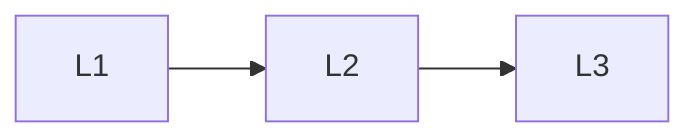

# Production

> Section of the **multi-agent-systems** handbook.

## Lessons

| # | Lesson |
|---|--------|
| 1 | [Multi-Agent Observability](01-observability.md) |
| 2 | [Team Evaluation](02-team-eval.md) |
| 3 | [Multi-Agent Case Studies](03-case-studies.md) |

**Topic hub:** [../README.md](../README.md)
