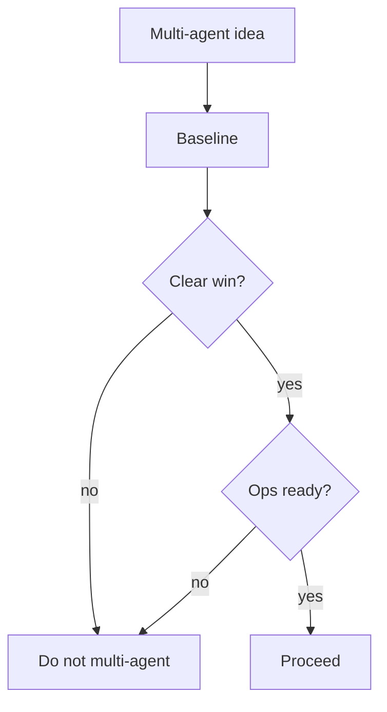

# When Not to Multi-Agent

> Anti-patterns and stop conditions: when multi-agent adds cost and failure without quality gains — prefer single-agent or deterministic workflows.

## Table of Contents

- [Overview](#overview)
- [Definition](#definition)
- [Why It Matters](#why-it-matters)
- [Uses](#uses)
- [How It Works](#how-it-works)
- [Worked Example](#worked-example)
- [Python Examples](#python-examples)
- [Production Considerations](#production-considerations)
- [Performance Considerations](#performance-considerations)
- [Cost Considerations](#cost-considerations)
- [Security Considerations](#security-considerations)
- [Best Practices](#best-practices)
- [Common Mistakes](#common-mistakes)
- [Interview Preparation](#interview-preparation)
- [Navigation](#navigation)

---

## Overview

This lesson covers **When Not to Multi-Agent** inside the `reliability` section of the `multi-agent-systems` handbook. Treat it as production engineering guidance: clear definitions, when to apply the idea, system shape, and code you can adapt.

---

## Definition

**When Not to Multi-Agent** — Anti-patterns and stop conditions: when multi-agent adds cost and failure without quality gains — prefer single-agent or deterministic workflows.

---

## Why It Matters

Saying no is a reliability feature. Many multi-agent incidents are design mistakes that a single well-tooled agent would avoid.

Without a clear model for this topic, teams ship demos that fail under load, cost, or correctness pressure.

---

## Uses

| Use case | How this applies |
|----------|------------------|
| Simple CRUD | Deterministic API workflow |
| Tight p95 | Coordination latency hurts |
| Weak evals | Cannot measure team gain |
| Tiny traffic | Ops cost of swarm unjustified |

---

## How It Works

Default to single agent + tools + good retrieval. Add agents only after a written justification and ablation. Collapse when online metrics regress.



---

## Worked Example

Password reset 'agent team' replaced by single agent calling auth APIs — fewer errors, half the cost.

---

## Python Examples

```python
from dataclasses import dataclass

@dataclass
class MultiAgentProposal:
    has_single_baseline: bool
    measured_lift: float
    p95_latency_ms: float
    team_trace_ready: bool
    oncall_trained: bool

def should_not_multi(p: MultiAgentProposal) -> list[str]:
    reasons = []
    if not p.has_single_baseline:
        reasons.append("no_baseline")
    if p.measured_lift < 0.03:
        reasons.append("lift_too_small")
    if p.p95_latency_ms > 8000:
        reasons.append("latency_budget")
    if not p.team_trace_ready:
        reasons.append("no_observability")
    if not p.oncall_trained:
        reasons.append("ops_not_ready")
    return reasons

def force_single(feature_flag_multi: bool, reasons: list[str]) -> bool:
    return (not feature_flag_multi) or bool(reasons)

```

---

## Production Considerations

- Log request IDs across orchestration steps.
- Fail closed on auth and policy; degrade only where product explicitly allows it.
- Keep feature flags for prompt/model swaps.

## Performance Considerations

- Bound concurrency to the model provider.
- Stream when UX needs time-to-first-token.
- Cache stable sub-results carefully with invalidation rules.

## Cost Considerations

- Track tokens and tool calls per feature / tenant.
- Prefer smaller models for routers and classifiers.
- Cap max tokens and tool-loop iterations.

## Security Considerations

- Never put secrets in prompts.
- Treat model output as untrusted until validated.
- Enforce tenant isolation on retrieval and tools.

---

## Best Practices

1. Start from a strong single agent; split only with measured gains.
2. Define message schemas and ownership of shared state.
3. Cap debate rounds and worker fan-out hard.
4. Measure team cost and latency, not just final quality.
5. Keep a collapse-to-single-agent feature flag.

---

## Common Mistakes

- Spawning agents because the framework makes it easy.
- No owner for conflicts on the blackboard.
- Unbounded debate that never converges.
- Duplicating the same retrieval across workers.
- Missing deadlock and cost-blowup monitors.

---

## Interview Preparation

**Q: When does multi-agent help?**

A: When specialization, parallelism, or critique measurably improves quality/latency enough to pay coordination cost — proven against a single-agent baseline.

**Q: What are common failure modes?**

A: Deadlocks, infinite critique loops, cost blowups from fan-out, and inconsistent shared state without locking or ownership.

**Q: How do you evaluate a multi-agent system?**

A: Joint task success, trajectory/team traces, cost per success, contention metrics, and ablation vs single agent on the same suite.

---

## Navigation

- **Section hub:** [README](README.md)
- **Topic hub:** [../README.md](../README.md)
