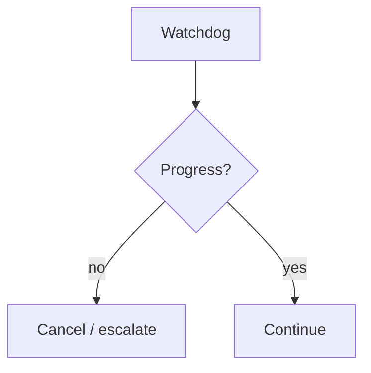

# Deadlocks and Loops

> Detecting and breaking circular waits, endless critique cycles, and agents waiting on each other without progress.

## Table of Contents

- [Overview](#overview)
- [Definition](#definition)
- [Why It Matters](#why-it-matters)
- [Uses](#uses)
- [How It Works](#how-it-works)
- [Worked Example](#worked-example)
- [Python Examples](#python-examples)
- [Production Considerations](#production-considerations)
- [Performance Considerations](#performance-considerations)
- [Cost Considerations](#cost-considerations)
- [Security Considerations](#security-considerations)
- [Best Practices](#best-practices)
- [Common Mistakes](#common-mistakes)
- [Interview Preparation](#interview-preparation)
- [Navigation](#navigation)

---

## Overview

This lesson covers **Deadlocks and Loops** inside the `reliability` section of the `multi-agent-systems` handbook. Treat it as production engineering guidance: clear definitions, when to apply the idea, system shape, and code you can adapt.

---

## Definition

**Deadlocks and Loops** — Detecting and breaking circular waits, endless critique cycles, and agents waiting on each other without progress.

---

## Why It Matters

Multi-agent systems deadlock like distributed systems. Without detectors, runs hang until budgets expire — or forever if budgets are missing.

Without a clear model for this topic, teams ship demos that fail under load, cost, or correctness pressure.

---

## Uses

| Use case | How this applies |
|----------|------------------|
| Circular wait | A waits on B waits on A |
| Critique loop | Endless revise without score gain |
| Ack starvation | Handoff never accepted |
| Tool ping-pong | Agents re-call same tools |

---

## How It Works

Track waits and identical message fingerprints. Use timeouts on handoffs. Break loops by escalating to coordinator or human with a compact trace.



---

## Worked Example

Critic and writer swap the same two drafts for 12 rounds; watchdog sees flat score and identical hashes → stop → return best-so-far.

---

## Python Examples

```python
from dataclasses import dataclass, field
from time import time
import hashlib

@dataclass
class WaitEdge:
    waiter: str
    waited: str
    since: float = field(default_factory=time)

@dataclass
class Watchdog:
    waits: list[WaitEdge] = field(default_factory=list)
    fingerprints: list[str] = field(default_factory=list)

    def waiting(self, waiter: str, waited: str) -> None:
        self.waits.append(WaitEdge(waiter, waited))

    def detect_cycle(self) -> bool:
        graph = {}
        for w in self.waits:
            graph.setdefault(w.waiter, set()).add(w.waited)
        seen = set()
        def dfs(n, stack):
            if n in stack:
                return True
            if n in seen:
                return False
            seen.add(n)
            stack.add(n)
            for m in graph.get(n, []):
                if dfs(m, stack):
                    return True
            stack.remove(n)
            return False
        return any(dfs(n, set()) for n in list(graph))

    def note_payload(self, payload: str) -> bool:
        fp = hashlib.sha256(payload.encode()).hexdigest()[:16]
        self.fingerprints.append(fp)
        recent = self.fingerprints[-6:]
        return len(recent) >= 4 and len(set(recent)) <= 2

def break_loop(best_so_far, reason: str) -> dict:
    return {"status": "stopped_loop", "reason": reason, "result": best_so_far}

```

---

## Production Considerations

- Log request IDs across orchestration steps.
- Fail closed on auth and policy; degrade only where product explicitly allows it.
- Keep feature flags for prompt/model swaps.

## Performance Considerations

- Bound concurrency to the model provider.
- Stream when UX needs time-to-first-token.
- Cache stable sub-results carefully with invalidation rules.

## Cost Considerations

- Track tokens and tool calls per feature / tenant.
- Prefer smaller models for routers and classifiers.
- Cap max tokens and tool-loop iterations.

## Security Considerations

- Never put secrets in prompts.
- Treat model output as untrusted until validated.
- Enforce tenant isolation on retrieval and tools.

---

## Best Practices

1. Start from a strong single agent; split only with measured gains.
2. Define message schemas and ownership of shared state.
3. Cap debate rounds and worker fan-out hard.
4. Measure team cost and latency, not just final quality.
5. Keep a collapse-to-single-agent feature flag.

---

## Common Mistakes

- Spawning agents because the framework makes it easy.
- No owner for conflicts on the blackboard.
- Unbounded debate that never converges.
- Duplicating the same retrieval across workers.
- Missing deadlock and cost-blowup monitors.

---

## Interview Preparation

**Q: When does multi-agent help?**

A: When specialization, parallelism, or critique measurably improves quality/latency enough to pay coordination cost — proven against a single-agent baseline.

**Q: What are common failure modes?**

A: Deadlocks, infinite critique loops, cost blowups from fan-out, and inconsistent shared state without locking or ownership.

**Q: How do you evaluate a multi-agent system?**

A: Joint task success, trajectory/team traces, cost per success, contention metrics, and ablation vs single agent on the same suite.

---

## Navigation

- **Section hub:** [README](README.md)
- **Topic hub:** [../README.md](../README.md)
