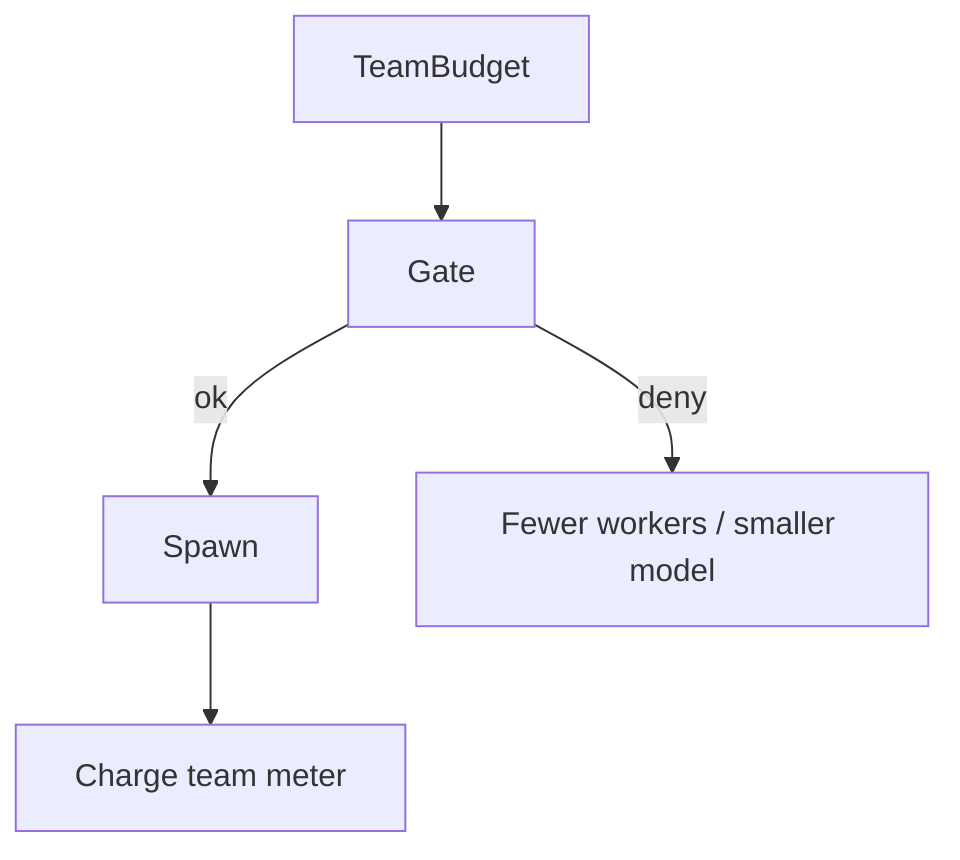

# Cost Blowups

> How fan-out, debate rounds, and recursive spawning explode spend — and the controls that keep multi-agent economics sane.

## Table of Contents

- [Overview](#overview)
- [Definition](#definition)
- [Why It Matters](#why-it-matters)
- [Uses](#uses)
- [How It Works](#how-it-works)
- [Worked Example](#worked-example)
- [Python Examples](#python-examples)
- [Production Considerations](#production-considerations)
- [Performance Considerations](#performance-considerations)
- [Cost Considerations](#cost-considerations)
- [Security Considerations](#security-considerations)
- [Best Practices](#best-practices)
- [Common Mistakes](#common-mistakes)
- [Interview Preparation](#interview-preparation)
- [Navigation](#navigation)

---

## Overview

This lesson covers **Cost Blowups** inside the `reliability` section of the `multi-agent-systems` handbook. Treat it as production engineering guidance: clear definitions, when to apply the idea, system shape, and code you can adapt.

---

## Definition

**Cost Blowups** — How fan-out, debate rounds, and recursive spawning explode spend — and the controls that keep multi-agent economics sane.

---

## Why It Matters

Cost blowups are the most common multi-agent production incident. Team-level budgets beat per-agent goodwill.

Without a clear model for this topic, teams ship demos that fail under load, cost, or correctness pressure.

---

## Uses

| Use case | How this applies |
|----------|------------------|
| Fan-out | N workers × expensive models |
| Recursive spawn | Workers creating sub-workers |
| Debate | Many rounds × long contexts |
| Retries | All workers retrying together |

---

## How It Works

Set a team wallet. Charge every child call. Forbid recursive spawn unless explicitly allowed with depth=1. Prefer smaller models for workers; reserve large models for merge/judge.



---

## Worked Example

Research team wallet $3/run; at $2.70 manager switches remaining workers to Haiku-class and skips optional critic.

---

## Python Examples

```python
from dataclasses import dataclass

@dataclass
class TeamWallet:
    max_usd: float
    spent: float = 0.0
    max_workers: int = 4
    max_depth: int = 1

    def charge(self, usd: float) -> bool:
        if self.spent + usd > self.max_usd:
            return False
        self.spent += usd
        return True

    def can_spawn(self, depth: int, current_workers: int) -> bool:
        if depth > self.max_depth:
            return False
        if current_workers >= self.max_workers:
            return False
        return self.spent < self.max_usd * 0.9

def pick_model(wallet: TeamWallet, phase: str) -> str:
    remaining = wallet.max_usd - wallet.spent
    if phase == "merge" and remaining > 0.5:
        return "large"
    if remaining < 0.4:
        return "small"
    return "medium"

def degrade(plan_workers: int, wallet: TeamWallet) -> int:
    if not wallet.can_spawn(1, 0):
        return 1
    return min(plan_workers, wallet.max_workers)

```

---

## Production Considerations

- Log request IDs across orchestration steps.
- Fail closed on auth and policy; degrade only where product explicitly allows it.
- Keep feature flags for prompt/model swaps.

## Performance Considerations

- Bound concurrency to the model provider.
- Stream when UX needs time-to-first-token.
- Cache stable sub-results carefully with invalidation rules.

## Cost Considerations

- Track tokens and tool calls per feature / tenant.
- Prefer smaller models for routers and classifiers.
- Cap max tokens and tool-loop iterations.

## Security Considerations

- Never put secrets in prompts.
- Treat model output as untrusted until validated.
- Enforce tenant isolation on retrieval and tools.

---

## Best Practices

1. Start from a strong single agent; split only with measured gains.
2. Define message schemas and ownership of shared state.
3. Cap debate rounds and worker fan-out hard.
4. Measure team cost and latency, not just final quality.
5. Keep a collapse-to-single-agent feature flag.

---

## Common Mistakes

- Spawning agents because the framework makes it easy.
- No owner for conflicts on the blackboard.
- Unbounded debate that never converges.
- Duplicating the same retrieval across workers.
- Missing deadlock and cost-blowup monitors.

---

## Interview Preparation

**Q: When does multi-agent help?**

A: When specialization, parallelism, or critique measurably improves quality/latency enough to pay coordination cost — proven against a single-agent baseline.

**Q: What are common failure modes?**

A: Deadlocks, infinite critique loops, cost blowups from fan-out, and inconsistent shared state without locking or ownership.

**Q: How do you evaluate a multi-agent system?**

A: Joint task success, trajectory/team traces, cost per success, contention metrics, and ablation vs single agent on the same suite.

---

## Navigation

- **Section hub:** [README](README.md)
- **Topic hub:** [../README.md](../README.md)
