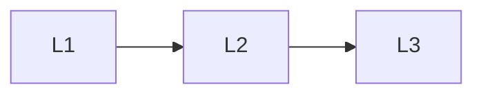

# Reliability

> Section of the **multi-agent-systems** handbook.

## Lessons

| # | Lesson |
|---|--------|
| 1 | [When Not to Multi-Agent](01-when-not-to-multi-agent.md) |
| 2 | [Deadlocks and Loops](02-deadlocks-and-loops.md) |
| 3 | [Cost Blowups](03-cost-blowups.md) |

**Topic hub:** [../README.md](../README.md)
