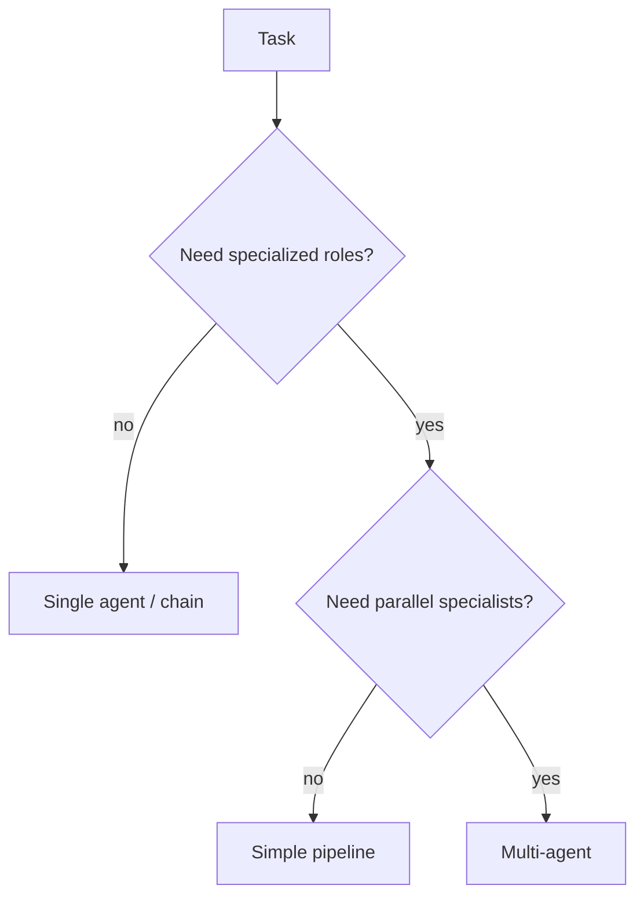

# When Not to Use Multi-Agent

> Complexity traps and simpler alternatives.

## Definition

Avoid multi-agent when a single agent with tools, a deterministic workflow, or RAG chain meets the bar. Multi-agent adds latency, cost, and failure modes that need their own eval.

## Why it matters

Hype-driven agent swarms are a leading cause of unmaintainable demos.

## How it works

## Key principles

1. **Workflows before swarms** — If steps are known, code them.
2. **Measure incremental gain** — Quality per extra $.
3. **Debugability is a feature** — Prefer inspectable graphs.

## Common applications

| Application | Description |
|-------------|-------------|
| FAQ | RAG only |
| Form filling | Structured extraction |
| Fixed ETL | Orchestrator without LLMs per stage |

## Common mistakes

- Five agents for a two-step task
- No cost dashboard on agent fan-out

## Further reading

- [LLM Application Development — orchestration](../llm-application-development/orchestration-patterns.md)
- [AI Agents](../ai-agents/README.md)
