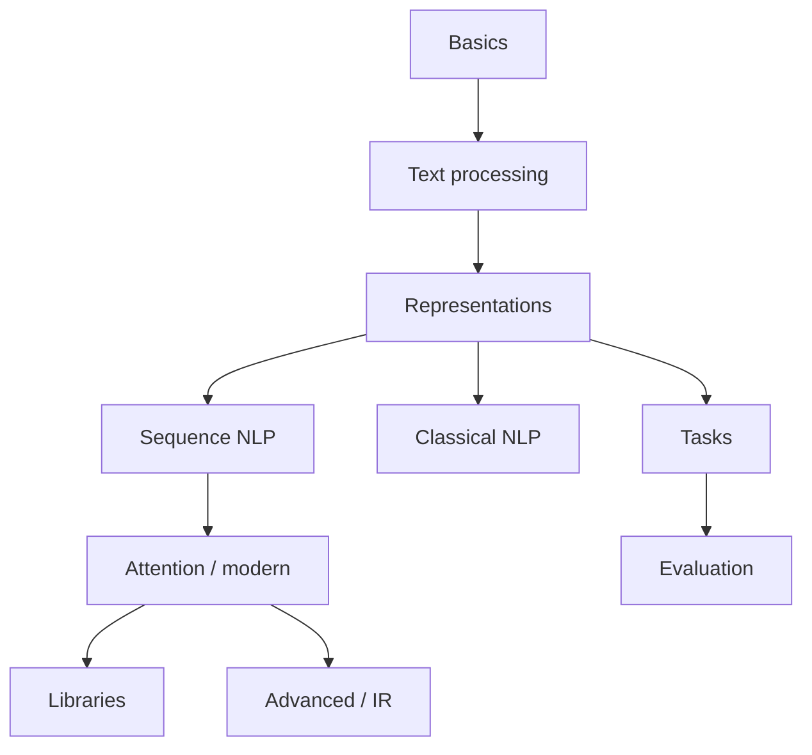

# Natural Language Processing

> Language technology curriculum — from classical text processing to attention, evaluation, and production NLP systems.

**Prerequisites:** [Deep Learning](../deep-learning/README.md) · [Machine Learning](../machine-learning/README.md)  
**Unlocks:** [Transformers](../transformers/README.md) · [Embeddings & Vector Databases](../embeddings-vector-databases/README.md) · [Large Language Models](../llm-engineering/README.md)

Lessons deepened 2026-08-12. Start with a section hub below (or expand **6. Natural Language Processing** in the left sidebar).

---

## Sections

| # | Section | What you will learn | Hub |
|---|---------|---------------------|-----|
| 1 | **NLP Basics** | Intro, representations, preprocessing, corpora | [nlp-basics/](nlp-basics/README.md) |
| 2 | **Text Processing** | Tokenize, stem/lemma, POS, NER | [text-processing/](text-processing/README.md) |
| 3 | **Text Representation** | BoW → embeddings → contextual | [text-representation/](text-representation/README.md) |
| 4 | **NLP Tasks** | Classify, translate, QA, generate | [nlp-tasks/](nlp-tasks/README.md) |
| 5 | **Classical NLP** | NB, logreg, HMM/CRF, topics | [classical-nlp/](classical-nlp/README.md) |
| 6 | **Sequence-Based NLP** | LMs, RNN/LSTM/GRU, seq2seq | [sequence-based-nlp/](sequence-based-nlp/README.md) |
| 7 | **Attention & Modern NLP** | Attention → transformers | [attention-modern-nlp/](attention-modern-nlp/README.md) |
| 8 | **NLP Libraries & Frameworks** | NLTK, spaCy, HF, Gensim, TextBlob | [nlp-libraries/](nlp-libraries/README.md) |
| 9 | **NLP Evaluation** | BLEU/ROUGE/PPL + human eval | [nlp-evaluation/](nlp-evaluation/README.md) |
| 10 | **Advanced NLP** | Multilingual, IR, RAG-ish systems | [advanced-nlp/](advanced-nlp/README.md) |

---

## Hierarchy

### 1. NLP Basics

| # | Topic |
|---|-------|
| 1 | [Introduction to NLP](nlp-basics/01-introduction-to-nlp.md) |
| 2 | [Text Representation](nlp-basics/02-text-representation.md) |
| 3 | [Text Preprocessing](nlp-basics/03-text-preprocessing.md) |
| 4 | [Text Normalization](nlp-basics/04-text-normalization.md) |
| 5 | [Corpus & Datasets](nlp-basics/05-corpus-and-datasets.md) |

### 2. Text Processing

| # | Topic |
|---|-------|
| 1 | [Tokenization](text-processing/01-tokenization.md) |
| 2 | [Stemming](text-processing/02-stemming.md) |
| 3 | [Lemmatization](text-processing/03-lemmatization.md) |
| 4 | [Stop Words](text-processing/04-stop-words.md) |
| 5 | [Regular Expressions](text-processing/05-regular-expressions.md) |
| 6 | [Sentence Segmentation](text-processing/06-sentence-segmentation.md) |
| 7 | [Part-of-Speech Tagging](text-processing/07-part-of-speech-tagging.md) |
| 8 | [Named Entity Recognition](text-processing/08-named-entity-recognition.md) |

### 3. Text Representation

| # | Topic |
|---|-------|
| 1 | [Bag of Words](text-representation/01-bag-of-words.md) |
| 2 | [N-Grams](text-representation/02-n-grams.md) |
| 3 | [TF-IDF](text-representation/03-tf-idf.md) |
| 4 | [Word Embeddings](text-representation/04-word-embeddings.md) |
| 5 | [Word2Vec](text-representation/05-word2vec.md) |
| 6 | [GloVe](text-representation/06-glove.md) |
| 7 | [FastText](text-representation/07-fasttext.md) |
| 8 | [Contextual Embeddings](text-representation/08-contextual-embeddings.md) |

### 4. NLP Tasks

| # | Topic |
|---|-------|
| 1 | [Text Classification](nlp-tasks/01-text-classification.md) |
| 2 | [Sentiment Analysis](nlp-tasks/02-sentiment-analysis.md) |
| 3 | [Text Similarity](nlp-tasks/03-text-similarity.md) |
| 4 | [Text Summarization](nlp-tasks/04-text-summarization.md) |
| 5 | [Machine Translation](nlp-tasks/05-machine-translation.md) |
| 6 | [Question Answering](nlp-tasks/06-question-answering.md) |
| 7 | [Information Extraction](nlp-tasks/07-information-extraction.md) |
| 8 | [Text Generation](nlp-tasks/08-text-generation.md) |

### 5. Classical NLP

| # | Topic |
|---|-------|
| 1 | [Naive Bayes for NLP](classical-nlp/01-naive-bayes-for-nlp.md) |
| 2 | [Logistic Regression for NLP](classical-nlp/02-logistic-regression-for-nlp.md) |
| 3 | [HMM](classical-nlp/03-hmm.md) |
| 4 | [Conditional Random Fields](classical-nlp/04-conditional-random-fields.md) |
| 5 | [Topic Modeling](classical-nlp/05-topic-modeling.md) |
| 6 | [Latent Dirichlet Allocation](classical-nlp/06-latent-dirichlet-allocation.md) |

### 6. Sequence-Based NLP

| # | Topic |
|---|-------|
| 1 | [Language Modeling](sequence-based-nlp/01-language-modeling.md) |
| 2 | [RNN for NLP](sequence-based-nlp/02-rnn-for-nlp.md) |
| 3 | [LSTM for NLP](sequence-based-nlp/03-lstm-for-nlp.md) |
| 4 | [GRU for NLP](sequence-based-nlp/04-gru-for-nlp.md) |
| 5 | [Sequence-to-Sequence Models](sequence-based-nlp/05-sequence-to-sequence-models.md) |
| 6 | [Encoder-Decoder Architecture](sequence-based-nlp/06-encoder-decoder-architecture.md) |

### 7. Attention & Modern NLP

| # | Topic |
|---|-------|
| 1 | [Attention Mechanism](attention-modern-nlp/01-attention-mechanism.md) |
| 2 | [Self-Attention](attention-modern-nlp/02-self-attention.md) |
| 3 | [Cross-Attention](attention-modern-nlp/03-cross-attention.md) |
| 4 | [Transformer Architecture](attention-modern-nlp/04-transformer-architecture.md) |
| 5 | [Positional Encoding](attention-modern-nlp/05-positional-encoding.md) |

### 8. NLP Libraries & Frameworks

| # | Topic |
|---|-------|
| 1 | [NLTK](nlp-libraries/01-nltk.md) |
| 2 | [spaCy](nlp-libraries/02-spacy.md) |
| 3 | [Hugging Face](nlp-libraries/03-hugging-face.md) |
| 4 | [Gensim](nlp-libraries/04-gensim.md) |
| 5 | [TextBlob](nlp-libraries/05-textblob.md) |

### 9. NLP Evaluation

| # | Topic |
|---|-------|
| 1 | [BLEU](nlp-evaluation/01-bleu.md) |
| 2 | [ROUGE](nlp-evaluation/02-rouge.md) |
| 3 | [METEOR](nlp-evaluation/03-meteor.md) |
| 4 | [Perplexity](nlp-evaluation/04-perplexity.md) |
| 5 | [Semantic Similarity](nlp-evaluation/05-semantic-similarity.md) |
| 6 | [Human Evaluation](nlp-evaluation/06-human-evaluation.md) |

### 10. Advanced NLP

| # | Topic |
|---|-------|
| 1 | [Multilingual NLP](advanced-nlp/01-multilingual-nlp.md) |
| 2 | [Low-Resource NLP](advanced-nlp/02-low-resource-nlp.md) |
| 3 | [Information Retrieval](advanced-nlp/03-information-retrieval.md) |
| 4 | [Semantic Search](advanced-nlp/04-semantic-search.md) |
| 5 | [Knowledge Graphs](advanced-nlp/05-knowledge-graphs.md) |
| 6 | [Question Answering Systems](advanced-nlp/06-question-answering-systems.md) |
| 7 | [NLP Pipelines](advanced-nlp/07-nlp-pipelines.md) |

---

## Definition

**Natural Language Processing (NLP)** enables computers to analyze and generate human language. This handbook covers preprocessing, representations, classical and neural methods, modern attention-based NLP, tooling, and evaluation.

---

## Reference notes (shorter overviews)

| Note | Document |
|------|----------|
| NLP landscape | [nlp-landscape.md](nlp-landscape.md) |
| Tokenization | [tokenization.md](tokenization.md) |
| Core NLP tasks | [core-nlp-tasks.md](core-nlp-tasks.md) |

---

## Related topics

- [Transformers](../transformers/README.md)
- [Large Language Models](../llm-engineering/README.md)
- [RAG](../rag/README.md)
- [Embeddings & Vector Databases](../embeddings-vector-databases/README.md)

---

## See also

- [Domains overview](../README.md)
- [Learning Roadmap](../../meta/roadmap.md)
