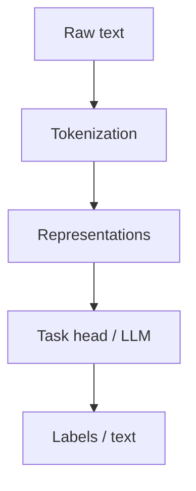

# Natural Language Processing

> How computers process human language — tokenization, representations, classic tasks, and the path to modern LLMs.

**Prerequisites:** [Deep Learning](../deep-learning/README.md)  
**Unlocks:** [Transformers](../transformers/README.md) · [Embeddings & Vector Databases](../embeddings-vector-databases/README.md)

---

## Definition

**Natural Language Processing (NLP)** is the field of enabling computers to read, understand, and generate human language. Classic tasks include classification, NER, translation, summarization, and question answering. Modern NLP is dominated by transformer language models.

---

## Learning path

---

## Documents

| # | Topic | Document |
|---|-------|----------|
| 1 | NLP landscape | [nlp-landscape.md](nlp-landscape.md) |
| 2 | Tokenization | [tokenization.md](tokenization.md) |
| 3 | Core NLP tasks | [core-nlp-tasks.md](core-nlp-tasks.md) |

---

## Related topics

- [Transformers](../transformers/README.md)
- [Embeddings & Vector Databases](../embeddings-vector-databases/README.md)
- [Prompt Engineering](../prompt-engineering/README.md)

---

## See also

- [Domains overview](../README.md)
- [Learning Roadmap](../../meta/roadmap.md)
- [Master Index](../../meta/indexes/MASTER-INDEX.md)
