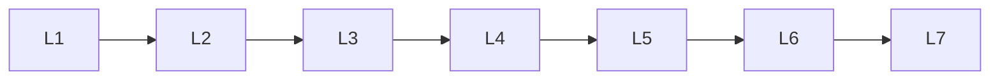

# Advanced Nlp

> Deep lessons for **Advanced Nlp** in the Natural Language Processing handbook.

## Lessons

| # | Lesson |
|---|--------|
| 1 | [Multilingual NLP](01-multilingual-nlp.md) |
| 2 | [Low-Resource NLP](02-low-resource-nlp.md) |
| 3 | [Information Retrieval](03-information-retrieval.md) |
| 4 | [Semantic Search](04-semantic-search.md) |
| 5 | [Knowledge Graphs](05-knowledge-graphs.md) |
| 6 | [Question Answering Systems](06-question-answering-systems.md) |
| 7 | [NLP Pipelines](07-nlp-pipelines.md) |

**Topic hub:** [../README.md](../README.md)
