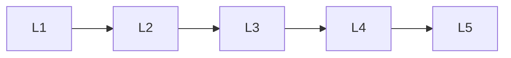

# Attention Modern Nlp

> Deep lessons for **Attention Modern Nlp** in the Natural Language Processing handbook.

## Lessons

| # | Lesson |
|---|--------|
| 1 | [Attention Mechanism](01-attention-mechanism.md) |
| 2 | [Self-Attention](02-self-attention.md) |
| 3 | [Cross-Attention](03-cross-attention.md) |
| 4 | [Transformer Architecture](04-transformer-architecture.md) |
| 5 | [Positional Encoding](05-positional-encoding.md) |

**Topic hub:** [../README.md](../README.md)
