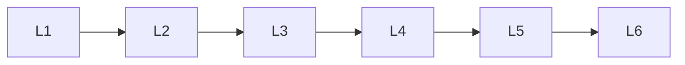

# Classical Nlp

> Deep lessons for **Classical Nlp** in the Natural Language Processing handbook.

## Lessons

| # | Lesson |
|---|--------|
| 1 | [Naive Bayes for NLP](01-naive-bayes-for-nlp.md) |
| 2 | [Logistic Regression for NLP](02-logistic-regression-for-nlp.md) |
| 3 | [HMM](03-hmm.md) |
| 4 | [Conditional Random Fields](04-conditional-random-fields.md) |
| 5 | [Topic Modeling](05-topic-modeling.md) |
| 6 | [Latent Dirichlet Allocation](06-latent-dirichlet-allocation.md) |

**Topic hub:** [../README.md](../README.md)
