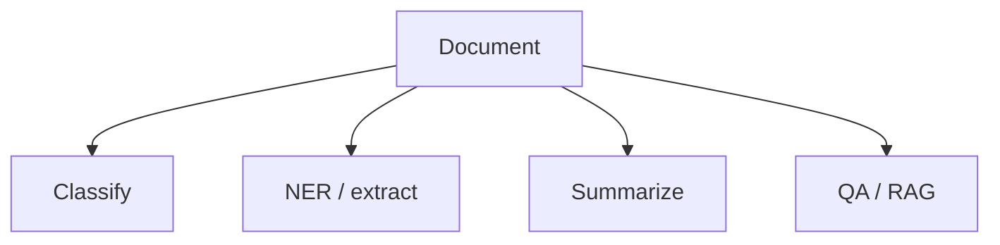

# Core NLP Tasks

> Classification, NER, summarization, translation, QA — and modern LLM formulations.

## Definition

Core NLP tasks are the recurring jobs: text classification, named entity recognition, summarization, translation, information extraction, and question answering. LLMs can perform many via prompting, but specialized models may win on cost/latency/accuracy.

## Why it matters

Product requirements map to these tasks. Naming the task clearly drives dataset, metric, and architecture choices.

## How it works

## Key principles

1. **Define span vs doc tasks** — Entity spans need different eval than doc labels.
2. **Metric match** — F1 for extraction; factuality for summaries.
3. **Hybrid systems** — LLM extract + schema validate.

## Common applications

| Application | Description |
|-------------|-------------|
| Support automation | Intent + slot filling |
| Knowledge apps | QA over docs |
| Compliance | PII NER |

## Common mistakes

- Evaluating summaries only with ROUGE when factuality matters
- No schema validation on LLM extractions

## Further reading

- [Chatbots](../chatbots/README.md)
- [RAG](../rag/README.md)
