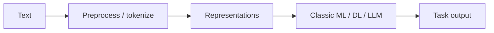

# 1. Introduction to NLP

> What NLP covers — understanding and generating language with machines.

## Definition

**Natural Language Processing (NLP)** enables computers to process, analyze, and generate human language for tasks like classification, extraction, translation, and dialogue.

## Stack today

## See also

- [Transformers](../../transformers/README.md) · [Large Language Models](../../llm-engineering/README.md)

---

## Continue

- **Section hub:** [NLP Basics](README.md)
- **Natural Language Processing overview:** [Natural Language Processing](../README.md)
