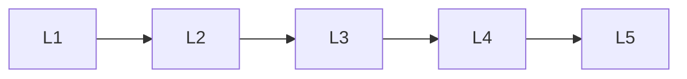

# Nlp Basics

> Deep lessons for **Nlp Basics** in the Natural Language Processing handbook.

## Lessons

| # | Lesson |
|---|--------|
| 1 | [Introduction to NLP](01-introduction-to-nlp.md) |
| 2 | [Text Representation](02-text-representation.md) |
| 3 | [Text Preprocessing](03-text-preprocessing.md) |
| 4 | [Text Normalization](04-text-normalization.md) |
| 5 | [Corpus & Datasets](05-corpus-and-datasets.md) |

**Topic hub:** [../README.md](../README.md)
