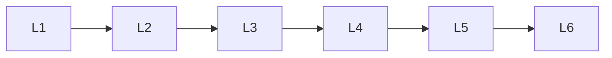

# Nlp Evaluation

> Deep lessons for **Nlp Evaluation** in the Natural Language Processing handbook.

## Lessons

| # | Lesson |
|---|--------|
| 1 | [BLEU](01-bleu.md) |
| 2 | [ROUGE](02-rouge.md) |
| 3 | [METEOR](03-meteor.md) |
| 4 | [Perplexity](04-perplexity.md) |
| 5 | [Semantic Similarity](05-semantic-similarity.md) |
| 6 | [Human Evaluation](06-human-evaluation.md) |

**Topic hub:** [../README.md](../README.md)
