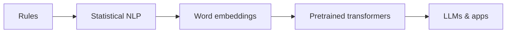

# NLP Landscape

> From rules and features to pretrained transformers — where NLP sits in AI engineering.

## Definition

NLP evolved from rule-based systems → statistical feature ML → deep pretrained models. Today, many tasks are framed as generation or embedding similarity on top of foundation models.

## Why it matters

AI engineers still need NLP literacy: tokenization quirks, evaluation metrics (BLEU/ROUGE/F1), and when a small classifier beats an LLM.

## How it works

## Key principles

1. **Right-size the model** — Not every text task needs a giant LLM.
2. **Mind evaluation** — Fluency ≠ correctness.
3. **Language is ambiguous** — Design for clarification and abstention.

## Common applications

| Application | Description |
|-------------|-------------|
| Search & retrieval | Query understanding |
| Moderation | Toxicity / PII |
| Assistants | QA and summarization |

## Common mistakes

- Using LLMs for high-throughput cheap classification without cost analysis
- Ignoring multilingual/tokenization edge cases

## Further reading

- [Core NLP tasks](core-nlp-tasks.md)
- [LLMs](../llm-engineering/README.md)
