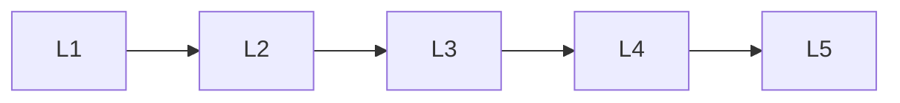

# Nlp Libraries

> Deep lessons for **Nlp Libraries** in the Natural Language Processing handbook.

## Lessons

| # | Lesson |
|---|--------|
| 1 | [NLTK](01-nltk.md) |
| 2 | [spaCy](02-spacy.md) |
| 3 | [Hugging Face](03-hugging-face.md) |
| 4 | [Gensim](04-gensim.md) |
| 5 | [TextBlob](05-textblob.md) |

**Topic hub:** [../README.md](../README.md)
