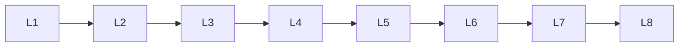

# Nlp Tasks

> Deep lessons for **Nlp Tasks** in the Natural Language Processing handbook.

## Lessons

| # | Lesson |
|---|--------|
| 1 | [Text Classification](01-text-classification.md) |
| 2 | [Sentiment Analysis](02-sentiment-analysis.md) |
| 3 | [Text Similarity](03-text-similarity.md) |
| 4 | [Text Summarization](04-text-summarization.md) |
| 5 | [Machine Translation](05-machine-translation.md) |
| 6 | [Question Answering](06-question-answering.md) |
| 7 | [Information Extraction](07-information-extraction.md) |
| 8 | [Text Generation](08-text-generation.md) |

**Topic hub:** [../README.md](../README.md)
