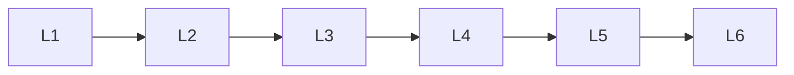

# Sequence Based Nlp

> Deep lessons for **Sequence Based Nlp** in the Natural Language Processing handbook.

## Lessons

| # | Lesson |
|---|--------|
| 1 | [Language Modeling](01-language-modeling.md) |
| 2 | [RNN for NLP](02-rnn-for-nlp.md) |
| 3 | [LSTM for NLP](03-lstm-for-nlp.md) |
| 4 | [GRU for NLP](04-gru-for-nlp.md) |
| 5 | [Sequence-to-Sequence Models](05-sequence-to-sequence-models.md) |
| 6 | [Encoder-Decoder Architecture](06-encoder-decoder-architecture.md) |

**Topic hub:** [../README.md](../README.md)
