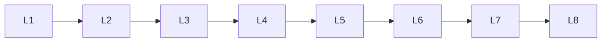

# Text Processing

> Deep lessons for **Text Processing** in the Natural Language Processing handbook.

## Lessons

| # | Lesson |
|---|--------|
| 1 | [Tokenization](01-tokenization.md) |
| 2 | [Stemming](02-stemming.md) |
| 3 | [Lemmatization](03-lemmatization.md) |
| 4 | [Stop Words](04-stop-words.md) |
| 5 | [Regular Expressions](05-regular-expressions.md) |
| 6 | [Sentence Segmentation](06-sentence-segmentation.md) |
| 7 | [Part-of-Speech Tagging](07-part-of-speech-tagging.md) |
| 8 | [Named Entity Recognition](08-named-entity-recognition.md) |

**Topic hub:** [../README.md](../README.md)
