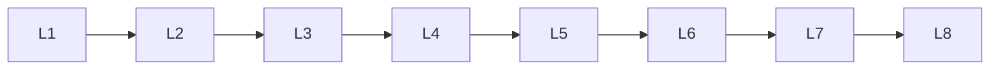

# Text Representation

> Deep lessons for **Text Representation** in the Natural Language Processing handbook.

## Lessons

| # | Lesson |
|---|--------|
| 1 | [Bag of Words](01-bag-of-words.md) |
| 2 | [N-Grams](02-n-grams.md) |
| 3 | [TF-IDF](03-tf-idf.md) |
| 4 | [Word Embeddings](04-word-embeddings.md) |
| 5 | [Word2Vec](05-word2vec.md) |
| 6 | [GloVe](06-glove.md) |
| 7 | [FastText](07-fasttext.md) |
| 8 | [Contextual Embeddings](08-contextual-embeddings.md) |

**Topic hub:** [../README.md](../README.md)
