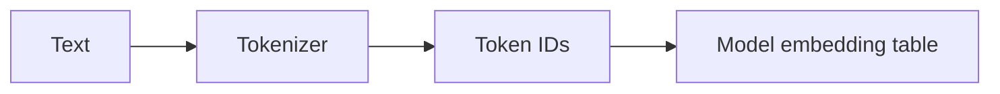

# Tokenization

> How text becomes model inputs — BPE/WordPiece and why token counts matter.

## Definition

Tokenization splits text into discrete tokens (subwords/bytes) the model was trained on. Algorithms like BPE and WordPiece balance vocabulary size with sequence length.

## Why it matters

Billing, context limits, and weird edge cases (code, languages, whitespace) are token issues. Prompt length is measured in tokens, not words.

## How it works

## Key principles

1. **Count tokens, not words** — English ≈ 0.75 words/token is only a rough heuristic.
2. **Same text ≠ same tokens** — Different models use different tokenizers.
3. **Watch special tokens** — Chat templates add hidden structure.

## Common applications

| Application | Description |
|-------------|-------------|
| Cost control | Budget prompts and RAG context |
| Chunking | Split docs near token limits |
| Debugging | Explain odd truncations |

## Common mistakes

- Assuming 1 token ≈ 1 word globally
- Chunking on characters while models limit tokens

## Further reading

- [LLM Engineering](../llm-engineering/README.md)
- [RAG chunking](../rag/chunking.md)
