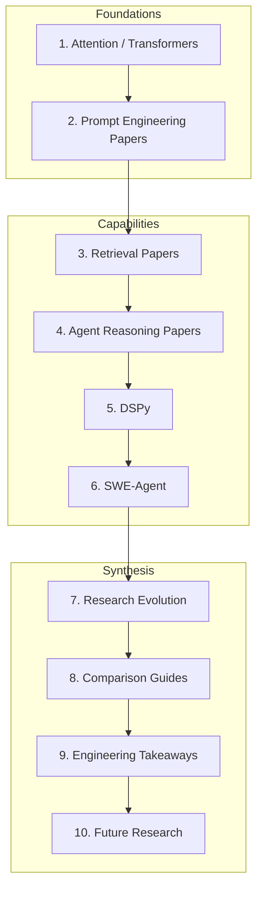

# AI Research Papers

> Engineering handbook for the research that shaped modern AI systems — not paper reproductions, but actionable architecture and tradeoff guidance.
> **Prerequisites:** [Phase 4 LLM Engineering](../llm-engineering/README.md) · [Phase 5 Prompt Engineering](../prompt-engineering/README.md)

---

## Module Overview

Research papers are the **design documents behind production patterns**. This module maps each influential paper to what engineers should implement, avoid, and measure.

**Unlocks:** Deeper context for [RAG](../rag/README.md) · [AI Agents](../ai-agents/README.md) · [MCP](../mcp/README.md) · [AI Evaluation](../ai-evaluation/README.md)

---

## Documents (10 Sections)

| # | Topic | Document |
|---|-------|----------|
| 1 | Transformer Foundations | [attention-is-all-you-need.md](attention-is-all-you-need.md) |
| 2 | Prompt Engineering Papers | [prompt-engineering-papers.md](prompt-engineering-papers.md) |
| 3 | Retrieval Papers | [retrieval-papers.md](retrieval-papers.md) |
| 4 | Agent Reasoning Papers | [agent-reasoning-papers.md](agent-reasoning-papers.md) |
| 5 | DSPy | [dspy.md](dspy.md) |
| 6 | SWE-Agent | [swe-agent.md](swe-agent.md) |
| 7 | Research Evolution | [research-evolution.md](research-evolution.md) |
| 8 | Comparison Guides | [research-comparison-guides.md](research-comparison-guides.md) |
| 9 | Engineering Takeaways | [engineering-takeaways.md](engineering-takeaways.md) |
| 10 | Future Research | [future-research.md](future-research.md) |

---

## Learning Path

### Path A — Foundations First (recommended for new engineers)

1. [Attention Is All You Need](attention-is-all-you-need.md) — understand what every LLM API wraps
2. [Prompt Engineering Papers](prompt-engineering-papers.md) — CoT, few-shot, instruction tuning
3. [Research Evolution](research-evolution.md) — timeline from transformers to agents
4. [Engineering Takeaways](engineering-takeaways.md) — consolidated do/don't list

### Path B — Building RAG Systems

1. [Retrieval Papers](retrieval-papers.md) — Self-RAG, GraphRAG, RAPTOR, CRAG
2. [Comparison Guides](research-comparison-guides.md) — GraphRAG vs RAPTOR, Self-RAG vs CRAG
3. [RAG Domain](../rag/README.md) — production implementation
4. [Retrieval Papers Cheat Sheet](../../cheat-sheets/retrieval-papers-cheat-sheet.md)

### Path C — Building Agents

1. [Agent Reasoning Papers](agent-reasoning-papers.md) — ReAct, ToT, Reflexion, Voyager, CAMEL
2. [SWE-Agent](swe-agent.md) — coding agent architecture
3. [DSPy](dspy.md) — programmatic prompt optimization
4. [AI Agents Domain](../ai-agents/README.md) — production patterns

### Path D — Interview & System Design Prep

1. [Research Comparison Guides](research-comparison-guides.md) — side-by-side tables
2. [Engineering Takeaways](engineering-takeaways.md) — what to implement in production
3. [Future Research](future-research.md) — open problems to discuss
4. [Paper Comparison Matrix Cheat Sheet](../../cheat-sheets/paper-comparison-matrix-cheat-sheet.md)

---

## Cheat Sheets

| Cheat Sheet | Use When |
|-------------|----------|
| [Transformer Concepts](../../cheat-sheets/transformer-concepts-cheat-sheet.md) | Explaining attention, KV cache, positional encoding |
| [Reasoning Methods](../../cheat-sheets/reasoning-methods-cheat-sheet.md) | Choosing ReAct vs ToT vs Reflexion |
| [Retrieval Papers](../../cheat-sheets/retrieval-papers-cheat-sheet.md) | Selecting advanced RAG pattern |
| [Agent Architectures](../../cheat-sheets/agent-architectures-papers-cheat-sheet.md) | Agent paper → production mapping |
| [Paper Comparison Matrix](../../cheat-sheets/paper-comparison-matrix-cheat-sheet.md) | Quick side-by-side decisions |
| [AI Research Timeline](../../cheat-sheets/ai-research-timeline-cheat-sheet.md) | Historical context in interviews |

---

## Related Domains

| Domain | Relationship |
|--------|--------------|
| [LLM Engineering](../llm-engineering/README.md) | APIs, tokens, inference — what transformers enable |
| [Prompt Engineering](../prompt-engineering/README.md) | CoT, few-shot — paper ideas in practice |
| [RAG](../rag/README.md) | Self-RAG, GraphRAG — production retrieval |
| [AI Agents](../ai-agents/README.md) | ReAct, planning — agent loops |
| [MCP](../mcp/README.md) | Tool protocol — post-agent standardization |
| [AI Evaluation](../ai-evaluation/README.md) | Benchmarks cited in papers |

---

## See Also

- [Research Paper Template](../../meta/templates/research-paper.md)
- [Master Index](../../meta/indexes/MASTER-INDEX.md)
- [Learning Roadmap](../../meta/roadmap.md)

## Changelog

| Version | Date | Changes |
|---------|------|---------|
| 1.0 | 2026-07-13 | Initial papers module — 10 sections + cheat sheets |
