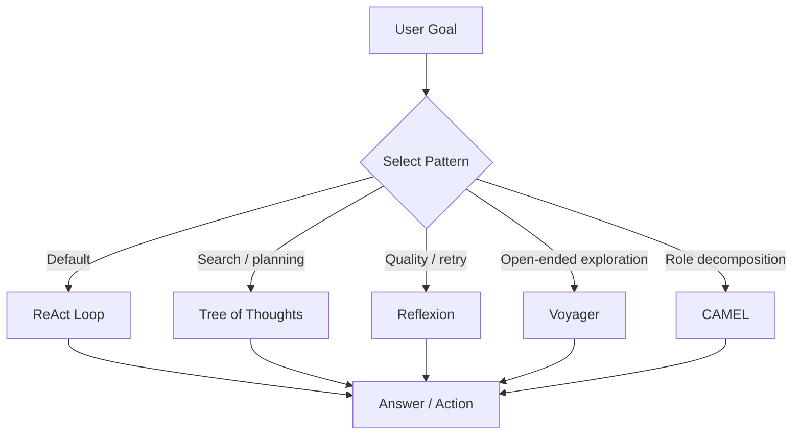
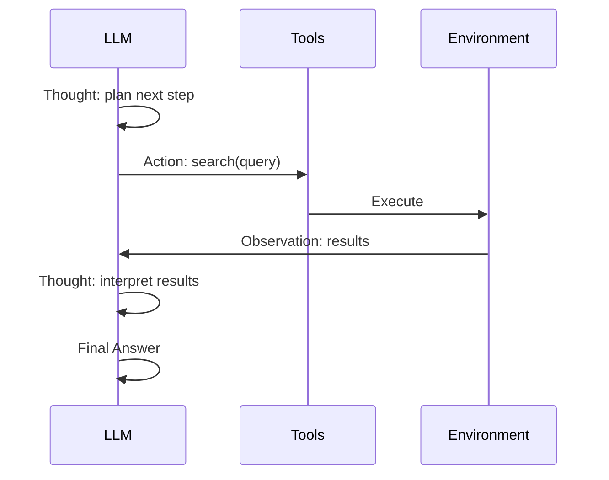
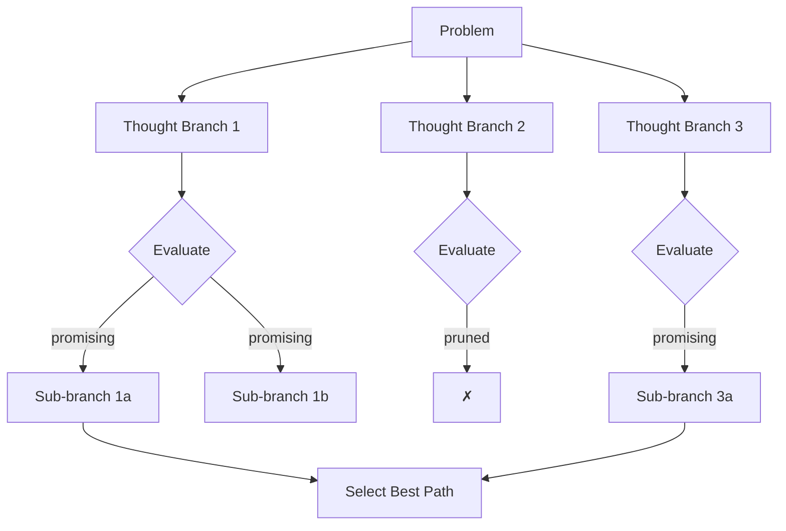
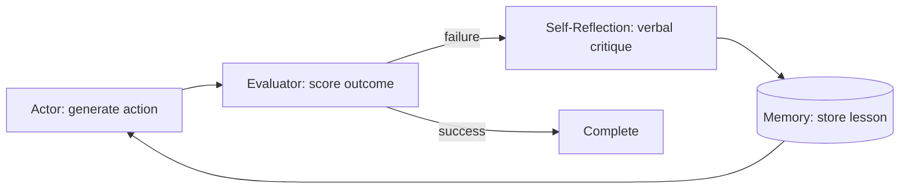
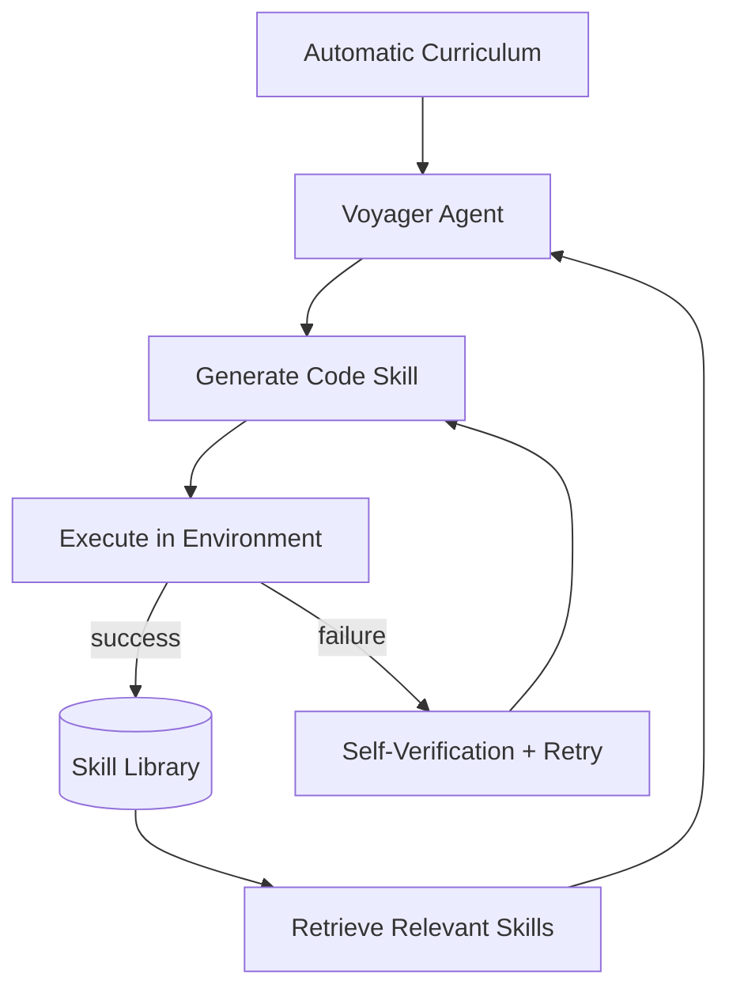
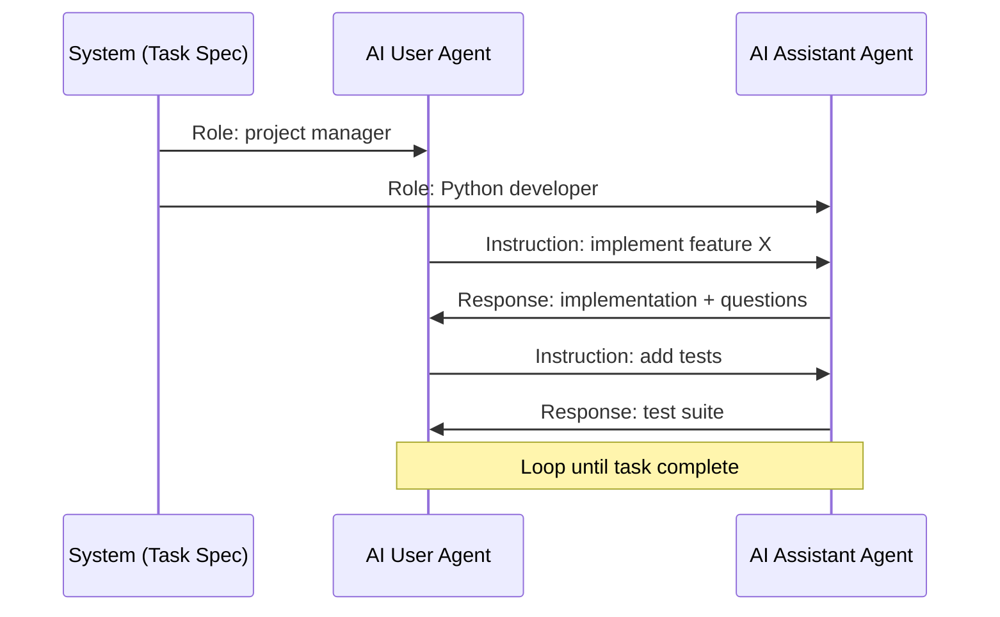

# Agent Reasoning Papers

> One-sentence takeaway: Agent reasoning papers formalize the think-act-observe loop and its extensions — ReAct is the production default; ToT, Reflexion, and multi-agent patterns address specific failure modes at higher cost.

## Overview

These papers define how LLMs **interleave reasoning with action** rather than generating answers in one shot. Each addresses a different bottleneck: grounding (ReAct), search (ToT), learning from failure (Reflexion), skill acquisition (Voyager), and role specialization (CAMEL).



---

## ReAct (Reasoning + Acting)

### Paper Details

| Field | Value |
|-------|-------|
| Authors | Yao et al. |
| Year | 2022 |
| Link | [arXiv:2210.03629](https://arxiv.org/abs/2210.03629) |

### TL;DR

ReAct interleaves **natural language reasoning traces** with **tool actions** and **environment observations**, grounding the model in external facts and reducing hallucination.

### Architecture



**Loop structure:** Thought → Action → Observation → (repeat) → Final Answer

### Key Contributions

1. Synergizes chain-of-thought reasoning with tool use in a single loop
2. Demonstrates improved performance on QA, fact verification, and interactive tasks
3. Observations ground subsequent thoughts — reduces confabulation

### Limitations

- Single trajectory — no backtracking on wrong paths
- Reasoning quality depends entirely on base model capability
- Verbose traces increase token cost and latency
- No persistent memory across sessions

### Production Applications

| Use Case | Implementation |
|----------|----------------|
| Tool-calling agents | OpenAI function calling, LangGraph ReAct agent |
| RAG agents | Search KB → observe chunks → reason → answer |
| API orchestration | Thought → call API → parse response → next step |

```python
REACT_PROMPT = """Answer using tools when needed.

Thought: [reason about what to do next]
Action: [tool_name]
Action Input: [JSON args]
Observation: [tool result — injected by system]
... (repeat)
Thought: I have enough information.
Final Answer: [response]
"""
```

### Engineering Takeaways

- **Default pattern** for production agents — simple, debuggable, framework-supported
- Cap iteration count and tool calls to prevent runaway loops
- Log thoughts separately from user-facing output

---

## Tree of Thoughts (ToT)

### Paper Details

| Field | Value |
|-------|-------|
| Authors | Yao et al. |
| Year | 2023 |
| Link | [arXiv:2305.10601](https://arxiv.org/abs/2305.10601) |

### TL;DR

ToT treats reasoning as **tree search** — generate multiple candidate thoughts, evaluate them, and expand promising branches while pruning dead ends.

### Architecture



**Search strategies:** BFS (breadth-first) or DFS (depth-first) over thought nodes.

### Key Contributions

1. Generalizes CoT to deliberate search with backtracking
2. Uses LLM as both generator and evaluator of intermediate states
3. Strong gains on puzzles, math, and planning tasks requiring exploration

### Limitations

- **Cost explodes** — N branches × M depth × evaluation calls
- Evaluation prompts are task-specific and hard to generalize
- Latency unsuitable for interactive applications
- No standard production framework integration

### Production Applications

| Use Case | When To Use |
|----------|-------------|
| Complex planning | Multi-step logistics with constraints |
| Code architecture decisions | Explore 3-5 design alternatives before implementing |
| Research synthesis | Deliberate over conflicting sources |

**Production alternative:** Use ReAct with explicit replanning on failure instead of full tree search — 80% of benefit at 20% of cost.

### Engineering Takeaways

- Reserve for **offline or high-stakes** decisions, not user-facing chat
- Limit branching factor (2-3) and depth (3-4)
- Cache evaluated states to avoid redundant LLM calls

---

## Reflexion

### Paper Details

| Field | Value |
|-------|-------|
| Authors | Shinn et al. |
| Year | 2023 |
| Link | [arXiv:2303.11366](https://arxiv.org/abs/2303.11366) |

### TL;DR

Reflexion adds a **verbal reinforcement loop** — after failure, the agent reflects on what went wrong and stores lessons in memory for the next attempt, without weight updates.

### Architecture



**Components:**
- **Actor** — generates actions (often ReAct-style)
- **Evaluator** — scores outcome (heuristic, unit test, or LLM judge)
- **Self-Reflection** — generates natural language critique
- **Memory** — accumulates reflections across trials

### Key Contributions

1. Learning from failure via natural language memory, not gradient updates
2. Significant improvement on AlfWorld, HotPotQA, and coding tasks
3. Separates acting, evaluating, and reflecting into distinct roles

### Limitations

- Requires reliable evaluator (hard for open-ended tasks)
- Memory grows unbounded without summarization
- Multiple trials multiply cost linearly
- Reflection quality limited by model capability

### Production Applications

| Use Case | Pattern |
|----------|---------|
| Code generation | Generate → run tests → reflect on failures → retry |
| Data pipeline agents | Execute → validate output schema → reflect → fix |
| Content review | Draft → score rubric → critique → revise |

```python
def reflexion_loop(task, max_trials=3):
  memory = []
  for trial in range(max_trials):
    result = actor.run(task, memory=memory)
    score = evaluator.score(result)
    if score.passed:
      return result
    reflection = reflector.critique(task, result, score)
    memory.append(reflection)
  return result  # best effort
```

### Engineering Takeaways

- **High ROI for code and structured tasks** with automated evaluators
- Cap trials (2-3) and summarize memory to control context growth
- Pair with ReAct as the actor, not as a replacement

---

## Voyager

### Paper Details

| Field | Value |
|-------|-------|
| Authors | Wang et al. |
| Year | 2023 |
| Link | [arXiv:2305.16291](https://arxiv.org/abs/2305.16291) |

### TL;DR

Voyager is a **lifelong learning agent** for open-ended environments (Minecraft) that writes, stores, and retrieves executable skills (code) in a growing skill library.

### Architecture



**Three components:**
1. **Automatic curriculum** — proposes increasingly complex goals
2. **Skill library** — indexed store of verified code skills with embeddings
3. **Iterative prompting** — environment feedback + error messages for refinement

### Key Contributions

1. Skill composability — new skills build on prior ones
2. Embeddings enable retrieval of relevant skills for new tasks
3. Demonstrates emergent behavior in open-ended exploration

### Limitations

- Evaluated in Minecraft — transfer to business domains requires adaptation
- Code execution in sandbox is a security requirement
- Curriculum design is environment-specific
- Skill library can accumulate redundant or conflicting skills

### Production Applications

| Use Case | Adaptation |
|----------|------------|
| DevOps automation | Library of verified scripts/playbooks |
| Data engineering | Reusable transformation functions |
| API integration | Cached tool-use patterns per endpoint |

### Engineering Takeaways

- Pattern: **verified skill library + embedding retrieval** beats re-prompting from scratch
- Requires sandboxed execution and skill deduplication
- Best for repetitive environments with composable actions

---

## CAMEL (Communicative Agents)

### Paper Details

| Field | Value |
|-------|-------|
| Authors | Li et al. |
| Year | 2023 |
| Link | [arXiv:2303.17760](https://arxiv.org/abs/2303.17760) |

### TL;DR

CAMEL uses **role-playing multi-agent collaboration** — an AI user and AI assistant converse with assigned personas to solve tasks autonomously, guided by inception prompting.

### Architecture



**Key mechanism:** Inception prompting prevents agents from deviating from roles or switching to human-directed chat.

### Key Contributions

1. Autonomous multi-agent task solving without human in the loop
2. Role assignment creates natural task decomposition
3. Scalable data generation for instruction tuning (synthetic conversations)

### Limitations

- Agents can collude or hallucinate progress without external verification
- Role design is critical — bad roles produce bad outputs
- No built-in tool use or grounding in original paper
- Conversation can diverge without termination criteria

### Production Applications

| Use Case | Pattern |
|----------|---------|
| Code review pipeline | Author agent + reviewer agent |
| Content creation | Writer agent + editor agent |
| Requirements → implementation | PM agent + engineer agent |
| Synthetic data generation | Role-play for training data |

### Engineering Takeaways

- Use **specialized roles with clear boundaries** — maps to CrewAI, AutoGen patterns
- Add external verification (tests, human review) — agents alone are not sufficient
- Define explicit termination conditions and max turns

---

## Cross-Paper Comparison

| Paper | Core Mechanism | Cost | Best For |
|-------|---------------|------|----------|
| ReAct | Think-act-observe loop | Medium | General tool agents |
| ToT | Tree search over thoughts | Very high | Exploration problems |
| Reflexion | Verbal memory from failure | High (retries) | Code, structured tasks |
| Voyager | Skill library + curriculum | High (setup) | Repetitive environments |
| CAMEL | Multi-agent role play | Medium-high | Task decomposition |

## Interview Questions

**Q: When would you choose ReAct over Tree of Thoughts?**
ReAct for production tool agents with latency constraints. ToT only when the task requires exploring multiple solution paths and cost/latency are acceptable.

**Q: How does Reflexion differ from fine-tuning on failures?**
Reflexion stores verbal critiques in prompt memory — no weight updates. Faster to implement but limited by context window and model comprehension.

**Q: What is the main risk with CAMEL-style multi-agent systems?**
Agents can appear productive while hallucinating progress. External verification (tests, retrieval, human review) is essential.

**Q: How would you productionize Voyager's skill library?**
Sandboxed execution, embedding-based retrieval, deduplication, versioning, and human approval for skills that touch production systems.

**Q: What is the default agent reasoning pattern for production?**
ReAct with iteration limits, optional Reflexion for tasks with automated evaluation, and replanning on tool failure.

---

## See Also

- [Agent Reasoning Patterns](../ai-agents/agent-reasoning-patterns.md)
- [SWE-Agent](swe-agent.md)
- [Research Comparison Guides](research-comparison-guides.md)
- [Reasoning Methods Cheat Sheet](../../cheat-sheets/reasoning-methods-cheat-sheet.md)
- [Agent Architectures Cheat Sheet](../../cheat-sheets/agent-architectures-papers-cheat-sheet.md)

## Changelog

| Version | Date | Changes |
|---------|------|---------|
| 1.0 | 2026-07-13 | Initial engineering guide — 5 agent reasoning papers |
