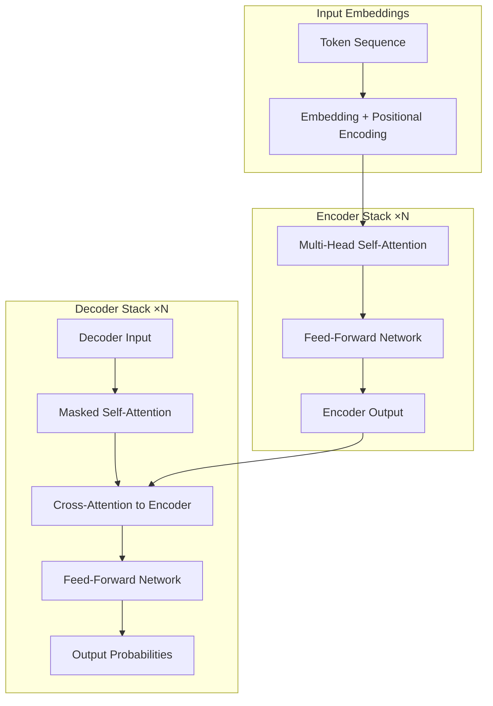
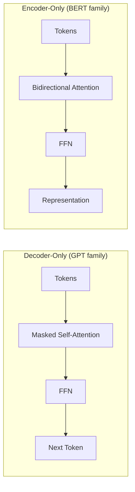

# Attention Is All You Need

> One-sentence takeaway: The Transformer replaced recurrence with parallel self-attention, making modern LLM training and inference possible at scale.

## Paper Details

| Field | Value |
|-------|-------|
| Authors | Vaswani et al. (Google Brain) |
| Year | 2017 |
| Venue | NeurIPS |
| Link | [arXiv:1706.03762](https://arxiv.org/abs/1706.03762) |
| Code | [tensor2tensor](https://github.com/tensorflow/tensor2tensor) |

## TL;DR

The Transformer processes entire token sequences in parallel using **scaled dot-product self-attention**, eliminating sequential RNN/LSTM bottlenecks. Encoder-decoder stacks with multi-head attention became the backbone of GPT (decoder-only), BERT (encoder-only), and T5 (encoder-decoder) families that power today's LLM APIs.

## Problem Statement

Sequence models before 2017 relied on RNNs and CNNs that processed tokens sequentially or with limited receptive fields. This created:

- Poor parallelization during training
- Difficulty modeling long-range dependencies
- Slow inference for long sequences

## Key Contributions

1. **Scaled dot-product attention** — O(n²) but fully parallelizable attention over all token pairs
2. **Multi-head attention** — Multiple attention subspaces capture different relationship types
3. **Positional encoding** — Injects order information without recurrence
4. **Encoder-decoder architecture** — Stacked layers with residual connections and layer normalization

## Method Overview

### Self-Attention Mechanism

Each token produces Query (Q), Key (K), and Value (V) vectors. Attention weights measure how much each token should attend to every other token:

```
Attention(Q, K, V) = softmax(QK^T / √d_k) · V
```

The √d_k scaling prevents softmax saturation in high dimensions.



### Multi-Head Attention

Multiple attention heads run in parallel, each learning different relationship patterns (syntax, coreference, long-range dependencies). Outputs are concatenated and projected.

### Positional Encoding

Sinusoidal functions add position information to embeddings so the model knows token order without recurrence:

```
PE(pos, 2i)   = sin(pos / 10000^(2i/d))
PE(pos, 2i+1) = cos(pos / 10000^(2i/d))
```

Modern models often use **rotary positional embeddings (RoPE)** or **ALiBi** instead, but the core idea — position must be explicit — remains.

## Architecture Variants for Engineers

| Variant | Used By | Production Pattern |
|---------|---------|-------------------|
| **Encoder-only** | BERT, embedding models | Classification, embeddings, reranking |
| **Decoder-only** | GPT, Llama, Claude | Chat, completion, agents |
| **Encoder-decoder** | T5, BART | Translation, summarization |



## Key Results

| Metric | RNN Baseline | Transformer | Improvement |
|--------|--------------|-------------|-------------|
| WMT En-De BLEU | 24.6 (GNMT) | 28.4 | +15% |
| Training time | Days (sequential) | Hours (parallel) | ~10× faster |
| Long-range deps | Degrades with distance | Constant path length | Qualitative leap |

## Relevance to AI Engineering

- **Directly applicable:** Understanding attention explains context windows, KV cache sizing, and why long prompts cost more
- **Inspirational:** Flash Attention, sparse attention, and sliding windows are engineering optimizations on this core idea
- **Theoretical:** You rarely implement transformers — you consume them via APIs — but architecture knowledge informs debugging

### What This Means for Your Stack

| Concept | Engineering Impact |
|---------|-------------------|
| Self-attention O(n²) | Context length drives compute and memory quadratically |
| KV cache | Decoder inference caches K/V per layer — key for latency budgeting |
| Causal masking | Decoder-only models cannot see future tokens — affects prompt design |
| Layer normalization | Training stability — relevant when fine-tuning |

## Practical Takeaways

1. **Context is not free** — every token attends to every other token; budget context aggressively
2. **Decoder-only dominates agents** — autoregressive generation matches tool-loop and chat patterns
3. **Embeddings use encoder-style models** — choose bi-directional models for retrieval, not chat models
4. **Positional limits matter** — models trained at 4K context degrade beyond training length without extensions

## Limitations

- **Quadratic complexity** — attention cost grows with sequence length squared
- **No built-in structure** — unlike RNNs, no inductive bias for sequential locality (mitigated by position encodings)
- **Data hunger** — parallel architecture needs massive data to outperform inductive-biased models
- **Original paper is seq2seq** — most production LLMs are decoder-only, a simplification not in the original

## Implementation Notes

You will not implement a transformer from scratch in production. Instead, understand these integration points:

```python
# Conceptual: what happens when you call an LLM API
# 1. Tokenize input → embedding lookup + positional encoding
# 2. N layers of: masked self-attention → FFN (with residuals)
# 3. Output projection → softmax over vocabulary
# 4. Sample or argmax next token; append to sequence; repeat

# KV cache optimization (inference)
# After processing prompt tokens, cache K and V tensors per layer
# Each new token only computes attention against cached K/V + current token
# Memory scales: 2 × num_layers × seq_len × hidden_dim × batch_size
```

### Inference Memory Estimation

```
KV cache bytes ≈ 2 × layers × seq_len × hidden_dim × bytes_per_param × batch
```

For a 7B model with 32 layers, 4096 hidden dim, fp16, seq_len=8192:
roughly 2 × 32 × 8192 × 4096 × 2 ≈ 4 GB KV cache alone.

## Related Work

| Paper | Relationship |
|-------|-------------|
| [BERT](https://arxiv.org/abs/1810.04805) | Encoder-only adaptation |
| [GPT-2](https://cdn.openai.com/better-language-models/language_models_are_unsupervised_multitask_learners.pdf) | Decoder-only scaling |
| [Flash Attention](https://arxiv.org/abs/2205.14135) | IO-aware attention optimization |
| [RoPE](https://arxiv.org/abs/2104.09864) | Modern positional encoding |

## Engineering Takeaways

| Implement | Avoid |
|-----------|-------|
| Context budgeting based on attention cost | Treating unlimited context as free |
| KV cache awareness in latency planning | Using chat models for embedding tasks |
| Right architecture for task (encoder vs decoder) | Assuming all "LLMs" work the same way |

## Interview Questions

**Q: Why did Transformers replace RNNs for LLMs?**
Parallel training across sequence positions, constant path length for long-range dependencies, and better scaling with compute.

**Q: What is the complexity of self-attention?**
O(n² · d) for sequence length n and dimension d — the dominant cost for long contexts.

**Q: Difference between encoder-only and decoder-only?**
Encoder uses bidirectional attention (sees full input); decoder uses causal masking (only past tokens) for autoregressive generation.

**Q: What is KV cache and why does it matter?**
Stores key/value tensors from prior tokens during inference so each new token doesn't recompute the full sequence — critical for latency but memory-intensive.

**Q: How would you debug a model performing poorly on long documents?**
Check if context exceeds training length, whether position encoding extrapolates, if retrieval is needed instead of stuffing context, and KV cache/memory limits.

---

## See Also

- [Prompt Engineering Papers](prompt-engineering-papers.md)
- [Research Evolution](research-evolution.md)
- [LLM Engineering](../llm-engineering/README.md)
- [Transformer Concepts Cheat Sheet](../../cheat-sheets/transformer-concepts-cheat-sheet.md)

## Changelog

| Version | Date | Changes |
|---------|------|---------|
| 1.0 | 2026-07-13 | Initial engineering guide |
