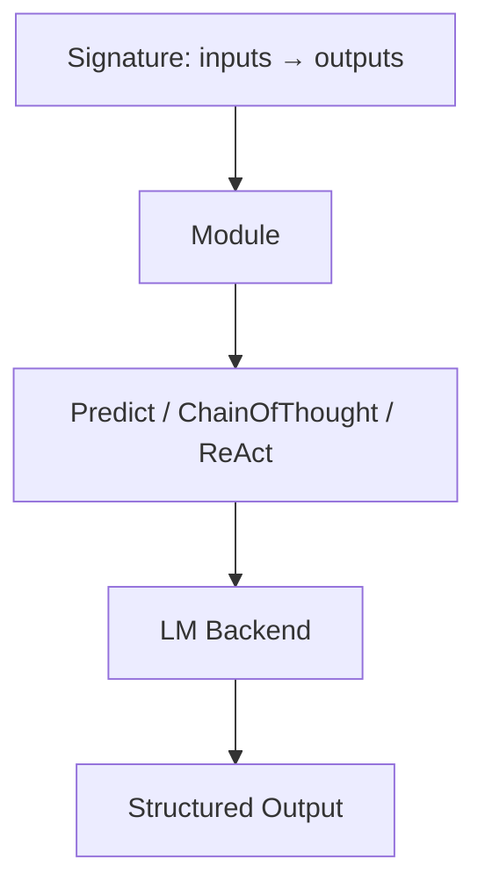
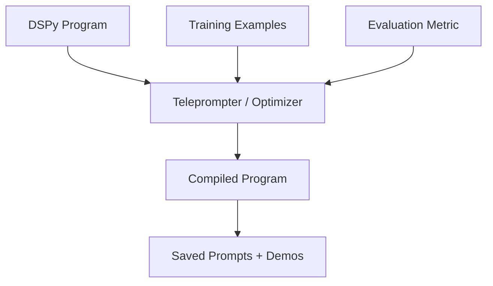
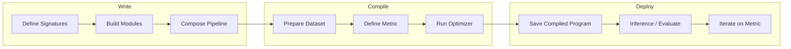

# DSPy

> One-sentence takeaway: DSPy replaces hand-crafted prompts with **composable Python modules** and **automated optimization** — treating prompts as compilable programs, not artisanal strings.

## Paper Details

| Field | Value |
|-------|-------|
| Authors | Khattab et al. (Stanford NLP) |
| Year | 2023 (framework); 2024 (MIPRO optimizer) |
| Link | [arXiv:2310.03714](https://arxiv.org/abs/2310.03714) |
| Code | [stanfordnlp/dspy](https://github.com/stanfordnlp/dspy) |

## TL;DR

DSPy is a framework that abstracts LLM calls into **signatures** and **modules**, then uses **teleprompters** (optimizers) to automatically find the best prompts and few-shot examples for your task using a labeled dataset and metric.

## Problem Statement

Hand-crafted prompts are:
- Fragile across model versions and providers
- Not reproducible or version-controlled systematically
- Expensive to iterate manually
- Impossible to optimize holistically in multi-step pipelines

## Programming Model

### Signatures

A signature declares **what** the LLM should do — input and output fields — without specifying **how** (the prompt text).

```python
import dspy

class ClassifySentiment(dspy.Signature):
    """Classify customer feedback sentiment."""
    feedback: str = dspy.InputField()
    sentiment: str = dspy.OutputField(desc="positive, negative, or neutral")
```

### Modules

Modules are composable building blocks that implement signatures using LLM calls.



| Module | Purpose |
|--------|---------|
| `dspy.Predict` | Basic input → output |
| `dspy.ChainOfThought` | Adds reasoning before output |
| `dspy.ReAct` | Tool-using agent module |
| `dspy.Retrieve` | Retrieval step in pipeline |

```python
class SentimentClassifier(dspy.Module):
    def __init__(self):
        super().__init__()
        self.classify = dspy.ChainOfThought(ClassifySentiment)

    def forward(self, feedback):
        return self.classify(feedback=feedback)
```

### Composition

Multi-step pipelines compose modules — each step is independently optimizable.


```python
class RAGPipeline(dspy.Module):
    def __init__(self, num_docs=3):
        super().__init__()
        self.retrieve = dspy.Retrieve(k=num_docs)
        self.generate = dspy.ChainOfThought("context, question -> answer")

    def forward(self, question):
        context = self.retrieve(question).passages
        return self.generate(context=context, question=question)
```

## Optimization (Compilation)

DSPy **compiles** programs by searching over prompt instructions and few-shot examples to maximize a metric on a dev set.



### Optimizers (Teleprompters)

| Optimizer | Strategy | Best For |
|-----------|----------|----------|
| `BootstrapFewShot` | Generate examples from program traces | Quick start, small datasets |
| `BootstrapFewShotWithRandomSearch` | Bootstrap + random search over demos | Better coverage |
| `MIPROv2` | Bayesian optimization over instructions + demos | Best quality, more compute |
| `COPRO` | Coordinate ascent over instructions | Instruction-only optimization |
| `LabeledFewShot` | Use provided labeled examples directly | When you have gold data |

```python
from dspy.teleprompt import MIPROv2

optimizer = MIPROv2(metric=accuracy_metric, num_candidates=10)
compiled_rag = optimizer.compile(
    RAGPipeline(),
    trainset=train_examples,
    valset=dev_examples,
)
compiled_rag.save("compiled_rag.json")
```

## Compiler Pipeline

The full DSPy workflow mirrors a traditional compiler:



**Stages:**
1. **Define** — signatures and modules (no prompt text)
2. **Prepare** — train/dev datasets with expected outputs
3. **Metric** — function that scores predictions (accuracy, F1, custom)
4. **Compile** — optimizer searches prompt space
5. **Evaluate** — test compiled program on held-out set
6. **Deploy** — load compiled prompts in production

## Production Workflow

```python
# 1. Configure LM backend
lm = dspy.LM("openai/gpt-4o-mini", api_key=os.environ["OPENAI_API_KEY"])
dspy.configure(lm=lm)

# 2. Define program
program = SentimentClassifier()

# 3. Compile with optimizer
tp = dspy.MIPROv2(metric=lambda ex, pred, trace=None: ex.sentiment == pred.sentiment)
compiled = tp.compile(program, trainset=train, valset=dev)

# 4. Evaluate
score = evaluate(compiled, testset=test)
print(f"Accuracy: {score}")

# 5. Save and load
compiled.save("sentiment_v1.json")
loaded = SentimentClassifier()
loaded.load("sentiment_v1.json")
```

### Production Considerations

| Concern | Approach |
|---------|----------|
| Model version changes | Re-compile when switching models |
| Latency | Compiled few-shot examples add context — budget tokens |
| Cost | Optimization is expensive; inference uses optimized prompts |
| Versioning | Save compiled programs as artifacts in CI/CD |
| Evaluation | Same metric function for optimization and monitoring |

## Relevance to AI Engineering

- **Directly applicable:** Replace manual prompt iteration with systematic optimization
- **Inspirational:** Treats prompts as code — version, test, compile, deploy
- **Complements:** Works alongside RAG, agents, and evaluation frameworks

## Practical Takeaways

1. **Start with signatures** — define I/O before writing any prompt text
2. **Invest in metrics** — optimization quality is bounded by metric quality
3. **Compile per model** — prompts optimized for GPT-4o may fail on Claude
4. **Use BootstrapFewShot first** — graduate to MIPROv2 when baseline is established
5. **Save compiled artifacts** — treat them like model weights in your deployment pipeline

## Limitations

- Optimization requires labeled datasets (50-300+ examples minimum)
- Search space exploration is compute-intensive
- Optimized prompts may overfit to dev set
- Less control over exact prompt wording — trade autonomy for performance
- Ecosystem still maturing — breaking changes between versions

## DSPy vs Manual Prompt Engineering

| Aspect | Manual PE | DSPy |
|--------|-----------|------|
| Iteration speed | Fast for 1 prompt | Fast for N-step pipelines |
| Reproducibility | Low | High (saved compilations) |
| Multi-step optimization | Manual per step | Joint optimization |
| Requires dataset | No | Yes |
| Model portability | Manual re-tuning | Re-compile |

## Interview Questions

**Q: What problem does DSPy solve?**
Automates prompt and few-shot example optimization using labeled data and metrics, replacing manual trial-and-error.

**Q: What is a DSPy signature?**
A declarative specification of input/output fields for an LLM call — separates what from how.

**Q: How does DSPy compilation work?**
An optimizer (teleprompter) searches over instruction text and demonstration examples to maximize a metric on a validation set.

**Q: When would you NOT use DSPy?**
No labeled data, single simple prompt, extreme latency constraints, or need for exact prompt control for compliance.

**Q: DSPy vs LangChain?**
LangChain orchestrates chains and tools; DSPy optimizes the prompts within those chains. They can be used together.

---

## See Also

- [Prompt Engineering Papers](prompt-engineering-papers.md)
- [Research Comparison Guides](research-comparison-guides.md)
- [Prompt Engineering Domain](../prompt-engineering/README.md)
- [AI Evaluation](../ai-evaluation/README.md)

## Changelog

| Version | Date | Changes |
|---------|------|---------|
| 1.0 | 2026-07-13 | Initial engineering guide |
