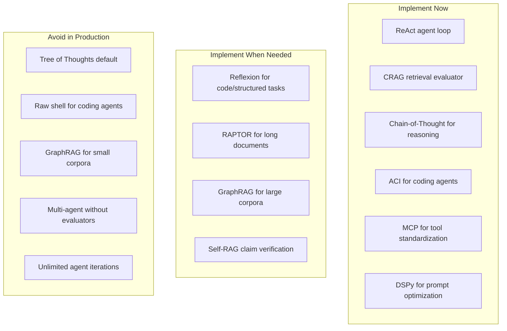
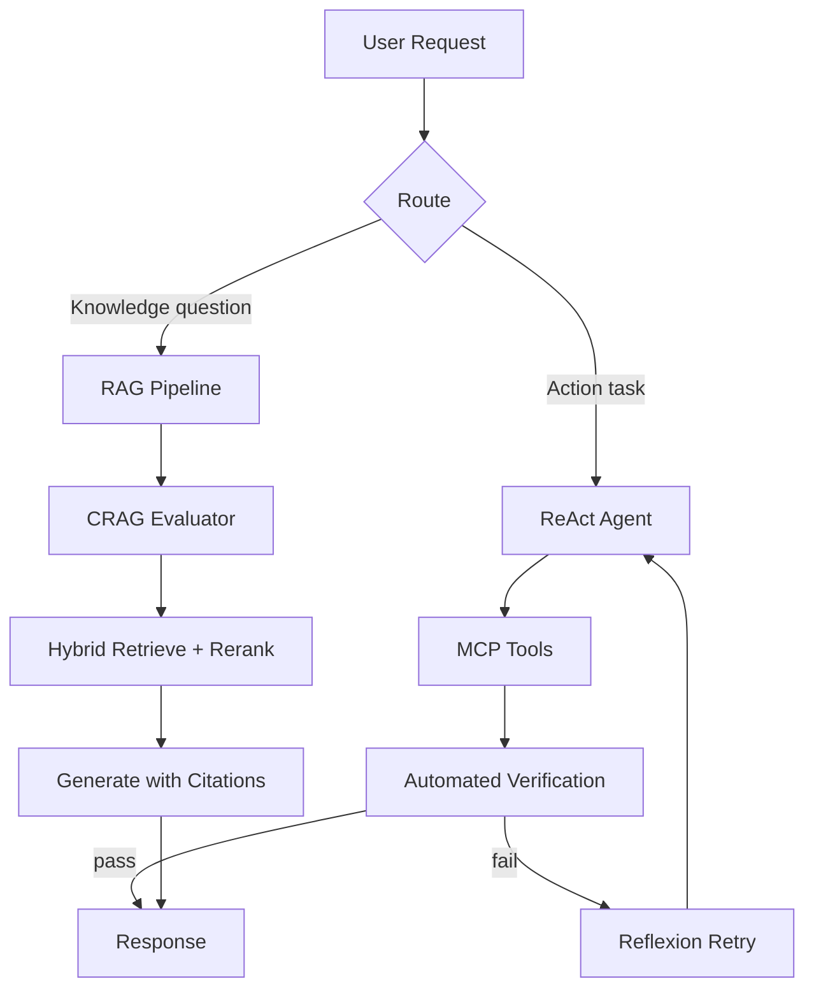

# Engineering Takeaways

> One-sentence takeaway: Research papers are a menu, not a mandate — implement the patterns with clear ROI, skip the ones that are expensive demos.

## Implement / Avoid Summary

---

## By Domain

### Transformers & LLMs

| Implement | Avoid |
|-----------|-------|
| Context budgeting based on attention cost | Treating unlimited context as free |
| KV cache awareness in latency planning | Using chat models for embedding tasks |
| Right model type for task (encoder vs decoder) | Assuming all LLMs behave identically |
| Monitor token usage per request | Ignoring quadratic attention cost growth |

**Source:** [Attention Is All You Need](attention-is-all-you-need.md)

---

### Prompt Engineering

| Implement | Avoid |
|-----------|-------|
| Clear instructions (models are instruction-tuned) | Over-engineering prompts for aligned models |
| CoT for multi-step reasoning tasks | CoT for simple extraction (wastes tokens) |
| Few-shot examples with consistent formatting | Random example ordering |
| DSPy when you have labeled data + multi-step pipeline | Manual prompt iteration at scale |
| Self-consistency for discrete-answer tasks | Self-consistency for open-ended generation |

**Source:** [Prompt Engineering Papers](prompt-engineering-papers.md) · [DSPy](dspy.md)

---

### Retrieval (RAG)

| Implement | Avoid |
|-----------|-------|
| CRAG-style retrieval evaluator before generation | Blind retrieve-then-generate |
| Hybrid search (dense + BM25) as default | Dense-only for keyword-heavy corpora |
| Reranking after retrieval | Stuffing 50 chunks into context |
| Citation and grounding checks | Trusting generation without source verification |
| RAPTOR for long narrative documents | RAPTOR for short FAQ-style content |
| GraphRAG for 1K+ doc enterprise KBs | GraphRAG for <100 document corpora |

**Source:** [Retrieval Papers](retrieval-papers.md) · [RAG Domain](../rag/README.md)

---

### Agent Reasoning

| Implement | Avoid |
|-----------|-------|
| ReAct as default agent loop | Tree of Thoughts as default |
| Iteration limits and tool call caps | Unlimited agent loops |
| Replan on tool failure | Ignoring failed tool calls |
| Reflexion when automated evaluator exists | Reflexion without reliable evaluator |
| Log thoughts separately from user output | Exposing raw reasoning to users |
| Skill libraries for repetitive tasks (Voyager pattern) | Re-prompting from scratch every time |

**Source:** [Agent Reasoning Papers](agent-reasoning-papers.md)

---

### Coding Agents

| Implement | Avoid |
|-----------|-------|
| Agent-Computer Interface (windowed view, precise edit) | Raw shell access (`cat`, `sed`) |
| Docker sandbox for code execution | Running agent commands on host |
| Test feedback after every edit | Generate code without verification |
| SWE-bench for evaluation | Claiming coding agent works without benchmarks |
| Progressive file disclosure | Dumping entire files into context |

**Source:** [SWE-Agent](swe-agent.md)

---

### Multi-Agent Systems

| Implement | Avoid |
|-----------|-------|
| Specialized roles with clear boundaries | Generic "helpful assistant" roles |
| External verification (tests, retrieval, HITL) | Trusting agent-to-agent consensus |
| Explicit termination conditions | Open-ended agent conversations |
| Production frameworks (CrewAI, LangGraph) | Raw CAMEL without guardrails |

**Source:** [Agent Reasoning Papers](agent-reasoning-papers.md) · [AI Agents](../ai-agents/README.md)

---

### Tool Protocols

| Implement | Avoid |
|-----------|-------|
| MCP for portable tool servers | Custom tool interface per framework |
| Tool descriptions optimized for LLM selection | Vague tool names and descriptions |
| Auth and permission boundaries per tool | Giving agents unrestricted tool access |

**Source:** [MCP Domain](../mcp/README.md)

---

## Production Pattern Stack (Recommended)

The minimum viable research-informed stack for most production AI applications:

| Layer | Pattern | Paper Source |
|-------|---------|-------------|
| 1. Retrieval | Hybrid search + rerank + CRAG evaluator | CRAG |
| 2. Generation | CoT for complex, direct for simple | CoT |
| 3. Agent loop | ReAct with iteration limits | ReAct |
| 4. Quality | Reflexion when evaluator exists | Reflexion |
| 5. Tools | MCP standardized servers | MCP |
| 6. Optimization | DSPy for multi-step pipelines | DSPy |
| 7. Evaluation | Automated metrics on every deploy | SWE-bench pattern |

---

## Cost-Impact Matrix

| Pattern | Implementation Cost | Runtime Cost | Quality Impact | ROI |
|---------|-------------------|-------------|----------------|-----|
| CRAG evaluator | Low | Low | High | **Highest** |
| ReAct agent loop | Low | Medium | High | **Highest** |
| Hybrid + rerank | Medium | Medium | High | **High** |
| CoT prompting | None | Medium (tokens) | Medium-High | **High** |
| Reflexion | Medium | High (retries) | High (code tasks) | **High** |
| DSPy optimization | High (setup) | Low (inference) | Medium-High | **Medium** |
| RAPTOR indexing | High | Low (query) | Medium | **Medium** |
| Self-RAG | High | High | High | **Medium** |
| GraphRAG | Very high | Medium | High (global Q) | **Low-Medium** |
| Tree of Thoughts | Medium | Very high | Medium | **Low** |

---

## Anti-Patterns (Learned from Research)

| Anti-Pattern | Why It Fails | Research Lesson |
|-------------|-------------|-----------------|
| "Let's use ToT for everything" | 10-50× cost, marginal gain on non-search tasks | ToT paper: only for exploration problems |
| "Our agent has 50 tools" | Tool selection accuracy degrades | ReAct: focused tool sets perform better |
| "We don't need eval, the demo works" | Demos ≠ production reliability | SWE-bench: 6-12% resolve rate even with ACI |
| "GraphRAG will solve our RAG problems" | Wrong tool for small corpora or simple queries | GraphRAG: indexing cost >> query benefit at small scale |
| "Multi-agent = 10x productivity" | Agents hallucinate progress without verification | CAMEL: needs external verification |
| "Bigger context = no need for RAG" | Attention degrades, cost explodes | Transformer: O(n²) cost; RAG still needed |
| "We'll fine-tune instead of RAG" | Knowledge goes stale, expensive to update | RAG: dynamic knowledge without retraining |

---

## Evaluation Checklist

Before deploying any research pattern:

- [ ] Defined metric that matches user value (not just BLEU/accuracy)
- [ ] Held-out test set representative of production traffic
- [ ] Measured cost per request (tokens, latency, API calls)
- [ ] Compared against simpler baseline (naive RAG, single-shot prompt)
- [ ] Tested on adversarial / edge cases
- [ ] Monitored in production with same metric
- [ ] Documented when to fall back to simpler pattern

---

## Interview Questions

**Q: What are the highest-ROI patterns from AI research?**
CRAG evaluator (fix bad retrieval), ReAct agent loop (tool use), hybrid search + rerank (better retrieval), CoT (reasoning).

**Q: What should you NOT implement from research papers?**
Tree of Thoughts as default, GraphRAG for small corpora, raw shell for coding agents, multi-agent without verification.

**Q: How do you decide which research pattern to adopt?**
Match pattern to failure mode: bad retrieval → CRAG, no tool use → ReAct, bad reasoning → CoT, code editing → ACI, prompt quality → DSPy.

**Q: What is the minimum viable research-informed stack?**
Hybrid RAG with CRAG evaluator + ReAct agent with MCP tools + automated evaluation.

---

## See Also

- [Research Comparison Guides](research-comparison-guides.md)
- [Future Research](future-research.md)
- [RAG Domain](../rag/README.md)
- [AI Agents Domain](../ai-agents/README.md)
- [AI Evaluation](../ai-evaluation/README.md)

## Changelog

| Version | Date | Changes |
|---------|------|---------|
| 1.0 | 2026-07-13 | Initial consolidated takeaways |
