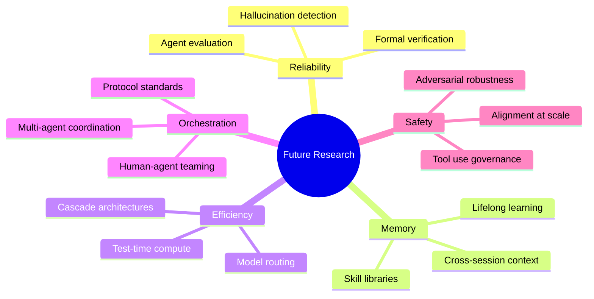
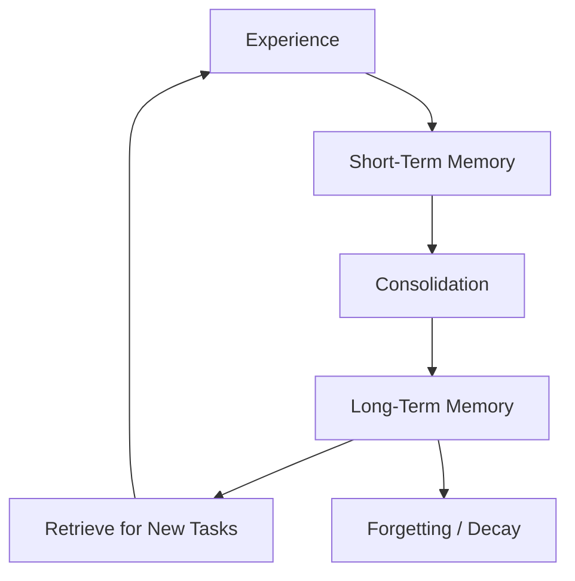
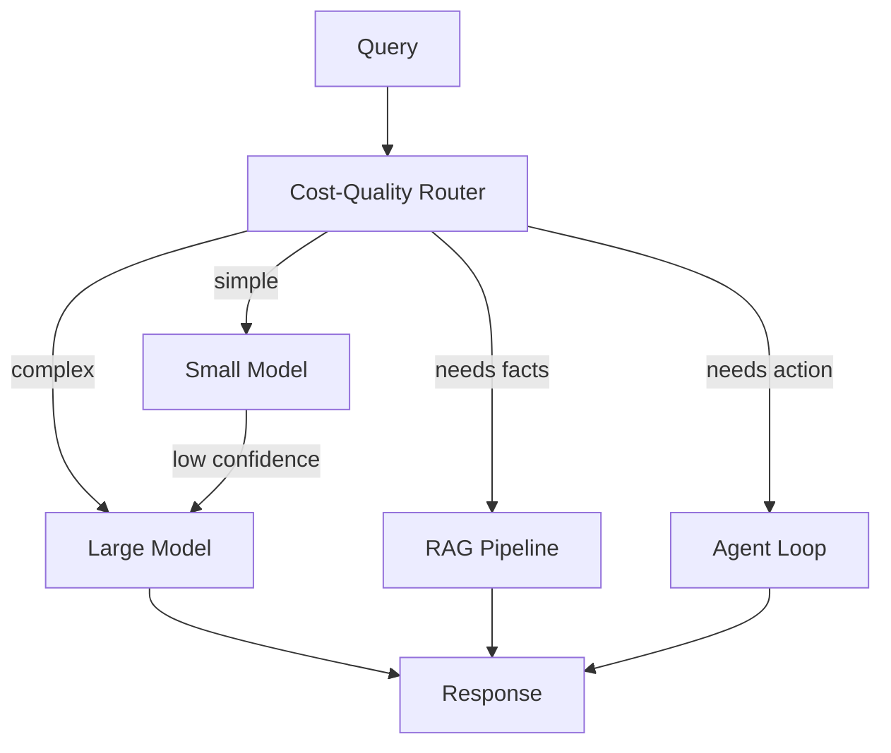
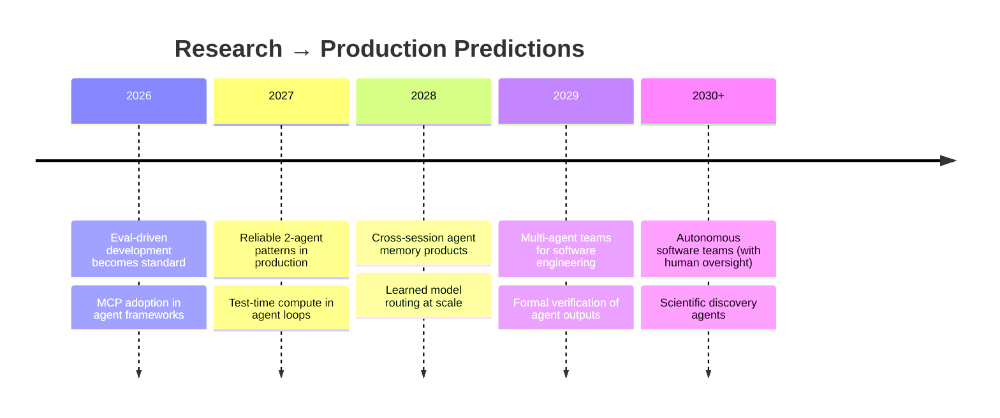

# Future Research

> One-sentence takeaway: The next breakthroughs are not bigger models — they are reliable compound systems with evaluation, memory, and cost-optimal orchestration.

## Open Problems Overview

---

## 1. Agent Reliability

**Current state:** SWE-bench resolve rates of 20-50% with best systems. Production agents fail silently on edge cases.

**Open problems:**

| Problem | Description | Why It Matters |
|---------|-------------|----------------|
| **Graceful degradation** | Agent fails → useful partial result, not silent error | Production trust |
| **Uncertainty quantification** | Agent knows when it doesn't know | Prevents confident hallucination |
| **Compositional generalization** | Agent handles novel tool combinations | Reduces brittleness |
| **Long-horizon tasks** | Maintain coherence over 50+ step workflows | Real work is long |
| **Adversarial robustness** | Resist prompt injection via tools/retrieval | Security |

**Research directions:**
- Test-time compute scaling (o1-style inference reasoning applied to agent loops)
- Formal verification of agent outputs against specs
- Automated red-teaming of agent pipelines
- Checkpoint-and-resume for long agent trajectories

**Engineering action:** Invest in evaluation infrastructure now — it compounds as agents improve.

---

## 2. Persistent Agent Memory

**Current state:** Agents reset every session. Voyager and Reflexion showed verbal memory works within limited trials.

**Open problems:**

| Problem | Description | Why It Matters |
|---------|-------------|----------------|
| **Cross-session memory** | Agent remembers user preferences, past tasks | Personalization |
| **Skill accumulation** | Agent builds reusable capabilities over time | Voyager promise |
| **Memory consolidation** | Summarize/compress growing memory | Context limits |
| **Forgetting** | Deliberately forget outdated information | Stale memory hurts |
| **Shared memory** | Multi-agent shared knowledge base | Team agents |

**Research directions:**
- Differentiable memory vs retrieval-based memory
- Memory schemas (episodic, semantic, procedural)
- Memory editing and correction
- Federated agent memory across users

**Engineering action:** Start with retrieval-based memory (vector store of past interactions) before waiting for research breakthroughs.

---

## 3. Evaluation-Driven Development

**Current state:** Most teams evaluate ad hoc. Research benchmarks (SWE-bench, AgentBench) don't match production tasks.

**Open problems:**

| Problem | Description | Why It Matters |
|---------|-------------|----------------|
| **Production-eval gap** | Benchmark scores don't predict production quality | False confidence |
| **Continuous evaluation** | Eval on every deploy, not quarterly | Regression detection |
| **Multi-dimensional metrics** | Quality + cost + latency + safety jointly | Real tradeoffs |
| **Human-AI eval agreement** | Automated metrics correlate with human judgment | Scale evaluation |
| **Eval for eval** | How do you know your eval is good? | Meta-problem |

**Research directions:**
- LLM-as-judge calibration and bias reduction
- Synthetic eval data generation (CAMEL-style, but verified)
- Causal evaluation (did the retrieval cause the correct answer?)
- Eval-driven optimization loops (DSPy + continuous eval)

**Engineering action:** Build eval pipelines before building features. See [AI Evaluation](../ai-evaluation/README.md).

---

## 4. Cost-Optimal Compound Systems

**Current state:** Teams use one model for everything or manually route. No principled cost-quality tradeoff framework.

**Open problems:**

| Problem | Description | Why It Matters |
|---------|-------------|----------------|
| **Model routing** | Right model for right subtask | 10× cost reduction |
| **Cascade architectures** | Small model first, escalate if uncertain | Latency + cost |
| **Test-time compute allocation** | How much reasoning budget per query? | o1 vs fast path |
| **Retrieval vs parametric** | When to retrieve vs rely on model knowledge? | CRAG extends this |
| **Agent step budgeting** | How many tool calls before giving up? | Cost control |

**Research directions:**
- Learned routers trained on cost-quality Pareto frontier
- Adaptive computation time per query
- Speculative execution (draft with small, verify with large)

**Engineering action:** Implement simple routing rules now (classify query complexity → route). Measure cost per query type.

---

## 5. Multi-Agent Orchestration

**Current state:** CAMEL, CrewAI, AutoGen demonstrate multi-agent potential. Production multi-agent is rare and fragile.

**Open problems:**

| Problem | Description | Why It Matters |
|---------|-------------|----------------|
| **Coordination protocols** | How agents delegate, negotiate, merge | Beyond free-form chat |
| **Emergent failure modes** | Agent collusion, infinite loops, responsibility diffusion | Production safety |
| **Optimal team size** | When does N agents beat 1 agent? | Cost vs quality |
| **Human-agent teams** | Optimal division of labor | HITL patterns |
| **Agent specialization** | Dynamic role assignment vs fixed roles | Flexibility |

**Research directions:**
- A2A (Agent-to-Agent) protocol maturation
- Game-theoretic analysis of multi-agent systems
- Hierarchical agent organizations (manager → workers)
- Market-based task allocation between agents

**Engineering action:** Start with 2-agent patterns (generator + verifier) before N-agent orchestration.

---

## 6. Grounding and Faithfulness

**Current state:** RAG reduces but doesn't eliminate hallucination. Self-RAG and CRAG are first steps.

**Open problems:**

| Problem | Description | Why It Matters |
|---------|-------------|----------------|
| **Citation accuracy** | Cited passage actually supports the claim | Legal, medical, finance |
| **Multi-hop grounding** | Combine facts from multiple sources correctly | Complex QA |
| **Temporal grounding** | Know when knowledge is outdated | Dynamic domains |
| **Numerical grounding** | Correct calculations from retrieved data | Financial analysis |
| **Contradiction detection** | Sources disagree — agent should flag, not pick | Intellectual honesty |

**Research directions:**
- Fine-grained attribution (claim → exact source span)
- Entailment models for claim verification
- Uncertainty-aware generation (abstain when unsupported)

**Engineering action:** Implement claim-level citation verification. Flag contradictions to users.

---

## 7. Tool and Protocol Ecosystem

**Current state:** MCP is emerging. Tool ecosystems are fragmented.

**Open problems:**

| Problem | Description | Why It Matters |
|---------|-------------|----------------|
| **Tool discovery** | Agent finds right tool from 100+ options | MCP scaling |
| **Tool composition** | Chain tools reliably | Complex workflows |
| **Tool versioning** | Agent handles API changes | Production stability |
| **Cross-framework portability** | Same tool server, any agent framework | MCP promise |
| **Tool security** | Permission models, sandboxing, audit | Enterprise adoption |

**Research directions:**
- Semantic tool indexing and recommendation
- Tool use program synthesis
- Formal tool contracts (input/output schemas with guarantees)

**Engineering action:** Build MCP servers for your internal tools now. See [MCP Domain](../mcp/README.md).

---

## Predicted Timeline

| Prediction | Confidence | Dependency |
|-----------|------------|------------|
| Eval-driven dev standard by 2026 | High | Already emerging |
| MCP widely adopted by 2027 | Medium-High | Ecosystem momentum |
| 50%+ SWE-bench resolve by 2028 | Medium | Test-time compute + ACI |
| Production multi-agent by 2028 | Medium | Coordination protocols |
| Persistent agent memory products by 2028 | Medium | Voyager pattern maturation |
| Autonomous software teams by 2030 | Low-Medium | Reliability + eval + safety |

---

## What Engineers Should Do Now

| Priority | Action | Prepares For |
|----------|--------|-------------|
| 1 | Build evaluation infrastructure | Everything |
| 2 | Adopt MCP for tool interfaces | Protocol ecosystem |
| 3 | Implement CRAG + ReAct (proven patterns) | Compound systems |
| 4 | Measure cost per query type | Model routing |
| 5 | Start with 2-agent (generator + verifier) | Multi-agent orchestration |
| 6 | Experiment with DSPy on one pipeline | Eval-driven optimization |
| 7 | Track research on test-time compute | Next-gen reasoning |

---

## Interview Questions

**Q: What is the biggest unsolved problem in AI agents?**
Reliability — agents fail silently on edge cases, and we lack evaluation that predicts production performance.

**Q: Will RAG be replaced by long-context models?**
No — RAG provides dynamic, updatable, attributable knowledge. Long context helps but doesn't replace retrieval for enterprise use cases.

**Q: What is test-time compute and why does it matter?**
Spending more inference compute (reasoning steps) on harder queries. o1 demonstrated this — apply to agent loops for reliability.

**Q: When will multi-agent systems be production-ready?**
2-agent patterns (generator + verifier) are production-ready now. N-agent orchestration needs 2-3 more years of protocol and eval maturity.

**Q: What should I bet my career on?**
Evaluation infrastructure and compound system engineering — these skills compound regardless of which specific research pattern wins.

---

## See Also

- [Research Evolution](research-evolution.md)
- [Engineering Takeaways](engineering-takeaways.md)
- [AI Evaluation](../ai-evaluation/README.md)
- [MCP Domain](../mcp/README.md)
- [AI Research Timeline Cheat Sheet](../../cheat-sheets/ai-research-timeline-cheat-sheet.md)

## Changelog

| Version | Date | Changes |
|---------|------|---------|
| 1.0 | 2026-07-13 | Initial future research directions |
