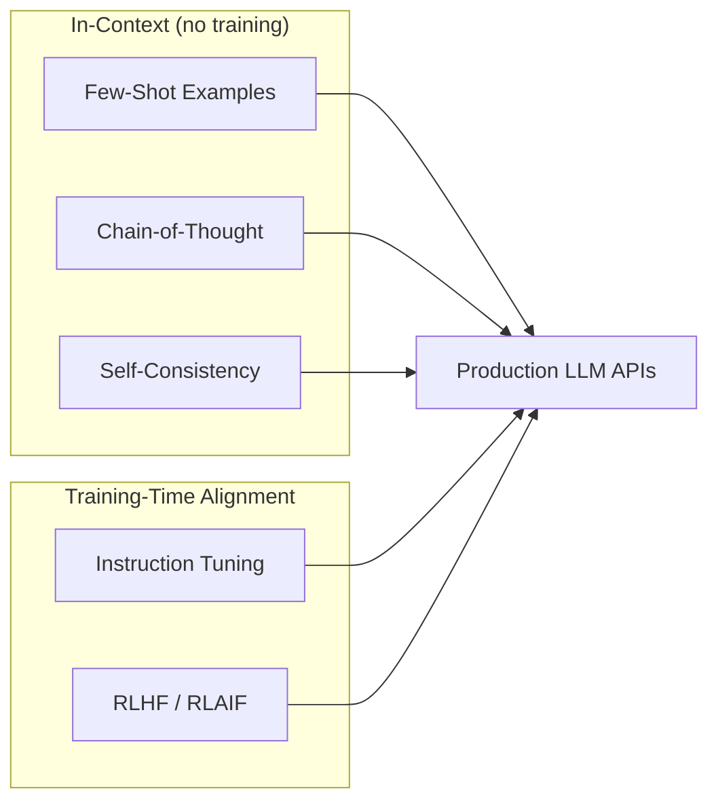
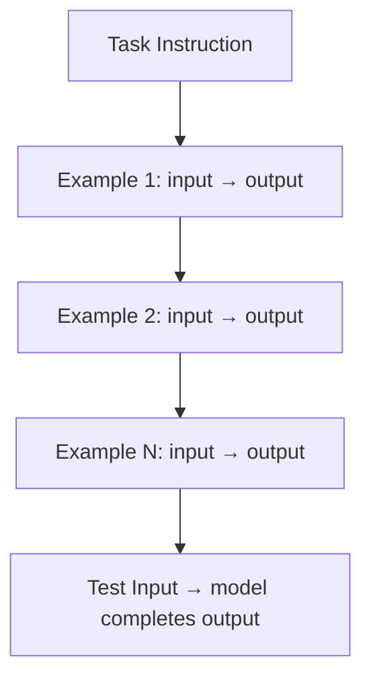
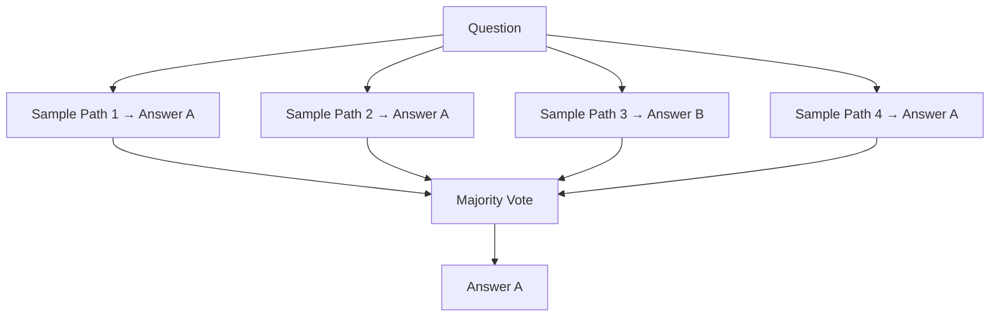
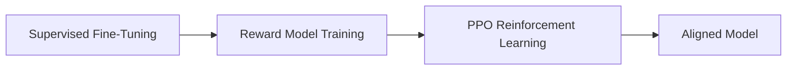

# Prompt Engineering Papers

> One-sentence takeaway: Prompting papers proved that **how you frame the input** — examples, reasoning steps, and instructions — often matters more than model size for task performance.

## Overview

Before agents and RAG, these papers established the core prompting toolkit: show examples (few-shot), ask for step-by-step reasoning (CoT), and align models to follow instructions (instruction tuning).



---

## Few-Shot Learning (GPT-3)

### Paper Details

| Field | Value |
|-------|-------|
| Authors | Brown et al. (OpenAI) |
| Year | 2020 |
| Title | Language Models are Few-Shot Learners |
| Link | [arXiv:2005.14165](https://arxiv.org/abs/2005.14165) |

### TL;DR

Large language models can perform new tasks from **a handful of examples in the prompt** — no gradient updates required. Performance scales with model size and example quality.

### Method Overview



**Prompt structure:** instruction + K examples + test input. The model infers the pattern from context.

### Key Contributions

1. Demonstrated in-context learning as a capability that emerges at scale
2. Established the prompt template: instruction → examples → query
3. Showed task performance improves predictably with model size

### Limitations

- Examples consume context window — typically 3-8 examples max
- Sensitive to example ordering, formatting, and label distribution
- No learning persists across sessions
- Smaller models may not few-shot reliably

### Production Applications

| Use Case | Pattern |
|----------|---------|
| Classification | 3-5 labeled examples per class |
| Format enforcement | 2-3 examples of desired JSON/XML output |
| Domain adaptation | Examples in target domain vocabulary |

```python
FEW_SHOT_TEMPLATE = """
Classify customer feedback as positive, negative, or neutral.

Feedback: "Love the new dashboard!"
Sentiment: positive

Feedback: "Shipping took forever."
Sentiment: negative

Feedback: "It works as described."
Sentiment: neutral

Feedback: "{user_input}"
Sentiment:
"""
```

### Engineering Takeaways

- **Curate examples carefully** — quality over quantity, diverse edge cases
- Use consistent formatting across all examples
- For production, prefer fine-tuning or DSPy optimization over manual example crafting

---

## Chain-of-Thought (CoT)

### Paper Details

| Field | Value |
|-------|-------|
| Authors | Wei et al. (Google) |
| Year | 2022 |
| Link | [arXiv:2201.11903](https://arxiv.org/abs/2201.11903) |

### TL;DR

Adding **"Let's think step by step"** or demonstrating intermediate reasoning steps dramatically improves performance on arithmetic, commonsense, and symbolic reasoning tasks.

### Method Overview


**Two variants:**
- **Zero-shot CoT** — append "Let's think step by step" to any prompt
- **Few-shot CoT** — include worked examples with visible reasoning chains

### Key Contributions

1. Unlocked reasoning in sufficiently large models without fine-tuning
2. Emergent ability — only works above ~100B parameters (original finding; smaller models now capable with instruction tuning)
3. Interpretable reasoning traces aid debugging

### Limitations

- Increases output tokens 3-10× — higher cost and latency
- Models can produce plausible but wrong reasoning (confabulated steps)
- Not all tasks benefit — simple extraction tasks may degrade
- Reasoning traces are not guaranteed to be faithful

### Production Applications

| Use Case | CoT Variant |
|----------|-------------|
| Math / calculations | Few-shot CoT with worked examples |
| Complex analysis | Zero-shot CoT + structured output |
| Debugging / root cause | "Think step by step" in system prompt |
| Agent planning | CoT as thought traces in ReAct |

### Engineering Takeaways

- Use CoT for **multi-step reasoning**, not simple lookups
- Hide reasoning traces from end users — show only final answer
- Validate final answers independently of reasoning chain

---

## Self-Consistency

### Paper Details

| Field | Value |
|-------|-------|
| Authors | Wang et al. |
| Year | 2022 |
| Link | [arXiv:2203.11171](https://arxiv.org/abs/2203.11171) |

### TL;DR

Sample **multiple CoT reasoning paths** and take the **majority vote** on the final answer — reduces variance without model changes.

### Architecture



### Engineering Takeaways

- 3-5 samples with temperature > 0 — good cost/accuracy tradeoff
- Best for tasks with discrete answers (multiple choice, classification, math)
- Expensive for open-ended generation — use for verification, not drafting

---

## Instruction Tuning (FLAN / FLAN-T5)

### Paper Details

| Field | Value |
|-------|-------|
| Authors | Wei et al. / Chung et al. |
| Year | 2021 / 2022 |
| Titles | Finetuned Language Models Are Zero-Shot Learners (FLAN) |
| Link | [arXiv:2109.01652](https://arxiv.org/abs/2109.01652) · [arXiv:2210.11416](https://arxiv.org/abs/2210.11416) |

### TL;DR

Fine-tuning on a **diverse collection of tasks formatted as instructions** dramatically improves zero-shot performance on unseen tasks — the foundation of modern "helpful assistant" models.

### Method Overview


**Instruction format:**
```
Task: Summarize the following article.
Input: {article text}
Output: {summary}
```

### Key Contributions

1. Instruction tuning generalizes better than task-specific fine-tuning
2. Scaling instruction diversity matters more than task depth
3. Foundation for all modern chat models (GPT-3.5+, Claude, Llama-Chat)

### Limitations

- Requires large-scale fine-tuning infrastructure
- Instruction format must match training format at inference
- Does not teach factual knowledge — only task format
- Catastrophic forgetting if not mixed with general data

### Engineering Takeaways

- Modern chat models already instruction-tuned — **write clear instructions**, not clever hacks
- Fine-tune on your task format only when API models insufficient
- Match prompt structure to how models were trained (instruction → input → output)

---

## InstructGPT / RLHF

### Paper Details

| Field | Value |
|-------|-------|
| Authors | Ouyang et al. (OpenAI) |
| Year | 2022 |
| Link | [arXiv:2203.02155](https://arxiv.org/abs/2203.02155) |

### TL;DR

**Reinforcement Learning from Human Feedback (RLHF)** aligns instruction-tuned models with human preferences — making them helpful, harmless, and honest. This is the training pipeline behind ChatGPT.

### Method Overview



**Three stages:**
1. **SFT** — fine-tune on high-quality human demonstrations
2. **Reward model** — train classifier on human preference comparisons
3. **PPO** — optimize model outputs against reward model

### Key Contributions

1. RLHF produces models humans prefer over larger unaligned models
2. Established the SFT → RM → RL pipeline used industry-wide
3. Demonstrated alignment reduces harmful outputs

### Limitations

- Expensive to train — requires human labelers and RL infrastructure
- Reward hacking — model optimizes reward, not true quality
- Alignment can reduce capability on some tasks (alignment tax)
- Human preferences are subjective and culturally biased

### Engineering Takeaways

- You benefit from RLHF via API models — focus on prompt design, not replicating RLHF
- Aligned models refuse harmful requests — design around safety boundaries
- For custom alignment, consider RLAIF (AI feedback) or DPO (simpler than PPO)

---

## Prompt Engineering vs Instruction Tuning vs RLHF

| Approach | When | Cost | Persistence |
|----------|------|------|-------------|
| Few-shot / CoT | Quick experiments, no training | Per-token | Per-session |
| Instruction tuning | Custom task format at scale | Training run | Permanent |
| RLHF / DPO | Alignment with preferences | Very expensive | Permanent |
| DSPy optimization | Automated prompt tuning | Optimization run | Saved prompts |

## Interview Questions

**Q: What is the difference between few-shot and fine-tuning?**
Few-shot puts examples in the prompt (no weight changes, limited examples). Fine-tuning updates weights on a dataset (persistent, scales to large datasets).

**Q: When does Chain-of-Thought help vs hurt?**
Helps on multi-step reasoning (math, planning, analysis). Hurts on simple extraction or when latency/cost constraints are tight.

**Q: What is instruction tuning and why does it matter?**
Training on diverse instruction-formatted tasks so the model generalizes to new tasks zero-shot. It's why you can prompt modern chat models with plain English.

**Q: Explain RLHF in three steps.**
SFT on demonstrations → train reward model on human preferences → optimize model with reinforcement learning against the reward model.

**Q: How would you improve a failing prompt without fine-tuning?**
Add few-shot examples, enable CoT, try self-consistency, restructure instructions, or use DSPy to optimize automatically.

---

## See Also

- [Prompt Engineering Domain](../prompt-engineering/README.md)
- [Advanced Reasoning Strategies](../prompt-engineering/advanced-reasoning-strategies.md)
- [DSPy](dspy.md)
- [Agent Reasoning Papers](agent-reasoning-papers.md)

## Changelog

| Version | Date | Changes |
|---------|------|---------|
| 1.0 | 2026-07-13 | Initial engineering guide — CoT, few-shot, instruction tuning |
