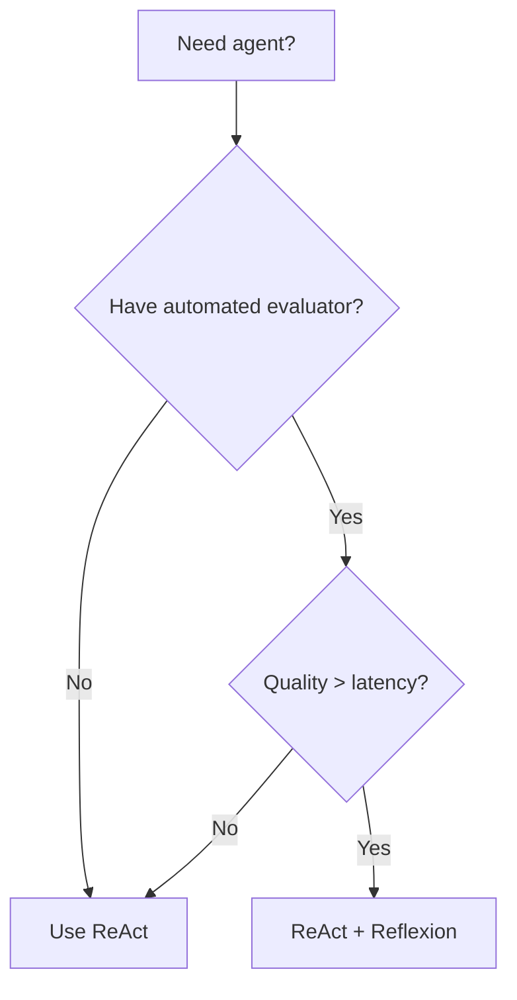
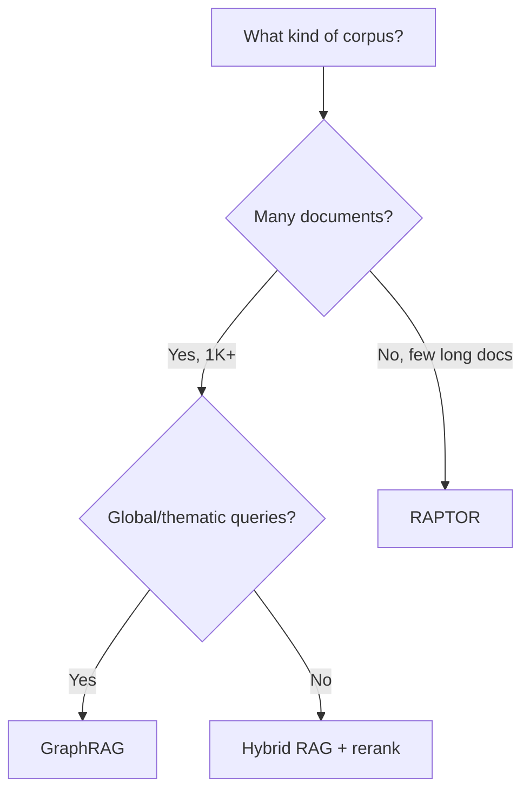
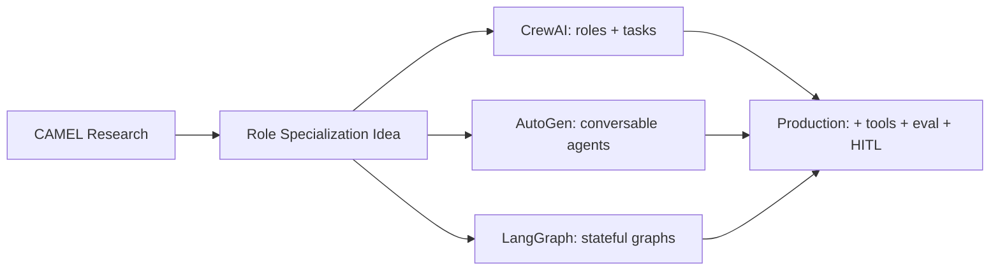

# Research Comparison Guides

> One-sentence takeaway: Use these tables to pick the right research pattern for your problem — not the most impressive one.

---

## ReAct vs Reflexion

| Dimension | ReAct | Reflexion |
|-----------|-------|-----------|
| **Core loop** | Thought → Action → Observation | Act → Evaluate → Reflect → Retry |
| **Memory** | Within-session context only | Accumulates reflections across trials |
| **Cost** | 1× (single trajectory) | N× (multiple trials) |
| **Latency** | Low-medium | High (sequential retries) |
| **Requires evaluator** | No | Yes (tests, heuristics, or LLM judge) |
| **Best for** | General tool agents, RAG agents | Code generation, structured tasks with clear pass/fail |
| **Production fit** | Default — framework support everywhere | Add when automated evaluation exists |
| **Failure mode** | Wrong path, no recovery | Evaluator itself is wrong |
| **Combine?** | Yes — use Reflexion with ReAct as the actor |

**Decision rule:** Start with ReAct. Add Reflexion when you have a reliable evaluator and quality matters more than latency.

---

## ReAct vs Tree of Thoughts

| Dimension | ReAct | Tree of Thoughts |
|-----------|-------|------------------|
| **Search strategy** | Single path (greedy) | Multi-path (branching search) |
| **Backtracking** | No (unless manual replan) | Yes (prune and explore alternatives) |
| **LLM calls per step** | 1 | N (branch factor) × depth |
| **Cost** | Medium | Very high |
| **Latency** | Seconds | Minutes |
| **Best for** | Tool use, retrieval, API calls | Puzzles, math, planning with dead ends |
| **Production fit** | Standard | Rare — offline/high-stakes only |
| **Failure mode** | Commits to wrong first path | Cost explosion, evaluation prompt fragility |
| **Practical alternative** | ReAct + replan on failure | Gets 80% benefit at 20% cost |

**Decision rule:** Use ReAct for production. Use ToT only when the problem has clear branching (multiple valid approaches) and you can afford 10-50× cost.

---

## GraphRAG vs RAPTOR

| Dimension | GraphRAG | RAPTOR |
|-----------|----------|--------|
| **Index structure** | Knowledge graph + community summaries | Recursive summary tree |
| **Indexing cost** | Very high (entity extraction + graph + communities) | High (clustering + summarization) |
| **Query type** | Global/thematic ("main themes?") + entity-specific | Multi-level ("overview" vs "detail") |
| **Corpus size** | Best at 1K+ documents | Best for long single documents |
| **Cross-document** | Strong (graph connects docs) | Weak (per-document trees) |
| **Entity relationships** | Explicit (graph edges) | Implicit (cluster similarity) |
| **Update cost** | Re-index entire graph | Rebuild tree for changed doc |
| **Production maturity** | Emerging (Microsoft tooling) | Research → early production |

**Decision rule:** GraphRAG for enterprise knowledge bases with cross-document questions. RAPTOR for long narrative documents (books, legal, research).

---

## Self-RAG vs CRAG

| Dimension | Self-RAG | CRAG |
|-----------|----------|------|
| **Who evaluates retrieval?** | The generation model (reflection tokens) | Separate evaluator model |
| **Granularity** | Per-claim support verification | Corpus-level relevance grading |
| **Fallback strategy** | Re-retrieve or revise generation | Query rewrite or web search |
| **Training required** | Ideally fine-tuned model | Evaluator can be small classifier |
| **Latency** | High (multi-step reflection) | Medium (one evaluation step) |
| **Implementation** | Hard without fine-tuning | Easier — prompt-based evaluator |
| **Best for** | Maximum faithfulness | Practical production improvement |
| **Cost to implement** | High | Low-medium |

**Decision rule:** Implement CRAG first (highest ROI). Add Self-RAG-style claim verification for high-stakes applications.

---

## DSPy vs Manual Prompt Engineering

| Dimension | Manual Prompt Engineering | DSPy |
|-----------|--------------------------|------|
| **Approach** | Hand-craft prompts and examples | Define signatures, auto-optimize |
| **Requires dataset** | No | Yes (50-300+ examples) |
| **Iteration** | Manual trial-and-error | Systematic search |
| **Multi-step pipelines** | Optimize each prompt separately | Joint optimization |
| **Reproducibility** | Low (prompts in notebooks) | High (saved compilations) |
| **Model portability** | Manual re-tuning per model | Re-compile per model |
| **Time to first result** | Minutes | Hours (setup + compilation) |
| **Ceiling performance** | Limited by human intuition | Limited by metric + data quality |
| **Best for** | Exploration, single prompts, no data | Production pipelines with eval data |

**Decision rule:** Manual PE for prototyping and simple tasks. DSPy when you have labeled data and a multi-step pipeline to optimize.

---

## SWE-Agent vs Traditional Agents

| Dimension | Traditional Agent (raw shell) | SWE-Agent (ACI) |
|-----------|------------------------------|-----------------|
| **File access** | `cat file.py` — full dump | Windowed viewer — progressive disclosure |
| **Editing** | `sed` / patch files | Line-range edit command |
| **Output format** | Raw terminal text | Structured, truncated, highlighted |
| **Token efficiency** | Poor (dumps entire files) | Good (100-line windows) |
| **Edit precision** | Low (regex errors) | High (exact line replacement) |
| **Test integration** | Manual `run` command | Built-in feedback loop |
| **Environment** | Host machine (risky) | Docker sandbox |
| **Evaluation** | Ad hoc | SWE-bench standard |
| **Best for** | General tasks | Code editing, bug fixing |

**Decision rule:** Never give coding agents raw shell. Build or use an ACI with windowed viewing, precise editing, and test feedback.

---

## CAMEL vs Multi-Agent Frameworks

| Dimension | CAMEL (research) | Production Multi-Agent (CrewAI, AutoGen) |
|-----------|-----------------|------------------------------------------|
| **Agent communication** | Free-form role-play dialogue | Structured task delegation |
| **Role definition** | Inception prompting | Explicit role + goal + backstory |
| **Tool use** | None in original paper | Built-in tool support |
| **Termination** | Implicit (task completion) | Explicit (max iterations, output schema) |
| **Verification** | None | Human-in-the-loop, evaluators |
| **Use case** | Research, synthetic data generation | Production task pipelines |
| **Risk** | Agents collude / hallucinate progress | Better guardrails but still needs oversight |

**Decision rule:** Use production frameworks (CrewAI, LangGraph) inspired by CAMEL's role specialization, but add tools, evaluators, and termination conditions CAMEL lacks.

---

## Master Decision Matrix

| I need to... | Use | Not |
|-------------|-----|-----|
| Build a tool agent | ReAct | ToT |
| Improve code generation | ReAct + Reflexion | ToT |
| Fix bad retrieval | CRAG evaluator | Jump to GraphRAG |
| Answer cross-doc themes | GraphRAG | Flat chunk RAG |
| Query long documents | RAPTOR | Standard chunking |
| Verify answer faithfulness | Self-RAG-style checks | Blind generation |
| Optimize prompts at scale | DSPy | Manual iteration |
| Build a coding agent | ACI (SWE-Agent pattern) | Raw shell access |
| Multi-agent task pipeline | CrewAI / LangGraph | Raw CAMEL |

## Interview Questions

**Q: ReAct vs Reflexion — when to use which?**
ReAct is the default for any tool agent. Add Reflexion when you have automated evaluation and need higher quality through retry-with-reflection.

**Q: GraphRAG vs RAPTOR?**
GraphRAG for many documents with entity relationships and global questions. RAPTOR for few long documents needing hierarchical summarization.

**Q: Should I implement Self-RAG or CRAG first?**
CRAG — simpler to implement (separate evaluator), immediate production value. Add Self-RAG claim verification later for high-stakes apps.

**Q: When is DSPy worth the setup cost?**
When you have 50+ labeled examples, a multi-step pipeline, and plan to iterate on model versions. Not worth it for single-prompt prototypes.

**Q: What did SWE-Agent teach the industry?**
Specialized agent interfaces (ACI) matter more than model capability alone for domain-specific tasks like code editing.

---

## See Also

- [Agent Reasoning Papers](agent-reasoning-papers.md)
- [Retrieval Papers](retrieval-papers.md)
- [Engineering Takeaways](engineering-takeaways.md)
- [Paper Comparison Matrix Cheat Sheet](../../cheat-sheets/paper-comparison-matrix-cheat-sheet.md)

## Changelog

| Version | Date | Changes |
|---------|------|---------|
| 1.0 | 2026-07-13 | Initial comparison guides |
