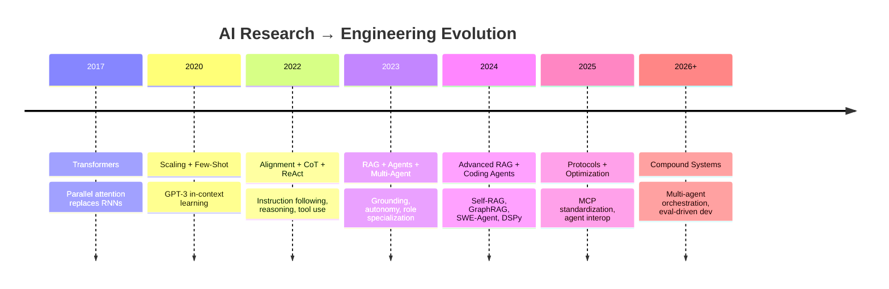
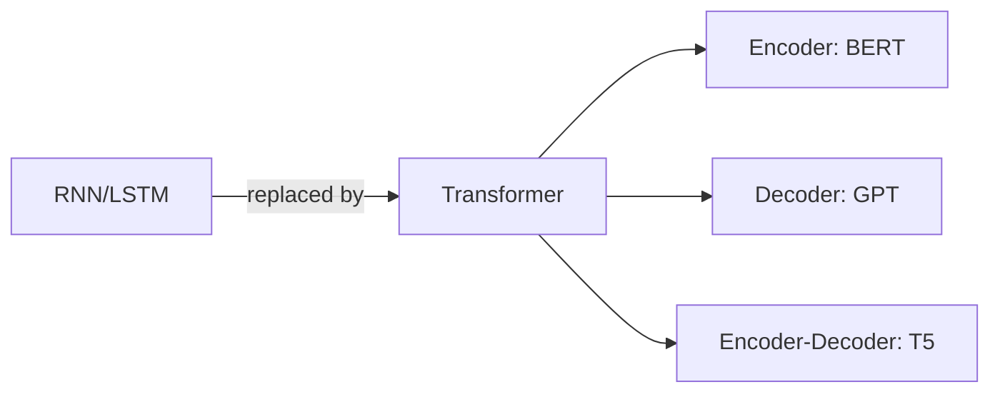
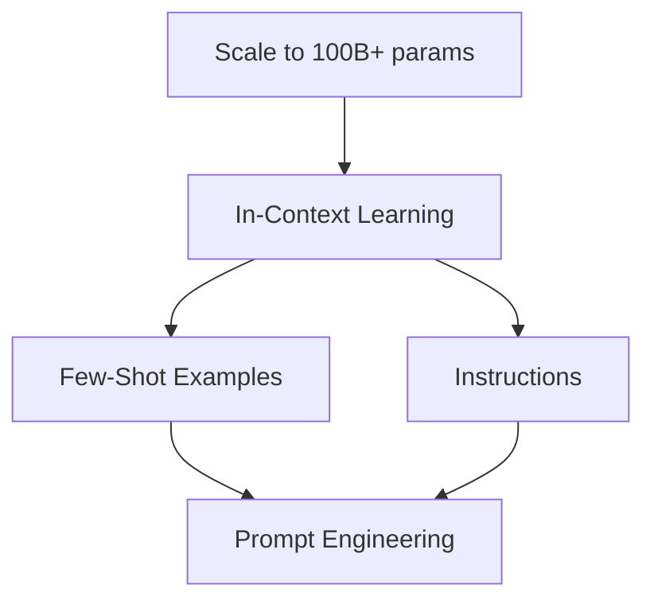
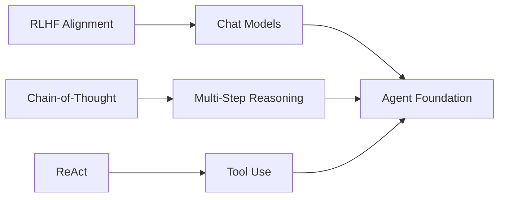
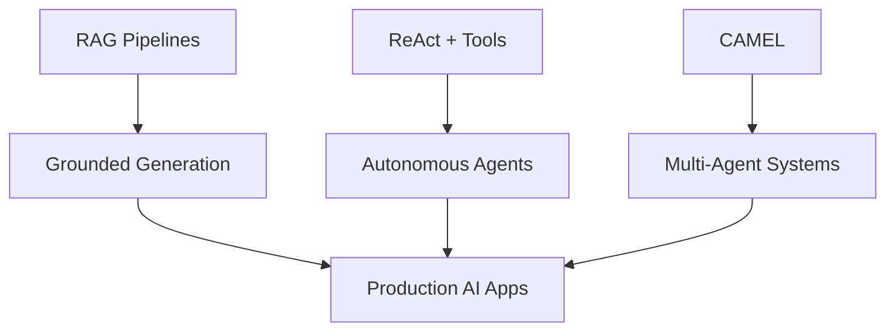
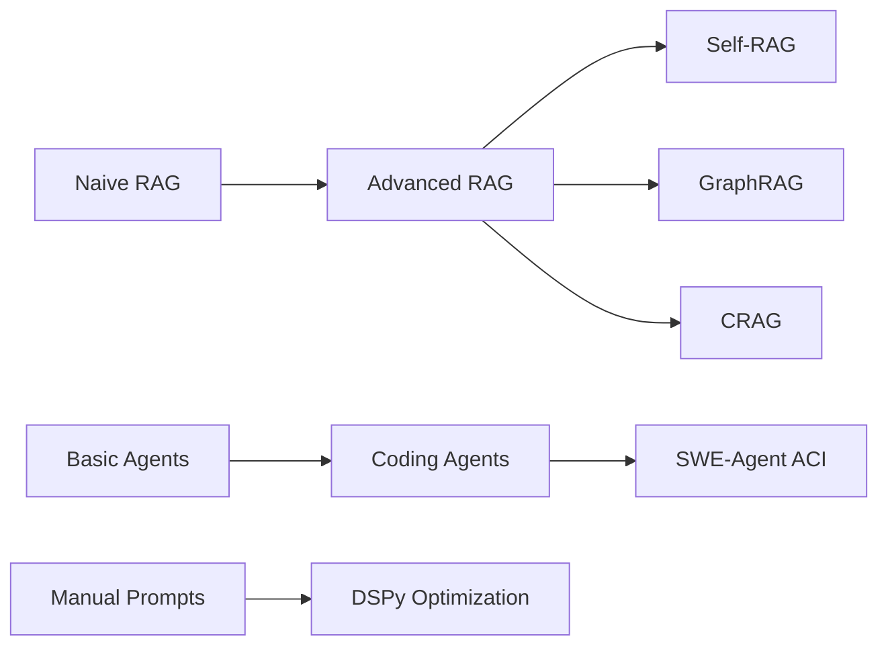
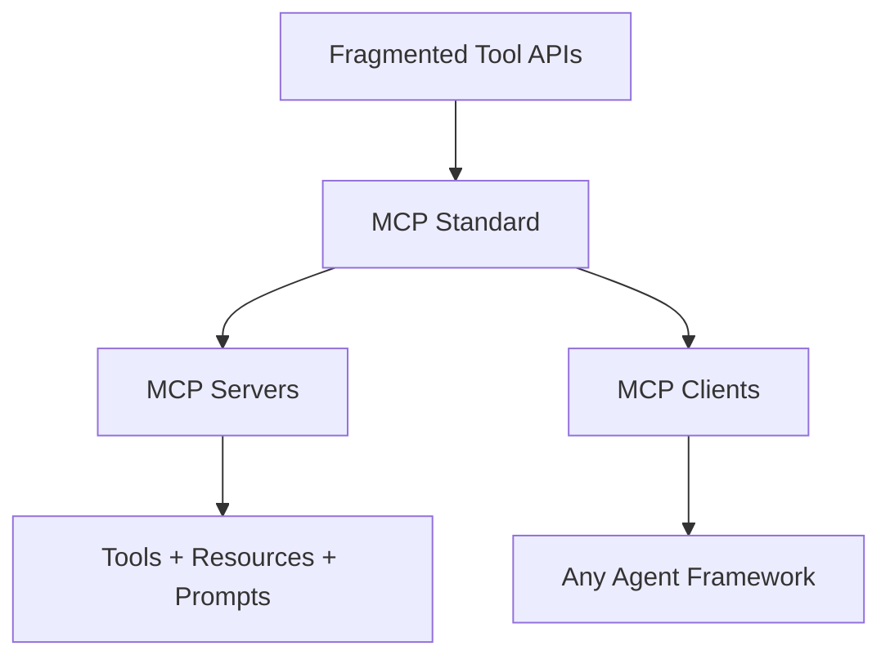
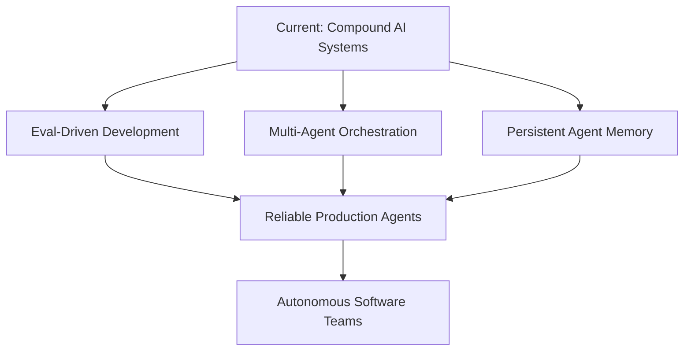
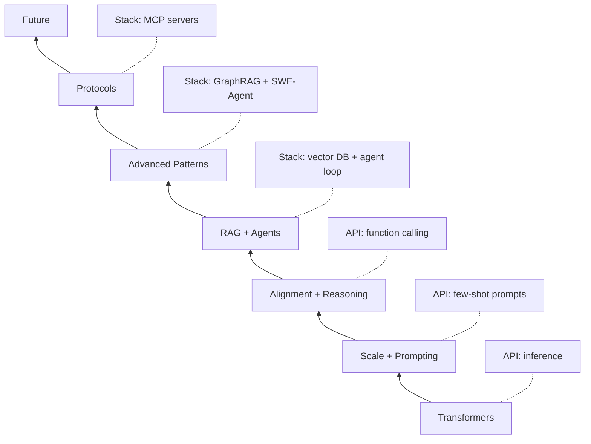

# Research Evolution

> One-sentence takeaway: AI engineering evolved in layers — each research wave solved the previous layer's limitations, from parallel sequence modeling to autonomous tool-using agents.

## Timeline Overview

---

## Era 1: Transformers (2017–2019)

**Problem solved:** Sequential processing bottleneck in RNNs/LSTMs.

| Year | Milestone | Engineering Impact |
|------|-----------|-------------------|
| 2017 | [Attention Is All You Need](attention-is-all-you-need.md) | Foundation architecture |
| 2018 | BERT (encoder-only) | Embeddings, classification, reranking |
| 2019 | GPT-2 (decoder-only) | Text generation at scale |

**Engineering unlock:** LLM APIs, embedding services, fine-tuning infrastructure.

**Limitation:** Models know only training data — no external knowledge, no actions.

---

## Era 2: Scale + Prompting (2020–2021)

**Problem solved:** How to use one model for many tasks without retraining.

| Year | Milestone | Engineering Impact |
|------|-----------|-------------------|
| 2020 | GPT-3 + [Few-Shot](prompt-engineering-papers.md) | Prompt engineering as discipline |
| 2021 | FLAN (instruction tuning) | Zero-shot task generalization |
| 2021 | Codex | Code generation from prompts |

**Engineering unlock:** Prompt templates, system prompts, API-based AI products.

**Limitation:** Hallucination, no grounding, no multi-step reasoning, no tool use.

---

## Era 3: Alignment + Reasoning (2022)

**Problem solved:** Models that follow instructions, reason step-by-step, and use tools.

| Year | Milestone | Engineering Impact |
|------|-----------|-------------------|
| 2022 | InstructGPT / RLHF | ChatGPT, aligned assistants |
| 2022 | [Chain-of-Thought](prompt-engineering-papers.md) | Step-by-step reasoning |
| 2022 | [ReAct](agent-reasoning-papers.md) | Tool-using agent loop |
| 2022 | Self-Consistency | Majority vote over reasoning paths |

**Engineering unlock:** Chatbots, function calling, agent frameworks (LangChain).

**Limitation:** Still no external knowledge retrieval, single-agent, no memory across sessions.

---

## Era 4: RAG + Agents (2023)

**Problem solved:** Grounding in external knowledge and autonomous multi-step task execution.

| Year | Milestone | Engineering Impact |
|------|-----------|-------------------|
| 2023 | RAG (Lewis et al., 2020; production adoption) | Vector DBs, retrieval pipelines |
| 2023 | [Tree of Thoughts](agent-reasoning-papers.md) | Deliberate search |
| 2023 | [Reflexion](agent-reasoning-papers.md) | Learning from failure |
| 2023 | [Voyager](agent-reasoning-papers.md) | Skill libraries |
| 2023 | [CAMEL](agent-reasoning-papers.md) | Multi-agent role play |
| 2023 | AutoGPT / BabyAGI | Agent hype cycle begins |

**Engineering unlock:** Production RAG, agent frameworks (LangGraph, CrewAI), vector databases.

**Limitation:** Naive RAG fails on complex queries; agents lack evaluation and safety.

---

## Era 5: Advanced Patterns (2024)

**Problem solved:** Naive RAG and agent failures at scale.

| Year | Milestone | Engineering Impact |
|------|-----------|-------------------|
| 2024 | [Self-RAG](retrieval-papers.md) | Retrieval reflection |
| 2024 | [GraphRAG](retrieval-papers.md) | Knowledge graph retrieval |
| 2024 | [RAPTOR](retrieval-papers.md) | Hierarchical retrieval |
| 2024 | [CRAG](retrieval-papers.md) | Corrective retrieval |
| 2024 | [SWE-Agent](swe-agent.md) | Coding agent ACI |
| 2024 | [DSPy](dspy.md) | Programmatic prompt optimization |
| 2024 | Devin / Cursor Agent | Commercial coding agents |

**Engineering unlock:** Advanced RAG architectures, coding agent interfaces, systematic prompt optimization.

**Limitation:** Fragmented tool interfaces, no standard agent-tool protocol.

---

## Era 6: Protocols + Standardization (2025)

**Problem solved:** Every agent framework invents its own tool interface.

| Year | Milestone | Engineering Impact |
|------|-----------|-------------------|
| 2025 | [MCP (Model Context Protocol)](../mcp/README.md) | Standardized tool/resource protocol |
| 2025 | A2A (Agent-to-Agent) | Inter-agent communication |
| 2025 | OpenAI function calling maturity | Production tool use |
| 2025 | Agent evaluation frameworks | SWE-bench, AgentBench, custom evals |

**Engineering unlock:** Portable tool servers, multi-framework agent tooling, standardized observability.

**Limitation:** MCP adoption still early; agent reliability and safety remain unsolved.

---

## Era 7: Future (2026+)

See [Future Research](future-research.md) for detailed open problems.

**Emerging themes:**
- Compound systems (RAG + agents + tools + eval in one pipeline)
- Test-time compute scaling (o1, inference-time reasoning)
- Agent memory and lifelong learning
- Formal verification of agent outputs
- Cost-optimal routing across models and patterns

---

## How Eras Build on Each Other

| Era | You Build | You Consume |
|-----|-----------|-------------|
| Transformers | Fine-tuning pipelines | LLM APIs |
| Prompting | Prompt templates | Chat completions |
| Reasoning | Agent loops | Function calling |
| RAG + Agents | Retrieval + orchestration | Vector DBs + frameworks |
| Advanced | Custom ACI, compilers | DSPy, SWE-bench |
| Protocols | MCP servers | MCP clients |
| Future | Eval infrastructure | Everything above |

---

## Interview Questions

**Q: What did each era add to the previous one?**
Transformers (architecture) → Prompting (task adaptation) → Alignment (safety/quality) → RAG (grounding) → Agents (autonomy) → Protocols (interoperability).

**Q: Why did RAG emerge after ChatGPT?**
Chat models hallucinate and have knowledge cutoffs. RAG grounds generation in retrieved facts without retraining.

**Q: What problem does MCP solve?**
Every agent framework had its own tool interface. MCP standardizes how agents discover and call tools/resources.

**Q: Where are we on the hype cycle?**
Past peak hype for "autonomous AGI agents." Entering productive phase for specific agent applications (coding, support, research) with real evaluation.

**Q: What is the next likely research breakthrough?**
Reliable multi-agent orchestration with formal evaluation, or test-time compute making reasoning models practical at agent-loop cost.

---

## See Also

- [Attention Is All You Need](attention-is-all-you-need.md)
- [Future Research](future-research.md)
- [Engineering Takeaways](engineering-takeaways.md)
- [AI Research Timeline Cheat Sheet](../../cheat-sheets/ai-research-timeline-cheat-sheet.md)

## Changelog

| Version | Date | Changes |
|---------|------|---------|
| 1.0 | 2026-07-13 | Initial timeline |
