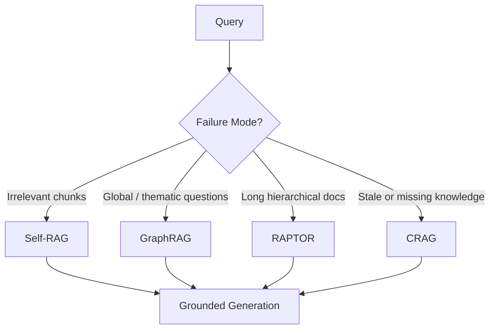
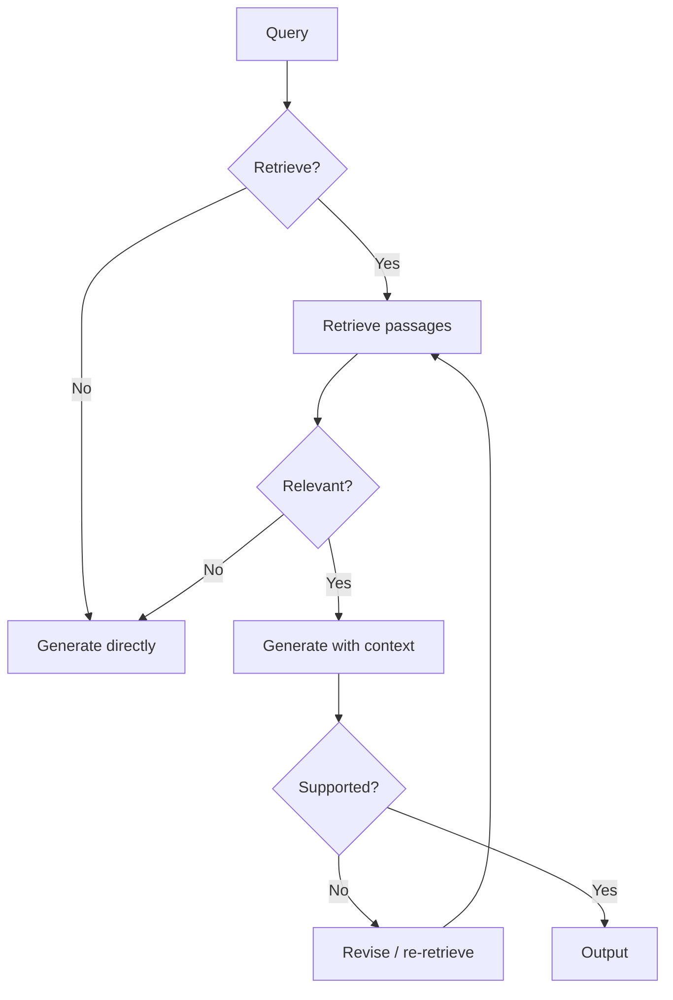
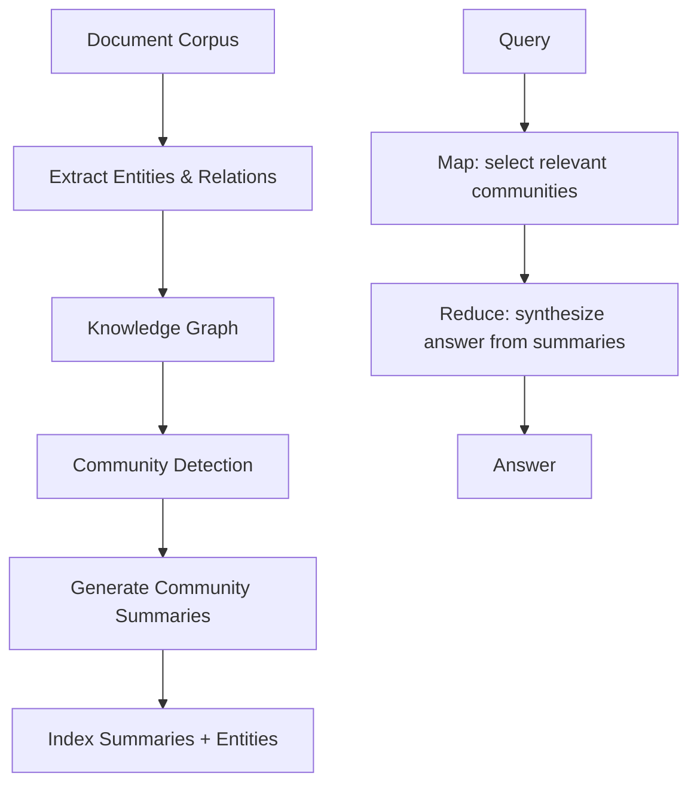
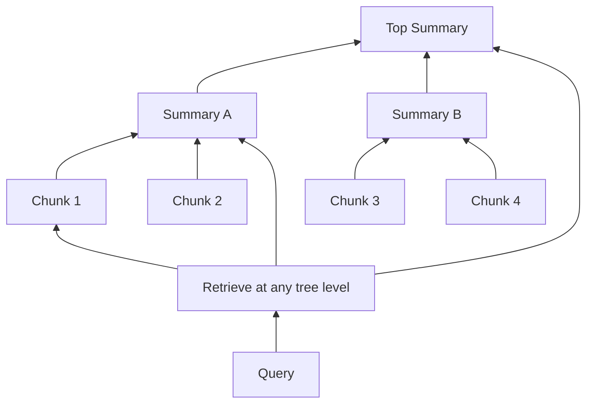
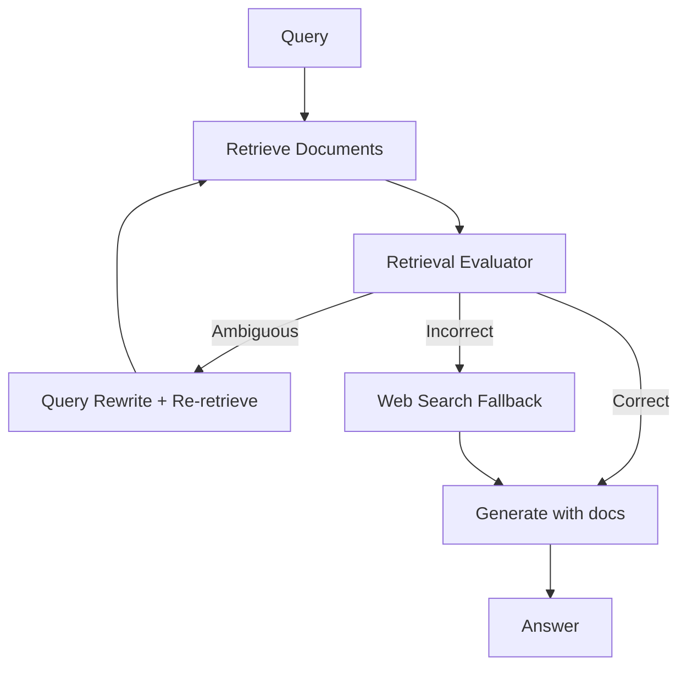

# Retrieval Papers

> One-sentence takeaway: Advanced retrieval papers add reflection, hierarchy, graphs, and correction to naive RAG — each solves a specific failure mode at the cost of complexity and latency.

## Overview

Naive RAG (retrieve → stuff context → generate) fails on global questions, long documents, irrelevant retrieval, and stale knowledge. These four papers represent the most cited engineering responses.



---

## Self-RAG

### Paper Details

| Field | Value |
|-------|-------|
| Authors | Asai et al. |
| Year | 2023 |
| Link | [arXiv:2310.11511](https://arxiv.org/abs/2310.11511) |

### TL;DR

Self-RAG trains the model to emit **reflection tokens** that decide whether to retrieve, whether retrieved passages are relevant, and whether the generation is supported by evidence.

### Architecture



**Reflection token types:**
- `Retrieve` — should I retrieve?
- `ISREL` — is this passage relevant?
- `ISSUP` — is the claim supported by the passage?
- `ISUSE` — is the response useful?

### Key Contributions

1. Retrieval decisions made by the model, not a fixed pipeline
2. Self-critique reduces hallucination and irrelevant retrieval
3. Trainable framework — reflection tokens learned during training

### Limitations

- Requires fine-tuned model or careful prompt simulation
- Multiple reflection steps add latency
- Reflection quality depends on base model
- Hard to evaluate reflection token accuracy in production

### Production Applications

| Scenario | Implementation |
|----------|----------------|
| High-stakes Q&A | Add relevance grading before generation |
| Noisy corpora | Skip retrieval when model is confident |
| Citation-heavy apps | Verify claim support before returning |

```python
# Prompt-simulated Self-RAG (without fine-tuning)
SELF_RAG_PROMPT = """
Step 1: Decide if retrieval is needed (yes/no) and why.
Step 2: If yes, grade each chunk: relevant / irrelevant.
Step 3: Generate answer using only relevant chunks.
Step 4: For each claim, mark: supported / unsupported.
Step 5: Revise unsupported claims or retrieve again.
"""
```

### Engineering Takeaways

- **Simulate with prompts** before investing in fine-tuning
- Grade retrieval relevance with a cheap model, generate with an expensive one
- Log reflection decisions for evaluation dashboards

---

## GraphRAG

### Paper Details

| Field | Value |
|-------|-------|
| Authors | Edge et al. (Microsoft Research) |
| Year | 2024 |
| Link | [arXiv:2404.16130](https://arxiv.org/abs/2404.16130) |

### TL;DR

GraphRAG builds a **knowledge graph** from documents, detects **communities** in the graph, generates **community summaries**, and uses them to answer global questions that span many documents.

### Architecture



**Two query modes:**
- **Global search** — map-reduce over community summaries (thematic questions)
- **Local search** — entity-centric graph traversal (specific entity questions)

### Key Contributions

1. Solves "global sensemaking" — questions like "What are the main themes across this dataset?"
2. Community summaries compress graph structure into LLM-readable context
3. Combines graph structure with vector retrieval

### Limitations

- **Expensive indexing** — entity extraction + community detection + summary generation
- Graph quality depends on extraction model accuracy
- Overkill for small corpora (<1000 docs)
- Community boundaries may not align with user mental models
- Re-indexing cost on document updates

### Production Applications

| Scenario | Fit |
|----------|-----|
| Enterprise knowledge base (10K+ docs) | Strong |
| Thematic analysis / due diligence | Strong |
| Single-document Q&A | Poor — use standard RAG |
| Real-time ingestion | Weak — batch indexing pipeline |

### Engineering Takeaways

- Run GraphRAG indexing as **offline batch job**, not per-query
- Start with local search before global — cheaper and often sufficient
- Budget for re-indexing on corpus updates

---

## RAPTOR

### Paper Details

| Field | Value |
|-------|-------|
| Authors | Sarthi et al. |
| Year | 2024 |
| Link | [arXiv:2401.18059](https://arxiv.org/abs/2401.18059) |

### TL;DR

RAPTOR builds a **recursive tree** of summaries — leaf nodes are chunks, parent nodes summarize clusters of children, enabling retrieval at multiple abstraction levels.

### Architecture



**Build process:**
1. Embed and cluster leaf chunks (by embedding similarity)
2. Summarize each cluster with an LLM
3. Recursively cluster and summarize until tree root
4. Index all levels (leaves + summaries) in vector store

### Key Contributions

1. Multi-level retrieval — match query granularity to tree depth
2. Summaries preserve thematic context lost in flat chunking
3. Strong on long narrative documents (books, reports)

### Limitations

- Tree construction is compute-intensive (clustering + summarization)
- Summarization can lose specific details (names, numbers, dates)
- Fixed tree structure — may not adapt to query patterns
- Clustering quality affects summary coherence

### Production Applications

| Scenario | Fit |
|----------|-----|
| Long reports, legal docs, research papers | Strong |
| Narrative with thematic sections | Strong |
| Structured data / tables | Weak |
| FAQ with short answers | Weak — flat chunks suffice |

### Engineering Takeaways

- Combine RAPTOR tree retrieval with **parent-document retrieval** for detail
- Store chunk → summary lineage for citation back to source
- Rebuild tree on document update, not incrementally (v1)

---

## CRAG (Corrective RAG)

### Paper Details

| Field | Value |
|-------|-------|
| Authors | Yan et al. |
| Year | 2024 |
| Link | [arXiv:2401.15884](https://arxiv.org/abs/2401.15884) |

### TL;DR

CRAG adds a **retrieval evaluator** that grades document relevance and triggers **corrective actions** — filter bad docs, rewrite queries, or fall back to web search.

### Architecture



**Three relevance grades:**
- **Correct** — documents are relevant, proceed
- **Ambiguous** — partially relevant, refine query and re-retrieve
- **Incorrect** — irrelevant, discard and use web search

### Key Contributions

1. Explicit retrieval quality gate before generation
2. Web search as fallback for knowledge gaps
3. Lightweight evaluator (often T5-large) — cheap relative to generation

### Limitations

- Evaluator accuracy is the bottleneck
- Web search adds latency and introduces uncontrolled sources
- Binary/ternary grading may miss nuanced relevance
- Fallback to web can violate data governance policies

### Production Applications

| Scenario | Fit |
|----------|-----|
| Knowledge bases with stale content | Strong |
| Mixed internal + external knowledge | Strong (with governance) |
| Closed corpora (no web allowed) | Partial — skip web fallback |
| High-precision requirements | Strong |

```python
def corrective_rag(query, retriever, evaluator, web_search, generator):
    docs = retriever.search(query, top_k=10)
    grade = evaluator.grade(query, docs)  # correct | ambiguous | incorrect

    if grade == "incorrect":
        docs = web_search(query)
    elif grade == "ambiguous":
        refined = rewrite_query(query, docs)
        docs = retriever.search(refined, top_k=10)

    return generator.generate(query, docs)
```

### Engineering Takeaways

- **Highest immediate ROI** for production RAG — add evaluator before advanced indexing
- Use a small, fast model for grading; reserve large model for generation
- Make web fallback configurable per tenant/data policy

---

## Selection Guide

| Your Problem | Start With | Escalate To |
|--------------|-----------|-------------|
| Irrelevant retrieval | CRAG evaluator | Self-RAG reflection |
| Long document Q&A | Hierarchical chunking | RAPTOR tree |
| Cross-document themes | Standard RAG + rerank | GraphRAG |
| Stale knowledge | CRAG web fallback | Agentic RAG with tools |

## Interview Questions

**Q: GraphRAG vs RAPTOR — when to use which?**
GraphRAG for cross-document entity relationships and global thematic questions. RAPTOR for long single documents where hierarchical summarization captures narrative structure.

**Q: How would you implement Self-RAG without fine-tuning?**
Multi-step prompt: retrieval decision → relevance grading → generation → support verification → revision. Use structured output or tool calls for each step.

**Q: What is the cheapest advanced RAG improvement?**
CRAG-style retrieval evaluator — a small classifier before generation prevents most hallucination from bad retrieval.

**Q: Why is GraphRAG expensive?**
Offline indexing requires entity extraction, graph construction, community detection, and summary generation across the entire corpus.

**Q: How do you evaluate advanced RAG patterns?**
Measure retrieval precision, answer faithfulness, and end-to-end accuracy separately. Use [RAGAS](../ai-evaluation/frameworks/ragas.md) or custom eval sets per pattern.

---

## See Also

- [Advanced RAG Architectures](../rag/advanced-rag-architectures.md)
- [Research Comparison Guides](research-comparison-guides.md)
- [Retrieval Papers Cheat Sheet](../../cheat-sheets/retrieval-papers-cheat-sheet.md)
- [RAG Domain](../rag/README.md)

## Changelog

| Version | Date | Changes |
|---------|------|---------|
| 1.0 | 2026-07-13 | Initial engineering guide — 4 retrieval papers |
