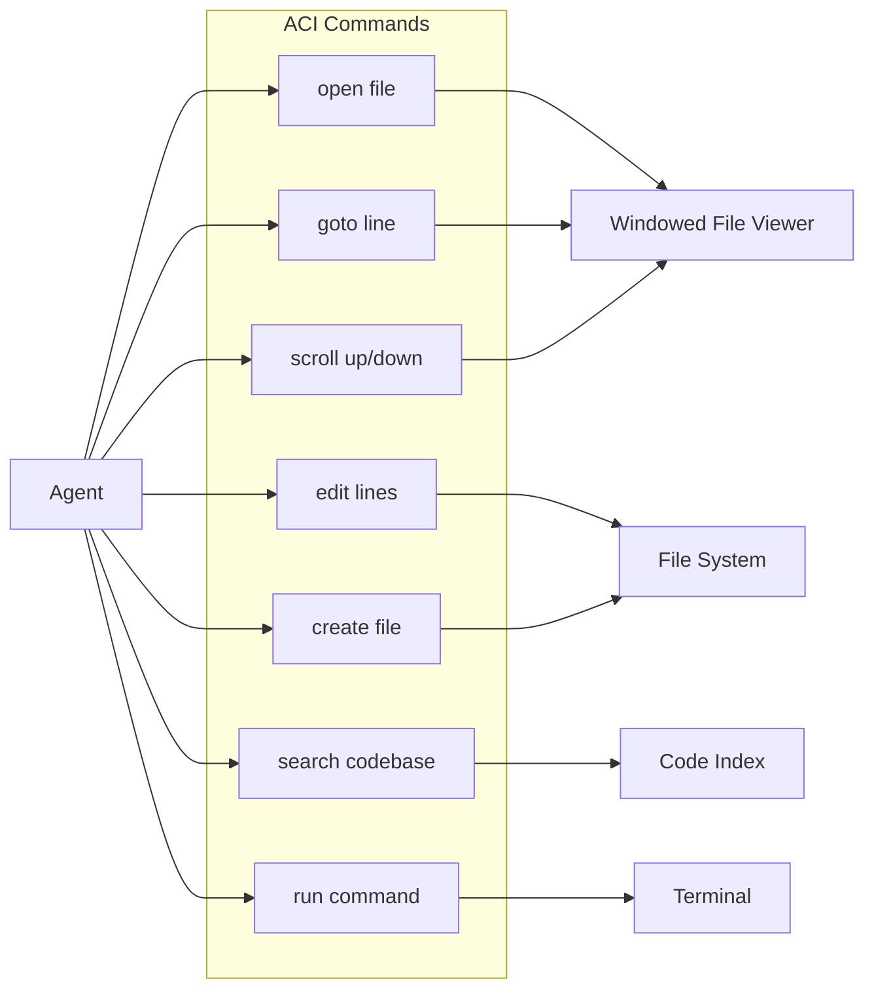
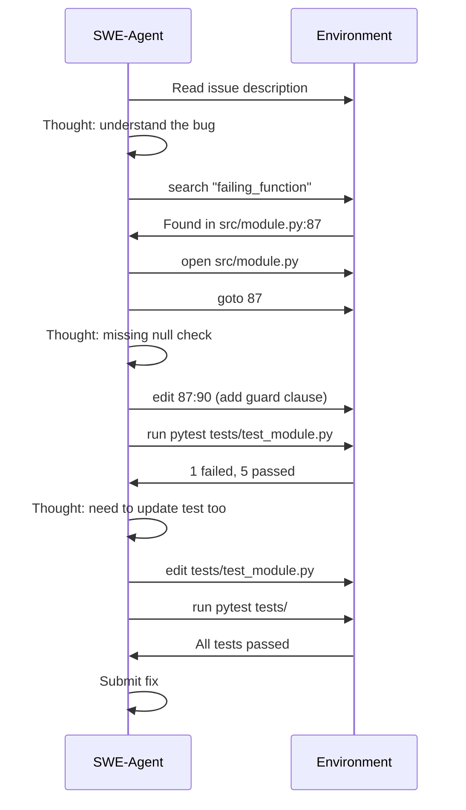
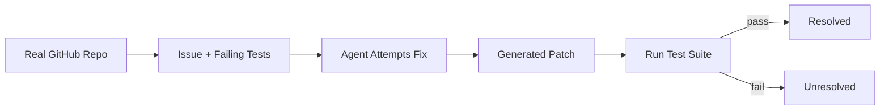

# SWE-Agent

> One-sentence takeaway: SWE-Agent demonstrates that a specialized **Agent-Computer Interface (ACI)** — not just a better model — is the key to autonomous code editing on real repositories.

## Paper Details

| Field | Value |
|-------|-------|
| Authors | Yang et al. (Princeton / Stanford) |
| Year | 2024 |
| Link | [arXiv:2405.15793](https://arxiv.org/abs/2405.15793) |
| Code | [SWE-agent/SWE-agent](https://github.com/SWE-agent/SWE-agent) |
| Benchmark | [SWE-bench](https://www.swebench.com/) |

## TL;DR

SWE-Agent solves real GitHub issues by interacting with a repository through a custom interface optimized for LM agents — specialized file viewer, search, and editor commands that minimize token waste and maximize edit precision.

## Problem Statement

General-purpose agents fail at software engineering because:
- Raw shell access produces verbose, ambiguous output
- File reading consumes entire context windows
- Edit commands (sed, patch) are error-prone for LMs
- No feedback loop between edit and test execution

## Architecture

```mermaid
flowchart TD
    ISSUE[GitHub Issue] --> AGENT[SWE-Agent LM]
    AGENT --> ACI[Agent-Computer Interface]
    ACI --> BROWSE[Browse / Search Files]
    ACI --> VIEW[View File (windowed)]
    ACI --> EDIT[Edit File (precise)]
    ACI --> RUN[Run Tests / Commands]
    RUN --> OBS[Observation]
    OBS --> AGENT
    AGENT -->|tests pass| PR[Submit Fix]
```

### Core Components

| Component | Role |
|-----------|------|
| **Language Model** | Reasoning, planning, and command selection |
| **Agent-Computer Interface (ACI)** | Custom commands optimized for code tasks |
| **Environment** | Docker container with repo checkout |
| **Feedback loop** | Test execution results guide next actions |

## Agent-Computer Interface (ACI)

The ACI is SWE-Agent's key innovation — purpose-built commands instead of raw bash.



### ACI Design Principles

| Principle | Implementation |
|-----------|---------------|
| **Minimize tokens** | Windowed file view (not full file dump) |
| **Precise edits** | Line-range replacement, not regex |
| **Structured feedback** | Formatted command output, error highlighting |
| **Progressive disclosure** | Browse directory → open file → scroll to relevant section |
| **Immediate verification** | Run tests after each edit |

### Example ACI Commands

```
open README.md          # Open file in viewer
goto 42                 # Jump to line 42
edit 42:45              # Replace lines 42-45 with new content
search "def authenticate"  # Find function definitions
run pytest tests/ -x    # Execute tests, stop on first failure
```

## Planning

SWE-Agent uses implicit planning through the ReAct loop rather than explicit upfront plans:



**Planning characteristics:**
- Issue understanding → localization → fix → verify → iterate
- Test feedback drives replanning (Reflexion-like, but implicit)
- No separate planner module — model plans in thought traces

## Tools

| Tool | Purpose | ACI Command |
|------|---------|-------------|
| File viewer | Read code with context window | `open`, `goto`, `scroll` |
| Editor | Make precise changes | `edit`, `create` |
| Search | Find relevant code | `search`, `find_file` |
| Terminal | Run tests and commands | `run` |
| Git | Version control awareness | Built into environment |

## Evaluation (SWE-bench)

SWE-bench is the standard benchmark for coding agents:

| Metric | Description |
|--------|-------------|
| **Resolve rate** | % of issues where agent's patch passes all tests |
| **SWE-bench Lite** | 300 curated Python issues |
| **SWE-bench Verified** | Human-validated solvable subset |
| **SWE-bench Full** | 2,294 issues across 12 repos |



### SWE-Agent Results (original paper)

| Benchmark | Resolve Rate |
|-----------|-------------|
| SWE-bench Lite | ~12.5% (Claude 3 Opus) |
| SWE-bench Full | ~6% |

Subsequent systems (Devin, OpenHands, Claude Code) have pushed rates higher, but SWE-Agent established the ACI pattern.

## Relevance to AI Engineering

- **Directly applicable:** ACI design principles for any code-editing agent
- **Inspirational:** Specialized interfaces beat general-purpose tool access
- **Benchmark:** SWE-bench for evaluating coding agent changes

## Practical Takeaways

1. **Design specialized tools** — don't give agents raw shell; give them windowed viewers and precise editors
2. **Test-driven feedback loop** — run tests after every edit, not just at the end
3. **Minimize context consumption** — progressive file disclosure, not full dumps
4. **Sandbox execution** — Docker containers for safety and reproducibility
5. **Measure on SWE-bench** — before claiming your coding agent works

## Limitations

- Python-focused benchmark — limited language diversity
- Single-file edits often sufficient — may not reflect large refactors
- Test suite quality varies across repos
- Docker overhead adds latency
- Requires capable model (GPT-4 class minimum for reasonable results)

## Implementation Notes

```python
# Conceptual ACI wrapper — production coding agent
class AgentComputerInterface:
    def open(self, path: str) -> str:
        """Return windowed view of file (e.g., 100 lines around cursor)."""
        ...

    def edit(self, path: str, start: int, end: int, new_content: str) -> str:
        """Replace lines start-end with new_content. Return diff summary."""
        ...

    def search(self, query: str) -> list[SearchResult]:
        """Ripgrep-style search with file:line context."""
        ...

    def run(self, command: str, timeout: int = 30) -> CommandResult:
        """Execute in sandbox. Return stdout, stderr, exit_code."""
        ...

# Agent loop
while not done:
    thought, action = llm.decide(issue, history, aci_state)
    observation = aci.execute(action)
    history.append((thought, action, observation))
    if tests_pass():
        done = True
```

## SWE-Agent vs Traditional Agents

| Aspect | Traditional Agent | SWE-Agent |
|--------|------------------|-----------|
| File access | `cat file.py` (full dump) | Windowed viewer |
| Editing | `sed` / manual patch | Line-range edit command |
| Feedback | Raw terminal output | Structured, truncated |
| Environment | Host machine | Docker sandbox |
| Evaluation | Ad hoc | SWE-bench standard |

## Interview Questions

**Q: What is the Agent-Computer Interface (ACI)?**
A set of commands designed specifically for LM agents to interact with code — windowed viewing, precise editing, structured output — instead of raw shell access.

**Q: Why does SWE-Agent outperform general agents on code tasks?**
The ACI minimizes token waste, enables precise edits, and provides structured feedback — reducing the error surface for the LM.

**Q: How would you evaluate a coding agent?**
SWE-bench resolve rate on held-out issues, plus custom evals for your codebase's languages, frameworks, and test patterns.

**Q: What are the risks of autonomous coding agents?**
Arbitrary code execution, breaking production systems, introducing security vulnerabilities, and generating plausible but incorrect fixes.

**Q: How does SWE-Agent relate to Cursor/Copilot/Devin?**
Same problem space — all use specialized interfaces, sandboxed execution, and test feedback. SWE-Agent open-sourced the ACI pattern and benchmark.

---

## See Also

- [Agent Reasoning Papers](agent-reasoning-papers.md)
- [AI Agents Domain](../ai-agents/README.md)
- [Research Comparison Guides](research-comparison-guides.md)
- [Agent Architectures Cheat Sheet](../../cheat-sheets/agent-architectures-papers-cheat-sheet.md)

## Changelog

| Version | Date | Changes |
|---------|------|---------|
| 1.0 | 2026-07-13 | Initial engineering guide |
