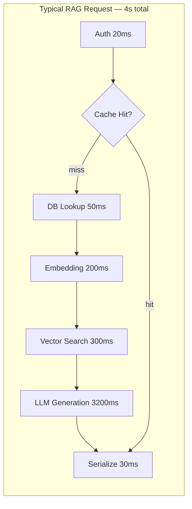
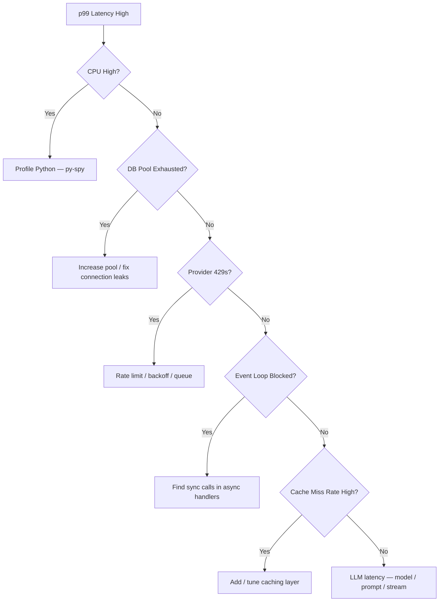

# Backend Performance for AI

> Make AI backends fast where it matters — profile before optimizing, cache deterministic work, pool connections, stream responses, and paginate everything that scales with data.

## Table of Contents

- [Performance Reality for AI Backends](#performance-reality-for-ai-backends)
- [Measuring Before Optimizing](#measuring-before-optimizing)
- [Profiling Techniques](#profiling-techniques)
- [Bottleneck Analysis](#bottleneck-analysis)
- [Caching Strategies](#caching-strategies)
- [Connection Pooling](#connection-pooling)
- [Async Optimization](#async-optimization)
- [Pagination](#pagination)
- [Streaming](#streaming)
- [Compression](#compression)
- [FastAPI Production Tuning](#fastapi-production-tuning)
- [Production Considerations](#production-considerations)
- [Common Mistakes](#common-mistakes)
- [Interview Preparation](#interview-preparation)
- [Navigation](#navigation)

---

## Performance Reality for AI Backends

Most AI backend latency is **not** your Python code. It is network I/O waiting on LLMs, vector databases, and embedding APIs. Optimizing Python loops while ignoring a 3-second OpenAI call is wasted effort.

| Component | Typical Latency Share | Optimization Lever |
|-----------|----------------------|-------------------|
| LLM inference | 60–90% | Model choice, caching, streaming |
| Vector search | 5–20% | Index tuning, cache hot queries |
| Database queries | 2–10% | Indexes, pooling, query optimization |
| Python application code | 1–5% | Profiling, async, avoid blocking |
| Serialization | 1–3% | orjson, response compression |

> **Production Standard:** Profile end-to-end first. Optimize the dominant bottleneck. Micro-optimize Python only after I/O and database paths are sound.



Cross-reference [Async Programming for AI Backends](../backend-engineering/async-programming-for-ai-backends.md) for event loop fundamentals and [Redis Backend Patterns for AI](../databases/redis/redis-backend-patterns-for-ai.md) for caching patterns.

---

## Measuring Before Optimizing

Define **SLIs** (Service Level Indicators) before touching code:

| Metric | Target (Example) | Tool |
|--------|------------------|------|
| p50 latency | < 2s for chat | Prometheus histogram |
| p99 latency | < 8s for chat | Prometheus histogram |
| Throughput | 200 RPS per worker | Load test (k6) |
| Error rate | < 0.1% | APM / logs |
| Time to first token (TTFT) | < 500ms | Custom span |
| Cache hit rate | > 40% for embeddings | Redis metrics |

### Golden Signals for AI APIs

1. **Latency** — p50/p95/p99 per endpoint
2. **Traffic** — requests per second, tokens per minute
3. **Errors** — 4xx/5xx, provider 429 rate
4. **Saturation** — connection pool usage, event loop lag, queue depth

```python
# Instrument with OpenTelemetry spans
from opentelemetry import trace

tracer = trace.get_tracer(__name__)

async def answer(self, query: str) -> str:
    with tracer.start_as_current_span("rag_service.answer") as span:
        span.set_attribute("query.length", len(query))
        with tracer.start_as_current_span("retriever.search"):
            chunks = await self.retriever.search(query)
        span.set_attribute("chunks.count", len(chunks))
        with tracer.start_as_current_span("llm.complete"):
            response = await self.llm.complete(self._build_prompt(query, chunks))
        return response.content
```

---

## Profiling Techniques

### 1. Distributed Tracing (Production)

Use OpenTelemetry + Jaeger/Tempo/Datadog to see where time goes across services.

```mermaid
gantt
    title Chat Request Trace
    dateFormat X
    axisFormat %L ms

    section API
    auth           :0, 15
    validation     :15, 5

    section RAG
    embed_query    :20, 180
    vector_search  :200, 250
    llm_stream     :450, 3500

    section Response
    serialize      :3950, 20
```



### 2. `py-spy` (Production-Safe Sampling)

Samples the Python process without restarting — safe for production.

```bash
# Sample a running Uvicorn worker for 30 seconds
py-spy record -o profile.svg --pid $(pgrep -f "uvicorn app.main:app") --duration 30

# Live top-like view
py-spy top --pid $(pgrep -f "uvicorn app.main:app")
```

### 3. `cProfile` (Development)

```python
import cProfile
import pstats
from pstats import SortKey

profiler = cProfile.Profile()
profiler.enable()
# ... run benchmark request ...
profiler.disable()
stats = pstats.Stats(profiler).sort_stats(SortKey.CUMULATIVE)
stats.print_stats(20)
```

### 4. `pytest-benchmark` (Regression)

```python
def test_chunking_performance(benchmark, large_document):
    result = benchmark(chunk_document, large_document, chunk_size=512)
    assert len(result) > 0
```

### 5. Load Testing

```javascript
// k6 script — chat endpoint load test
import http from "k6/http";
import { check } from "k6";

export const options = {
    stages: [
        { duration: "1m", target: 50 },
        { duration: "3m", target: 50 },
        { duration: "1m", target: 0 },
    ],
    thresholds: {
        http_req_duration: ["p(95)<5000"],
        http_req_failed: ["rate<0.01"],
    },
};

export default function () {
    const res = http.post(
        "https://api.example.com/v1/chat",
        JSON.stringify({ message: "What is RAG?" }),
        { headers: { "Content-Type": "application/json", Authorization: "Bearer ${TOKEN}" } }
    );
    check(res, { "status is 200": (r) => r.status === 200 });
}
```

---

## Bottleneck Analysis

Systematic approach when p99 latency exceeds SLO:



### Common Bottleneck Signatures

| Symptom | Likely Cause | Investigation |
|---------|--------------|---------------|
| p99 spikes, CPU low | Blocking I/O in async handler | `py-spy`, asyncio debug |
| p99 spikes, CPU high | CPU-bound parsing in handler | Move to worker process |
| Errors under load | Connection pool exhaustion | Pool metrics, `pool.timeout` |
| Steady high latency | No caching on embeddings | Cache hit rate metrics |
| TTFT slow but total OK | LLM queue / cold start | Stream earlier; check provider region |
| DB timeouts | Missing index, N+1 queries | `EXPLAIN ANALYZE`, SQLAlchemy echo |

### N+1 Query Detection

```python
# BAD — N+1: one query per conversation message
async def get_conversations_with_messages(db, user_id: str):
    conversations = await repo.get_by_user(user_id)
    for conv in conversations:
        conv.messages = await repo.get_messages(conv.id)  # N queries!
    return conversations

# GOOD — single join or eager load
from sqlalchemy.orm import selectinload

stmt = (
    select(Conversation)
    .where(Conversation.user_id == user_id)
    .options(selectinload(Conversation.messages))
)
```

---

## Caching Strategies

Cache **deterministic, expensive, repeatable** work. Never cache non-deterministic LLM prose without explicit TTL and version keys.

### What to Cache in AI Backends

| Data | Cache Key | TTL | Invalidation |
|------|-----------|-----|--------------|
| Query embeddings | `emb:{model}:{hash(text)}` | 24h | Model version change |
| Retrieval results | `rag:{tenant}:{hash(query+filters)}` | 1h | Document update event |
| LLM responses (FAQ) | `llm:{model}:{hash(prompt)}` | 1h | Prompt version bump |
| User session / auth | `session:{token_id}` | 15min | Logout / revoke |
| Rate limit counters | `rl:{user}:{window}` | window size | Automatic expiry |
| Config / feature flags | `cfg:{key}` | 5min | Admin update |

### Redis Cache-Aside Pattern

```python
import hashlib
import json
from redis.asyncio import Redis

class EmbeddingCache:
    def __init__(self, redis: Redis, ttl_seconds: int = 86400):
        self.redis = redis
        self.ttl = ttl_seconds

    def _key(self, text: str, model: str) -> str:
        digest = hashlib.sha256(f"{model}:{text}".encode()).hexdigest()[:16]
        return f"emb:{model}:{digest}"

    async def get_or_compute(self, text: str, model: str, compute_fn) -> list[float]:
        key = self._key(text, model)
        cached = await self.redis.get(key)
        if cached:
            return json.loads(cached)

        embedding = await compute_fn(text, model)
        await self.redis.setex(key, self.ttl, json.dumps(embedding))
        return embedding
```

### Cache Stampede Prevention

```python
import asyncio

async def get_with_lock(redis, key: str, lock_ttl: int, compute_fn):
    cached = await redis.get(key)
    if cached:
        return cached

    lock_key = f"lock:{key}"
    acquired = await redis.set(lock_key, "1", nx=True, ex=lock_ttl)
    if not acquired:
        await asyncio.sleep(0.1)
        return await get_with_lock(redis, key, lock_ttl, compute_fn)

    try:
        value = await compute_fn()
        await redis.setex(key, 3600, value)
        return value
    finally:
        await redis.delete(lock_key)
```

### HTTP Caching for Static AI Assets

```python
from fastapi import Response

@app.get("/v1/documents/{doc_id}/chunks")
async def list_chunks(doc_id: str, response: Response):
    chunks = await chunk_service.get_cached(doc_id)
    response.headers["Cache-Control"] = "private, max-age=300"
    response.headers["ETag"] = f'"{chunks.version_hash}"'
    return chunks
```

See [Redis for AI](../databases/redis/redis-for-ai.md) and [Redis Backend Patterns](../databases/redis/redis-backend-patterns-for-ai.md).

---

## Connection Pooling

Creating a new TCP+TLS connection per request adds 50–200ms. Pool connections for databases, Redis, and HTTP clients.

### HTTP Client Pool (LLM / Embedding APIs)

```python
import httpx
from contextlib import asynccontextmanager
from fastapi import FastAPI

@asynccontextmanager
async def lifespan(app: FastAPI):
    app.state.http_client = httpx.AsyncClient(
        timeout=httpx.Timeout(30.0, connect=5.0),
        limits=httpx.Limits(
            max_connections=100,
            max_keepalive_connections=20,
            keepalive_expiry=30.0,
        ),
    )
    yield
    await app.state.http_client.aclose()

app = FastAPI(lifespan=lifespan)
```

### PostgreSQL Pool (asyncpg / SQLAlchemy)

```python
from sqlalchemy.ext.asyncio import create_async_engine, async_sessionmaker

engine = create_async_engine(
    settings.database_url,
    pool_size=20,           # persistent connections
    max_overflow=10,          # burst capacity
    pool_timeout=30,        # wait before error
    pool_recycle=1800,      # recycle stale connections
    pool_pre_ping=True,     # detect dead connections
)

AsyncSessionLocal = async_sessionmaker(engine, expire_on_commit=False)
```

### Pool Sizing Formula

```
pool_size ≈ (workers × expected_concurrent_db_ops_per_request)

Example: 4 Uvicorn workers × 5 concurrent DB ops = 20 pool_size
Add max_overflow for burst (10–50% of pool_size)
```

| Pool Symptom | Fix |
|--------------|-----|
| `QueuePool timeout` | Increase `pool_size` or reduce hold time |
| Too many DB connections | Lower `pool_size × workers` below DB `max_connections` |
| Stale connection errors | Enable `pool_pre_ping=True` |
| Connection leak | Ensure sessions closed in `finally` / dependency `yield` |

```python
# FastAPI dependency — always close session
async def get_db():
    async with AsyncSessionLocal() as session:
        try:
            yield session
            await session.commit()
        except Exception:
            await session.rollback()
            raise
```

---

## Async Optimization

Async shines when I/O waits overlap. These patterns maximize concurrency without blocking the event loop.

### Concurrent Independent I/O

```python
import asyncio

async def enrich_context(query: str, user_id: str) -> dict:
    embedding_task = asyncio.create_task(embedding_service.embed(query))
    history_task = asyncio.create_task(conversation_repo.get_recent(user_id, limit=5))
    prefs_task = asyncio.create_task(user_repo.get_preferences(user_id))

    embedding, history, prefs = await asyncio.gather(
        embedding_task, history_task, prefs_task
    )
    return {"embedding": embedding, "history": history, "prefs": prefs}
```

### Semaphore for Provider Rate Limits

```python
LLM_SEMAPHORE = asyncio.Semaphore(10)  # max 10 concurrent LLM calls per worker

async def call_llm(prompt: str) -> str:
    async with LLM_SEMAPHORE:
        return await llm_client.complete(prompt)
```

### Offload CPU-Bound Work

```python
import asyncio
from functools import partial

async def parse_pdf(content: bytes) -> str:
    loop = asyncio.get_running_loop()
    return await loop.run_in_executor(
        app.state.process_pool,
        partial(extract_text_from_pdf, content),
    )
```

### Anti-Patterns

| Anti-Pattern | Effect | Fix |
|--------------|--------|-----|
| `requests.get()` in `async def` | Blocks event loop | `httpx.AsyncClient` |
| `time.sleep()` in `async def` | Blocks event loop | `asyncio.sleep()` |
| New HTTP client per request | No connection reuse | Shared client in lifespan |
| Unbounded `asyncio.gather` | Provider 429 storm | Semaphore |
| Sync SQLAlchemy in async route | Blocks event loop | `asyncpg` + `AsyncSession` |

---

## Pagination

Never return unbounded lists. AI backends accumulate conversations, messages, documents, and chunks — all need pagination.

### Offset Pagination (Simple)

```python
from pydantic import BaseModel, Field

class PaginationParams(BaseModel):
    page: int = Field(default=1, ge=1)
    page_size: int = Field(default=20, ge=1, le=100)

class PaginatedResponse(BaseModel):
    items: list
    total: int
    page: int
    page_size: int
    has_next: bool


@app.get("/v1/conversations", response_model=PaginatedResponse)
async def list_conversations(
    pagination: PaginationParams = Depends(),
    user=Depends(get_current_user),
    db=Depends(get_db),
):
    offset = (pagination.page - 1) * pagination.page_size
    items, total = await conversation_repo.list_paginated(
        user_id=user.id,
        offset=offset,
        limit=pagination.page_size,
    )
    return PaginatedResponse(
        items=items,
        total=total,
        page=pagination.page,
        page_size=pagination.page_size,
        has_next=offset + pagination.page_size < total,
    )
```

### Cursor Pagination (Scalable)

Offset pagination degrades on large tables (`OFFSET 100000` scans rows). Use cursor pagination for message history and logs.

```python
from pydantic import BaseModel
from datetime import datetime
import base64
import json

class CursorParams(BaseModel):
    cursor: str | None = None
    limit: int = 20


def encode_cursor(created_at: datetime, id: str) -> str:
    payload = json.dumps({"t": created_at.isoformat(), "id": id})
    return base64.urlsafe_b64encode(payload.encode()).decode()


@app.get("/v1/conversations/{conv_id}/messages")
async def list_messages(conv_id: str, params: CursorParams = Depends()):
    after_created_at, after_id = None, None
    if params.cursor:
        decoded = json.loads(base64.urlsafe_b64decode(params.cursor))
        after_created_at = datetime.fromisoformat(decoded["t"])
        after_id = decoded["id"]

    messages = await message_repo.list_after(
        conv_id, after_created_at, after_id, limit=params.limit + 1
    )
    has_more = len(messages) > params.limit
    messages = messages[: params.limit]
    next_cursor = encode_cursor(messages[-1].created_at, messages[-1].id) if has_more else None

    return {"items": messages, "next_cursor": next_cursor, "has_more": has_more}
```

| Strategy | Best For | Avoid When |
|----------|----------|------------|
| Offset | Admin UIs, small datasets | Deep pages on millions of rows |
| Cursor | Chat history, feeds, logs | Need total count on every page |
| Keyset | Time-series data | Complex multi-column sort |

---

## Streaming

Streaming improves **perceived latency** (TTFT) and reduces memory for long responses.

### LLM Token Streaming (SSE)

```python
from fastapi.responses import StreamingResponse

@app.post("/v1/chat/stream")
async def chat_stream(request: ChatRequest, user=Depends(get_current_user)):
    async def event_generator():
        async for token in llm_client.stream(request.message):
            yield f"data: {json.dumps({'token': token})}\n\n"
        yield "data: [DONE]\n\n"

    return StreamingResponse(
        event_generator(),
        media_type="text/event-stream",
        headers={
            "Cache-Control": "no-cache",
            "X-Accel-Buffering": "no",  # disable nginx buffering
        },
    )
```

### Streaming Benefits

| Benefit | Detail |
|---------|--------|
| Lower TTFT | User sees tokens in ~200ms vs waiting 5s |
| Memory efficiency | No buffering full response in server RAM |
| Client disconnect | Cancel LLM call when user navigates away |
| Backpressure | `async for` paces provider output |

### nginx SSE Configuration

```nginx
location /v1/chat/stream {
    proxy_pass http://uvicorn:8000;
    proxy_buffering off;
    proxy_cache off;
    proxy_read_timeout 300s;
    chunked_transfer_encoding on;
}
```

### Stream Cancellation

```python
from starlette.requests import Request

async def event_generator(request: Request):
    async for token in llm_client.stream(prompt):
        if await request.is_disconnected():
            await llm_client.cancel()
            break
        yield f"data: {token}\n\n"
```

Cross-reference [Backend Fundamentals — Streaming APIs](../backend-engineering/backend-fundamentals-for-ai.md#streaming-apis).

---

## Compression

Compress large response bodies to reduce bandwidth — especially document lists, chunk metadata, and embedding search results.

### GZip Middleware

```python
from fastapi.middleware.gzip import GZipMiddleware

app.add_middleware(GZipMiddleware, minimum_size=1000)  # compress responses > 1KB
```

### When to Compress

| Content | Compress? | Notes |
|---------|-----------|-------|
| JSON API responses > 1KB | Yes | GZip/Brotli at nginx or app |
| SSE token streams | No | Compression buffers chunks — defeats streaming |
| Pre-compressed files (PDF) | No | Marginal gain |
| Embedding vectors JSON | Yes | Large float arrays compress well |

### Brotli at nginx (Better than GZip)

```nginx
brotli on;
brotli_comp_level 6;
brotli_types application/json text/plain application/javascript;
gzip on;
gzip_types application/json text/plain;
```

### Request Body Compression

For large document upload APIs, accept `Content-Encoding: gzip` on requests:

```python
from fastapi import Request

async def read_compressed_body(request: Request) -> bytes:
    body = await request.body()
    if request.headers.get("content-encoding") == "gzip":
        import gzip
        return gzip.decompress(body)
    return body
```

---

## FastAPI Production Tuning

### Uvicorn Workers

```bash
# CPU-bound light, I/O heavy — more workers than CPUs
uvicorn app.main:app --host 0.0.0.0 --port 8000 --workers 4 --loop uvloop --http httptools
```

| Setting | Recommendation |
|---------|----------------|
| Workers | `2 × CPU cores + 1` for I/O-bound (tune with load test) |
| `--loop uvloop` | Faster event loop (Linux) |
| `--http httptools` | Faster HTTP parser |
| `ORJSONResponse` | Faster JSON serialization |

### orjson Response Class

```python
from fastapi.responses import ORJSONResponse

app = FastAPI(default_response_class=ORJSONResponse)
```

### Pydantic v2 Performance

Pydantic v2 uses Rust core — ensure models use `model_config = ConfigDict(from_attributes=True)` and avoid validators on hot paths when possible.

### Health Checks and Warmup

```python
@app.on_event("startup")
async def warmup():
    await db_engine.connect()          # warm connection pool
    await redis.ping()                 # warm Redis
    await http_client.get("/health")   # warm HTTP pool to LLM provider
```

---

## Production Considerations

- **Optimize the bottleneck** — profile before rewriting Python; LLM latency usually dominates.
- **Cache with version keys** — include `model`, `prompt_version`, and `tenant_id` in cache keys.
- **Right-size pools** — `workers × pool_size` must not exceed database `max_connections`.
- **Stream by default for chat** — users perceive streaming as 3× faster even when total time is identical.
- **Paginate all list endpoints** — enforce `max page_size` server-side.
- **Load test with realistic payloads** — 4KB prompts behave differently than "hello".
- **Regional affinity** — deploy workers near LLM provider and database regions.
- **Autoscaling signals** — scale on p95 latency and queue depth, not just CPU.

---

## Common Mistakes

| Mistake | Impact | Fix |
|---------|--------|-----|
| Optimizing Python before profiling | Wasted effort | Distributed tracing first |
| No HTTP connection pooling | 100ms+ per LLM call overhead | Shared `httpx.AsyncClient` |
| Caching LLM without version key | Stale answers after prompt change | Key includes `prompt_version` |
| `OFFSET` pagination on large tables | Slow deep pages | Cursor pagination |
| GZip on SSE streams | Buffered streaming | Disable compression for SSE |
| Unbounded `page_size` param | Memory DoS | `le=100` on Pydantic field |
| Sync code in async handlers | Event loop blocking | Async drivers or executor |
| One global LLM semaphore across workers | Under-utilization | Per-worker semaphore + Redis global limit |
| No pool `pre_ping` | Random connection errors | `pool_pre_ping=True` |
| Returning full embedding vectors | Huge payloads | Truncate in list views; full in detail |

---

## Interview Preparation

### Frequently Asked Questions

**Q1: How do you approach performance optimization for an AI backend?**

> **Strong answer:** Measure first — p50/p99 per endpoint with distributed tracing. Identify dominant latency (usually LLM). Then: cache embeddings and retrieval, connection pool HTTP/DB, stream LLM responses for TTFT, paginate lists, async for concurrent I/O. Profile Python only after I/O is optimized.

**Q2: Why is connection pooling critical for LLM APIs?**

> **Strong answer:** Each new HTTPS connection costs TCP handshake + TLS negotiation (50–200ms). AI backends make many calls to OpenAI/embedding APIs. Shared `httpx.AsyncClient` with `max_connections` and `keepalive` reuses connections. Create once in lifespan, not per request.

**Q3: When do you use cursor vs offset pagination?**

> **Strong answer:** Offset for simple admin UIs with small datasets. Cursor/keyset for chat message history and logs at scale — `OFFSET 100000` forces full table scan. Cursor encodes last item's sort key; stable under concurrent inserts.

**Q4: How does streaming improve performance if total time is the same?**

> **Strong answer:** TTFT drops dramatically — user sees tokens in hundreds of ms instead of waiting for full completion. Perceived latency improves. Server memory is lower (no full buffer). Client disconnect can cancel provider call. Different metric than total generation time.

### Real-World Scenario

**Scenario:** Chat API p50 is 2s (fine) but p99 is 45s. CPU is 15%. LLM provider latency is normal.

> **Discussion points:** Check event loop blocking (sync DB, `requests` library). Connection pool exhaustion causing queue waits. Unbounded concurrent LLM calls hitting 429 retries. Missing DB index on conversation lookup. nginx `proxy_read_timeout` causing retries. Use `py-spy` and distributed traces to find the 45s tail.

---

## Navigation

### Prerequisites

- [Async Programming for AI Backends](../backend-engineering/async-programming-for-ai-backends.md) — event loop, concurrency
- [Backend Fundamentals for AI](../backend-engineering/backend-fundamentals-for-ai.md) — streaming, middleware
- [PostgreSQL for AI](../databases/postgresql/postgresql-for-ai.md) — indexes, query tuning

### Related Topics

- [Redis for AI](../databases/redis/redis-for-ai.md) — caching layer
- [Redis Backend Patterns for AI](../databases/redis/redis-backend-patterns-for-ai.md) — cache patterns
- [Backend Architecture for AI](../backend-engineering/backend-architecture-for-ai.md) — service layer design
- [Inference Optimization](../inference-optimization/README.md) — model-level latency

### Next Topics

- [Observability](../observability/README.md) — metrics and tracing
- [Testing Backend for AI](../backend-engineering/testing-backend-for-ai.md) — load test complement
- [Monitoring](../monitoring/README.md) — SLO dashboards

### Future Reading

- [Distributed Systems](../distributed-systems/README.md) — scaling beyond single worker
- [Cloud Deployment](../cloud-deployment/README.md) — regional deployment

---

## See Also

- [Performance Optimization Domain README](README.md)
- [httpx Connection Pooling](https://www.python-httpx.org/advanced/resource-limits/)
- [SQLAlchemy Pool Configuration](https://docs.sqlalchemy.org/en/20/core/pooling.html)
- [Master Index](../../meta/indexes/MASTER-INDEX.md)

## Changelog

| Version | Date | Changes |
|---------|------|---------|
| 1.0 | 2026-07-13 | Initial Phase 3 release |
