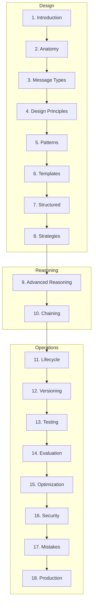

# Prompt Engineering

> Production-quality handbook treating prompts as maintainable software artifacts.
> **Prerequisites:** [LLM Engineering](../llm-engineering/README.md)

---

## Module Overview

Prompt Engineering is a software engineering discipline — not a collection of hacks.
This module teaches how to design, test, version, optimize, and deploy prompts in production AI systems.

**Unlocks:** [Context Engineering](../context-engineering/README.md) · [RAG](../rag/README.md) · [AI Agents](../ai-agents/README.md)

---

## Documents (18 Sections)

| # | Topic | Document |
|---|-------|----------|
| 1 | Introduction | [introduction-to-prompt-engineering.md](introduction-to-prompt-engineering.md) |
| 2 | Prompt Anatomy | [prompt-anatomy.md](prompt-anatomy.md) |
| 3 | Message Types | [message-types.md](message-types.md) |
| 4 | Design Principles | [prompt-design-principles.md](prompt-design-principles.md) |
| 5 | Prompt Patterns | [prompt-patterns.md](prompt-patterns.md) |
| 6 | Templates Guide | [prompt-templates-guide.md](prompt-templates-guide.md) |
| 7 | Structured Prompting | [structured-prompting.md](structured-prompting.md) |
| 8 | Prompting Strategies | [prompting-strategies.md](prompting-strategies.md) |
| 9 | Advanced Reasoning | [advanced-reasoning-strategies.md](advanced-reasoning-strategies.md) |
| 10 | Prompt Chaining | [prompt-chaining.md](prompt-chaining.md) |
| 11 | Prompt Lifecycle | [prompt-lifecycle.md](prompt-lifecycle.md) |
| 12 | Prompt Versioning | [prompt-versioning.md](prompt-versioning.md) |
| 13 | Prompt Testing | [prompt-testing.md](prompt-testing.md) |
| 14 | Prompt Evaluation | [prompt-evaluation.md](prompt-evaluation.md) |
| 15 | Prompt Optimization | [prompt-optimization.md](prompt-optimization.md) |
| 16 | Prompt Security | [prompt-security.md](prompt-security.md) |
| 17 | Common Mistakes | [prompt-engineering-mistakes.md](prompt-engineering-mistakes.md) |
| 18 | Production | [production-prompt-engineering.md](production-prompt-engineering.md) |

**Comparisons:** [prompt-comparison-guides.md](prompt-comparison-guides.md)

---

## Template Library

16 production templates in [`prompts/templates/`](../../prompts/templates/):

QA · Summarization · Classification · Extraction · Translation · Code generation · Code review · Documentation · Brainstorming · Email · SQL · JSON · Markdown · Agent planning · Evaluation judge · RAG query

---

## Code Examples

[`examples/prompt-engineering/`](../../examples/prompt-engineering/) — loader, chaining, few-shot, XML, evaluation, RAG, function calling, support chatbot, document analysis

---

## Cheat Sheets

- [Prompt Anatomy](../../cheat-sheets/prompt-anatomy-cheat-sheet.md)
- [Prompt Patterns](../../cheat-sheets/prompt-patterns-cheat-sheet.md)
- [Structured Prompting](../../cheat-sheets/structured-prompting-cheat-sheet.md)
- [Output Constraints](../../cheat-sheets/prompt-output-constraints-cheat-sheet.md)
- [Delimiters](../../cheat-sheets/prompt-delimiters-cheat-sheet.md)
- [XML Prompting](../../cheat-sheets/xml-prompting-cheat-sheet.md)
- [JSON Prompting](../../cheat-sheets/json-prompting-cheat-sheet.md)
- [Testing Checklist](../../cheat-sheets/prompt-testing-checklist.md)
- [Debugging Checklist](../../cheat-sheets/prompt-debugging-checklist.md)
- [LLM Sampling Parameters](../../cheat-sheets/llm-sampling-parameters.md)

---

## Learning Path

1. **Foundations** — Introduction → Anatomy → Message Types → Design Principles
2. **Craft** — Patterns → Templates → Structured → Strategies
3. **Reasoning** — Advanced Reasoning → Chaining
4. **Operations** — Lifecycle → Versioning → Testing → Evaluation
5. **Production** — Optimization → Security → Mistakes → Production

**Milestone:** Versioned prompt with golden dataset, CI regression tests, and structured output validation.

---

## Completion Checklist

- [ ] Read all 18 sections
- [ ] Use at least 3 templates from `prompts/templates/`
- [ ] Implement versioned prompt loading (not inline strings)
- [ ] Create golden dataset with ≥20 cases for one prompt
- [ ] Run evaluation suite before/after prompt change
- [ ] Document prompt in repository with changelog
- [ ] Review [prompt engineering mistakes](prompt-engineering-mistakes.md) against your prompts

---

## See Also

- [LLM Engineering](../llm-engineering/README.md) prerequisite
- [Prompt Library](../../prompts/README.md)
- [Master Index](../../meta/indexes/MASTER-INDEX.md)
